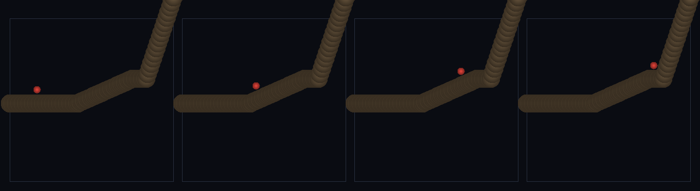

# step_0114 — (조립) 경사 한계: 완경사는 오르고 급경사(절벽)는 막힌다(창발 walkability)

> [design/playable-world.md](../../design/playable-world.md) PW-A/B. 조립 step(engine 변경 0·0111/0113 보행 재사용·author 벽 0). 긴 설명은 viewer `note`(scenes/step_0114.js)가 집.

## 논의 (조립 step·walkability 가 창발)

- **세계를 어떻게 변형?** 0113 보행에서 *어디까지 오를 수 있나*가 창발한다. 같은 제어 힘으로 완만한 비탈은 오르지만 가파른 절벽 앞엔 선다(경사 따라 내려가는 중력 성분 mg·sinθ 가 제어 힘+마찰을 이김). 임계는 힘 균형에서 창발 — 지형에 "못 가는 곳" 태그를 박지 않는다(절대 원칙).
- **무엇으로 검증?** ① 완경사 오름(24° climb↑) ② 급경사 막힘(72° climb≈0) ③ 창발 임계(같은 절벽도 F 키우면 오름) ④ 결정론.
- **무엇이 보존/변하나?** engine 불변. 보행 부품은 부품 verify 가 보증. 새로 생긴 건 *경사가 빚는 walkability*(완경사=길·절벽=장벽·author 없이).

## 구현 — viewer 조립 (engine 변경 0)

```js
// 평지 → 완경사(0.45·24°) → 절벽(3.0·72°). author 한 "벽" 아님 — 그냥 더 가파른 높이장
function elev(x){ let e=4; if(x>20)e+=0.45*Math.min(x-20,16); if(x>40)e+=3.0*(x-40); return e; }
// 0111 의 걷기 그대로 → 완경사 오름·절벽서 멈춤(힘 균형 임계)
```

## 검증

**(a) 수치 — `node HTJ/steps/step_0114/verify.js` → PASS (4/4)** — 조립 cross-thread 만(보행은 부품 verify).

```
PASS  완경사 오름 — 24° 비탈 climb 10.11>4(꾸준히 오름)
PASS  급경사 막힘 — 72° 절벽 climb 0.03<1(같은 힘으로 못 오름·절벽 밑 정지)
PASS  창발 임계 — 같은 72° 절벽이 F8 막힘(0.03) → F30 오름(27.80)·한계가 힘 따라 움직임(author 벽 아님)
PASS  결정론 — 같은 경사·힘 → 같은 결과 = 지문 0xd2e1af83
```
- 전 step verify **회귀 0**(engine 변경 0).

**(b) 눈 — `steps/step_0114/capture.png`** (탑다운·평지+완경사+절벽·캐릭터=빨강·시간 4 프레임)



빨간 캐릭터가 흙빛 비탈을 올라 *절벽 밑에서 막혀 선다*(완경사=오름·절벽=장벽·verify ①②).

## 다음

**걸을 수 있는 땅의 *지형*이 행위성을 빚는다(길↔장벽·author 없이) — 다음은 끝없이 펼쳐지는 지형(0115 streamChunks·PW-B).** **정직한 한계**: 1D 단면·단일 접촉점·임계 각은 노브(F·μ·g)에 의존.
