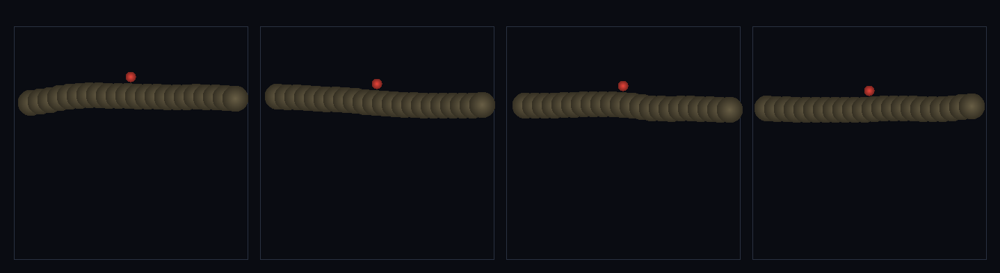

# step_0115 — (조립) 끝없이 걷는 땅: 지형이 관찰자(캐릭터) 둘레로 스트리밍된다

> [design/playable-world.md](../../design/playable-world.md) PW-B·PW 불변식(비용 ∝ 관찰 영역). 조립 step(engine 변경 0·0073 streamChunks + 0113 보행). 긴 설명은 viewer `note`(scenes/step_0115.js)가 집.

## 논의 (조립 step·관찰자=캐릭터 스트리밍)

- **세계를 어떻게 변형?** 0113 보행을 *무한 세계*로. 지면을 통째로 만들지 않고 `streamChunks`(0073·무한 grid 중 관찰자 반경 안만 materialize)로 *캐릭터 둘레 창*에서만 펼친다(관찰자=플레이어). 세계는 무한(elev(x) 모든 x 정의)이지만 *활성 앵커 수*는 창에 묶여 일정 → 비용 ∝ 관찰 영역.
- **무엇으로 검증?** ① 무한 보행(span≫창) ② 작업집합 유계(활성 앵커 거리 무관·횡단 컬럼≫활성) ③ 연속 지형(틈 없이 늘 접지) ④ 결정론.
- **무엇이 보존/변하나?** engine 불변. streamChunks·보행 부품은 부품 verify 가 보증. 새로 생긴 건 *관찰자=캐릭터 무한 보행*(유계 비용).

## 구현 — viewer 조립 (engine 변경 0)

```js
// 지면을 캐릭터(관찰자) 둘레 창에서만 — streamChunks(0073)·band j=0·무한 grid 중 반경 안만
const { chunks } = Stream.streamChunks({ cx: ch.cx, cy: 0 }, { spacing: SP, radius: W, shapeAt: (i,j)=> j===0?1:null });
const an = chunks.map(c => ({ cx: c.gx*SP, cy: elev(c.gx*SP)-3, radius: 3, ... }));  // 활성 앵커=창 안만
// 0113 의 보행 그대로 → 걸어도 활성 앵커 유계·세계 무한
```

## 검증

**(a) 수치 — `node HTJ/steps/step_0115/verify.js` → PASS (4/4)** — 조립 cross-thread 만(streamChunks·보행은 부품 verify).

```
PASS  무한 보행 — span 117.0>창 2W=44(고정 창 넘어 끝없이)
PASS  작업집합 유계 — 활성 앵커 22~22(거리 무관·시작 22=한참 뒤 22)·횡단 컬럼 58≫활성 22(비용≠세계 크기)
PASS  연속 지형 — 스트리밍 내내 접지(틈/낙하 0·관찰자 창이 늘 발밑 지면 보장)
PASS  결정론 — 같은 입력 → 같은 무한 보행 = 지문 0xb4fa8450
```
- 전 step verify **회귀 0**(engine 변경 0).

**(b) 눈 — `steps/step_0115/capture.png`** (탑다운·카메라=캐릭터 중심·캐릭터=빨강·시간 4 프레임)



빨간 캐릭터는 항상 화면 중앙, 흙빛 지형이 발밑으로 *흘러간다* — 매 프레임 다른 지형인데 활성 앵커 수는 그대로(verify ①②).

## 다음

**PW-B "끝없이 걷는 땅" 핵심 — 무한 절차 세계를 유계 비용으로 걷는다. 다음은 근거리 진짜 물리/원거리 필드 LOD(0116·adaptLOD 관찰자=캐릭터).** **정직한 한계**: 1D 단면 띠·매 step 재materialize(증분 캐싱 후속)·앵커 그리드 해상도.
