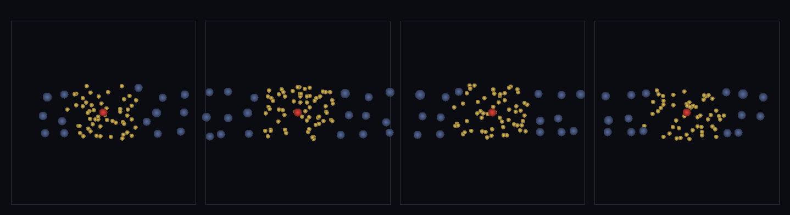

# step_0116 — (조립) 근거리 진짜 물리/원거리 필드: LOD 가 관찰자(캐릭터)를 따라간다

> [design/playable-world.md](../../design/playable-world.md) PW-B·PW 불변식(비용 ∝ 관찰 영역). 조립 step(engine 변경 0·0039 adaptLOD). 긴 설명은 viewer `note`(scenes/step_0116.js)가 집.

## 논의 (조립 step·관찰자=캐릭터 LOD)

- **세계를 어떻게 변형?** 0115(끝없는 지형)의 짝 — 지형 너머 *사물*도 비용을 관찰 영역에 묶는다. `adaptLOD`(0039)에 관찰자=캐릭터를 주면 근처는 개별 구체(fine·진짜 물리), 멀면 블록당 하나(coarse). 걸으면 fine 영역이 따라간다. 먼 디테일을 늘려도(밀도↑) effective 유계.
- **무엇으로 검증?** ① 근거리 fine/원거리 coarse(far 블록≪far 개체) ② 비용 유계(far 밀도 ×8→effective 평탄) ③ 보존(LOD 총 질량 정확) ④ 관찰자 따라감(fine 집합이 관찰자 좇음) ⑤ 결정론.
- **무엇이 보존/변하나?** engine 불변. adaptLOD 는 부품 verify 가 보증. 새로 생긴 건 *관찰자=캐릭터 LOD*(비용∝관찰·사물 판).

## 구현 — viewer 조립 (engine 변경 0)

```js
w.__obsX = 18 + t*0.18;                                          // 캐릭터(관찰자) 이동
const r = En.adaptLOD(field, { observer:[obsX,8,0], nearRadius:NEARR, blockSize:BS, spread:1 });
// 근처=개별 fine 구체·멀면 블록당 coarse → fine 영역이 캐릭터 따라감·effective 유계
```

## 검증

**(a) 수치 — `node HTJ/steps/step_0116/verify.js` → PASS (5/5)** — 조립 cross-thread 만(adaptLOD 는 부품 verify).

```
PASS  근거리 fine/원거리 coarse — fine 16개(개별)·far 395개→블록 34개(≪far·합쳐짐)
PASS  비용 유계 — far 밀도 ×8(개체 117→817) → effective 49→50(평탄·블록 흡수)
PASS  보존 — LOD 총 질량(coarsen 합산) = 817 → 817 (rel 0.00e+0 < 1e-12)
PASS  관찰자 따라감 — obs20 fine 75개(x≈20 둘레)·obs90 fine 76개(x≈90 둘레)·fine 영역이 관찰자 좇음
PASS  결정론 — 같은 관찰자 → 같은 LOD = 지문 0x78771ffa
```
- 전 step verify **회귀 0**(engine 변경 0).

**(b) 눈 — `steps/step_0116/capture.png`** (탑다운·카메라=캐릭터 중심·fine=밝은 작은 점·coarse=큰 흐린 덩이·시간 4 프레임)



빨간 캐릭터 둘레에 밝은 작은 점(fine 개별 구체)이 모이고 가장자리(먼 곳)는 큰 흐린 덩이(coarse 블록) — 걸으면 fine 무리가 따라 움직인다(verify ①④).

## 다음

**PW-B 완성 — 끝없는 지형(0115) + 끝없는 사물(0116)을 유계 비용으로. 다음은 PW-C(딛고 사는 환경·건널 수 있는 물 0117·발밑 바이옴/DNA 바위 0118).** **정직한 한계**: coarse 모양 LOD 근사(0039 한계)·far 블록은 세계 공간 범위엔 비례(밀도엔 무관)·near 개체 상호작용은 아직(시연=LOD 만).
