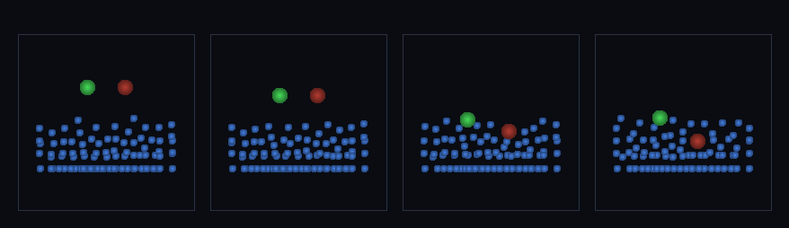

# step_0117 — (조립) 건널 수 있는 물: SPH 물이 상호작용하는 물체다(부력+저항)

> [design/playable-world.md](../../design/playable-world.md) PW-C(딛고 사는 환경·건널 수 있는 물). 조립 step(engine 변경 0·0041 압력 + 0046 점성 + 경계 재사용). 긴 설명은 viewer `note`(scenes/step_0117.js)가 집.

## 논의 (조립 step·물 상호작용 창발)

- **세계를 어떻게 변형?** 캐릭터를 SPH 물 입자와 *같은 배열*에 넣어 함께 굴리면 물 만드는 법칙에서 두 거동이 창발: ① 부력=SPH 압력(0041) ∇P(아르키메데스·잠김 깊이∝밀도) ② 저항=SPH 점성(0046·물 속 운동 느려짐). 물은 generic SPH(타입 0)·캐릭터는 그 압력장 속 한 물체.
- **무엇으로 검증?** ① 부력(가벼움 뜸·무거움 잠김·깊이∝밀도) ② 안 빠짐(바닥 통과 0) ③ 저항(물 속 vx<진공) ④ 물 보존 ⑤ 결정론.
- **무엇이 보존/변하나?** engine 불변. SPH 압력·점성·경계는 부품 verify 가 보증. 새로 생긴 건 *캐릭터↔물 상호작용*(부력+저항).

## 구현 — viewer 조립 (engine 변경 0)

```js
const all = [...water, light, heavy];                           // 캐릭터를 물 입자와 같은 배열에
Sph.sphPressureForce(all, DT, popt);                            // 부력 = 압력 ∇P(아르키메데스·0041)
Sph.sphViscosity(all, DT, vopt);                                // 저항 = 점성(0046)
for (p of all) p.pz -= p.mass*G*DT;                             // 중력(밀도차가 뜸/가라앉음 가름)
Sph.sphBoundaryForce(water, an, ...); Sph.sphBoundaryForce([light,heavy], an, ...);  // 벽·바닥 담음
```

## 검증

**(a) 수치 — `node HTJ/steps/step_0117/verify.js` → PASS (5/5)** — 조립 cross-thread 만(SPH 압력·점성은 부품 verify).

```
PASS  부력 — 가벼움 z 8.54(수면 8.6 근처·뜸) > 무거움 z 5.04(더 깊이·깊이∝밀도)
PASS  안 빠짐 — 가벼움 z 8.54>0·무거움 z 5.04>0(바닥 통과 0·물+경계 떠받침)
PASS  저항 — 민 캐릭터 vx 진공 5.00(그대로·뉴턴1) → 물 속 2.38(<0.7×·점성 저항·건너기 힘듦)
PASS  보존 — 물 질량(캐릭터 진입 후) = 98 → 98 (rel 0.00e+0 < 1e-12)
PASS  결정론 — 같은 낙하 → 같은 부력 = 지문 0x29f99503
```
- 전 step verify **회귀 0**(engine 변경 0).

**(b) 눈 — `steps/step_0117/capture.png`** (측면도·물=파랑·가벼움=초록·무거움=적갈·시간 4 프레임)



초록(가벼움)·적갈(무거움) 캐릭터가 못에 떨어져 — 초록은 수면에 *뜨고* 적갈은 *가라앉는다*(부력·깊이∝밀도·verify ①).

## 다음

**PW-C 첫 벽돌 — 환경의 물이 *상호작용하는 물체*(딛고·뜨고·건너는). 다음은 발밑 바이옴·DNA 형태 바위(0118).** **정직한 한계**: 캐릭터를 SPH 입자로 근사·작은 못·정지 물(흐르는 물 건너기 후속)·걷기와 결합 안 함(시연=물 상호작용만).
