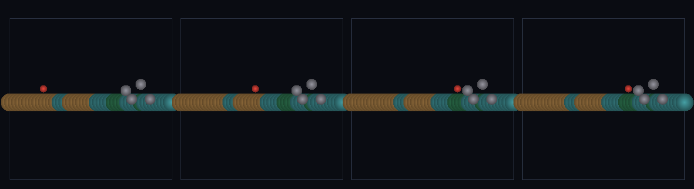

# step_0118 — (조립) 발밑 바이옴 + DNA 형태 바위: 환경이 발밑에서 행위성과 만난다

> [design/playable-world.md](../../design/playable-world.md) PW-C(딛고 사는 환경). 조립 step(engine 변경 0·두 작은 조립 묶음·0090 biomeField + 0062/0063 shapeDNA + 보행 재사용). 긴 설명은 viewer `note`(scenes/step_0118.js)가 집.

## 논의 (조립 step·환경↔행위성 만남)

- **세계를 어떻게 변형?** PW-C 마무리 — 두 작은 조립을 한 무대에. ① 발밑 바이옴: biomeField(0090)를 *캐릭터 발밑 x* 에서 샘플 → 걸으면 발밑 바이옴(땅 색)이 기후 경계서 바뀜. ② DNA 형태 바위: 세계 형태 사전(shapeDict·0062) hash 로 reconstructShape(0063)가 *비구형* 구성원 구로 펼친 바위 → 캐릭터가 그 *실제 형태 footprint* 에 막힘(바운딩 구 아님).
- **무엇으로 검증?** ① 발밑 바이옴(≥3종·biomeField 일치) ② 바이옴 경계(≥2) ③ DNA footprint(비구형·실제 구성원에 막힘) ④ 형태=세계 DNA(등록 hash) ⑤ 결정론.
- **무엇이 보존/변하나?** engine 불변. biomeField·shapeDNA·보행은 부품 verify 가 보증. 새로 생긴 건 *환경 장(바이옴·DNA 형태)이 발밑 행위성과 만남*. 둘 다 generic(타입 0).

## 구현 — viewer 조립 (engine 변경 0)

```js
const biomeAt = (x) => biome(x, 0).biome;                       // 발밑 바이옴 샘플(0090)
const hash = DNA.registerShape(dict, members, {quantum:0.25});  // 세계 형태 사전 등록(0062·dedup)
const rockPts = DNA.reconstructShape(rock, dict, ...);          // 비구형 footprint(0063)
const rockAn = rockPts.map(p => ({ cx:p.cx, cy:p.cy, radius:p.r, mass:1e9, ... }));  // 실제 구성원=충돌 경계
// 0111 보행 그대로 → 바이옴 띠 가로지르며 걸어 DNA 형태 바위에 막힘
```

## 검증

**(a) 수치 — `node HTJ/steps/step_0118/verify.js` → PASS (5/5)** — 조립 cross-thread 만(biomeField·shapeDNA·보행은 부품 verify).

```
PASS  발밑 바이옴 — 걸으며 3종 바이옴 가로지름(≥3)·발밑 값 3=biomeField 샘플(별도 author 아님)
PASS  바이옴 경계 — 경로 x[10,38]에 바이옴 경계 5개(≥2·기후 띠 가로지름)
PASS  DNA footprint — 바위 4 구성원(비구형)·왼쪽 구성원 x 34.4·캐릭터 31.4서 막힘(실제 형태 윤곽·바운딩 구 아님)
PASS  형태=세계 DNA — 바위 형태가 등록 hash 06dc2c91(사전 1개·dedup canonical 4점)서 옴
PASS  결정론 — 같은 입력 → 같은 보행·바위 = 지문 0xaebe8524
```
- 전 step verify **회귀 0**(engine 변경 0).

**(b) 눈 — `steps/step_0118/capture.png`** (측면도·땅=발밑 바이옴 색[탄/청록/녹]·DNA 바위=회색 비구형·캐릭터=빨강·시간 4 프레임)



빨간 캐릭터가 *색이 바뀌는*(바이옴 띠) 땅을 걸어 회색 *DNA 형태* 바위(비구형 구성원 무리)에 막혀 선다(verify ①③).

## 다음

**PW-C — 발밑 바이옴·건널 수 있는 물(0117)·DNA 형태 바위가 *딛고 사는 환경*을 이룬다. 다음은 PW-D(살아 움직이는 것·DNA 형태 덩어리가 움직이는 원시 생물).** **정직한 한계**: 1D 발밑 샘플·바위는 앵커 구성원 근사·바이옴이 아직 보행 물리를 바꾸진 않음(색만·바이옴별 마찰 등 후속).
