# Master Graph — 스냅샷

> **이 파일은 생성물이다.** 손으로 고치지 않는다 — `npm run master:graph` 가 다시 만든다.
> 원본은 `graph/*.yaml` 과 `constraints/DC-*.yaml` 이다.
> 인터랙티브 관찰(필터 · 서브그래프 · 상세)은 같은 명령이 만드는 `graph-view.html` 을 연다.

노드 113 — WorldState 22 · Actor 2 · Goal 6 · Possibility 22 · Capability 58 · Knowledge 3

Capability 구현 상태 — ■ IMPLEMENTED 15 · ▨ PARTIAL 7 · □ MISSING 36

## 인과 뼈대 — WorldState → Goal → Possibility

세계의 사정이 Goal 을 만들고, 각 Goal 은 여러 Possibility 로 갈린다 (OR).

```mermaid
flowchart LR
  MA-PLAYER(["PLAYER"])
  MA-HOSTILE-COMBATANT(["HOSTILE-COMBATANT"])
  MG-EXPLORE-BEIRA{{"EXPLORE-BEIRA"}}
  MG-ACQUIRE-RARE-ORGAN{{"ACQUIRE-RARE-ORGAN"}}
  MG-OVERCOME-SUPERIOR-OPPONENT{{"OVERCOME-SUPERIOR-OPPONENT"}}
  MG-SURVIVE-ENEMY-OFFENSIVE{{"SURVIVE-ENEMY-OFFENSIVE"}}
  MG-HOLD-HUNTING-GROUND{{"HOLD-HUNTING-GROUND"}}
  MG-RESCUE-THE-TAKEN{{"RESCUE-THE-TAKEN"}}
  MP-OUTGROW-THE-OPPONENT["OUTGROW-THE-OPPONENT"]
  MP-MATCH-WEAPON-TO-ARMOR["MATCH-WEAPON-TO-ARMOR"]
  MP-PIERCE-THE-HARD-DEFENSE["PIERCE-THE-HARD-DEFENSE"]
  MP-BREAK-THE-GUARD["BREAK-THE-GUARD"]
  MP-READ-AND-COUNTER["READ-AND-COUNTER"]
  MP-EXPLOIT-OPEN-BODY["EXPLOIT-OPEN-BODY"]
  MP-INTERRUPT["INTERRUPT"]
  MP-CONTROL-MOVEMENT["CONTROL-MOVEMENT"]
  MP-WEAPONIZE-ENVIRONMENT["WEAPONIZE-ENVIRONMENT"]
  MP-BET-ON-THE-CRITICAL-BLOW["BET-ON-THE-CRITICAL-BLOW"]
  MP-STAKE-EVERYTHING-ON-ONE-BLOW["STAKE-EVERYTHING-ON-ONE-BLOW"]
  MP-TRADE-BODY-FOR-RESOURCE["TRADE-BODY-FOR-RESOURCE"]
  MP-EVADE-BY-MOVING-THE-BODY["EVADE-BY-MOVING-THE-BODY"]
  MP-HOLD-FORTIFIED["HOLD-FORTIFIED"]
  MP-LEARN-TO-HANDLE-THE-LAYER["LEARN-TO-HANDLE-THE-LAYER"]
  MP-ADAPT-BY-RESOURCE["ADAPT-BY-RESOURCE"]
  MP-PREPARE-IN-CIVILIZATION["PREPARE-IN-CIVILIZATION"]
  MP-KILL-CREATURE["KILL-CREATURE"]
  MP-TAKE-SHED-ORGAN["TAKE-SHED-ORGAN"]
  MP-TRADE-WITH-ACTOR["TRADE-WITH-ACTOR"]
  MP-FIND-DEAD-SPECIMEN["FIND-DEAD-SPECIMEN"]
  MP-FORCE-CREATURE-TO-RELEASE["FORCE-CREATURE-TO-RELEASE"]
  MW-PRIMAL-WORLD[/"PRIMAL-WORLD"/]
  MW-WORLD-PRESSURE[/"WORLD-PRESSURE"/]
  MW-FREE-PRESSURE[/"FREE-PRESSURE"/]
  MW-BOUND-PRESSURE[/"BOUND-PRESSURE"/]
  MW-SAFE-FRONTIER[/"SAFE-FRONTIER"/]
  MW-DEPTH-GRADIENT[/"DEPTH-GRADIENT"/]
  MW-ZONE-FRINGE[/"ZONE-FRINGE"/]
  MW-ZONE-WILD[/"ZONE-WILD"/]
  MW-ZONE-DANGER[/"ZONE-DANGER"/]
  MW-ZONE-DEEP[/"ZONE-DEEP"/]
  MW-ZONE-UNKNOWN[/"ZONE-UNKNOWN"/]
  MW-HYPER-PREDATION[/"HYPER-PREDATION"/]
  MW-SPATIAL-SHEAR[/"SPATIAL-SHEAR"/]
  MW-MACRO-TERRAIN[/"MACRO-TERRAIN"/]
  MW-TERRAIN-BAIWANG-BASIN[/"TERRAIN-BAIWANG-BASIN"/]
  MW-TERRAIN-SUNEATER-ICEFIELD[/"TERRAIN-SUNEATER-ICEFIELD"/]
  MW-TERRAIN-NAME-EATING-FOREST[/"TERRAIN-NAME-EATING-FOREST"/]
  MW-TERRAIN-BREATHLESS-SEA[/"TERRAIN-BREATHLESS-SEA"/]
  MW-TERRAIN-SKYFALL-RANGE[/"TERRAIN-SKYFALL-RANGE"/]
  MW-TERRAIN-WALKING-CONTINENTS[/"TERRAIN-WALKING-CONTINENTS"/]
  MW-TERRAIN-UNHAPPENED-DESERT[/"TERRAIN-UNHAPPENED-DESERT"/]
  MW-TERRAIN-BLOODBLOOM-FOREST[/"TERRAIN-BLOODBLOOM-FOREST"/]

  MA-PLAYER -.-> MG-EXPLORE-BEIRA
  MA-PLAYER -.-> MG-ACQUIRE-RARE-ORGAN
  MA-PLAYER -.-> MG-OVERCOME-SUPERIOR-OPPONENT
  MA-PLAYER -.-> MG-SURVIVE-ENEMY-OFFENSIVE
  MA-HOSTILE-COMBATANT -.-> MG-HOLD-HUNTING-GROUND
  MW-SAFE-FRONTIER --> MG-EXPLORE-BEIRA
  MG-ACQUIRE-RARE-ORGAN --> MG-EXPLORE-BEIRA
  MW-ZONE-WILD --> MG-ACQUIRE-RARE-ORGAN
  MG-OVERCOME-SUPERIOR-OPPONENT --> MG-EXPLORE-BEIRA
  MW-ZONE-FRINGE --> MG-OVERCOME-SUPERIOR-OPPONENT
  MG-SURVIVE-ENEMY-OFFENSIVE --> MG-OVERCOME-SUPERIOR-OPPONENT
  MW-ZONE-FRINGE --> MG-SURVIVE-ENEMY-OFFENSIVE
  MW-ZONE-FRINGE --> MG-HOLD-HUNTING-GROUND
  MW-TERRAIN-NAME-EATING-FOREST --> MG-RESCUE-THE-TAKEN
  MW-TERRAIN-BREATHLESS-SEA --> MG-RESCUE-THE-TAKEN
  MW-TERRAIN-SKYFALL-RANGE --> MG-RESCUE-THE-TAKEN
  MW-TERRAIN-BLOODBLOOM-FOREST --> MG-RESCUE-THE-TAKEN
  MG-OVERCOME-SUPERIOR-OPPONENT --> MP-OUTGROW-THE-OPPONENT
  MG-OVERCOME-SUPERIOR-OPPONENT --> MP-MATCH-WEAPON-TO-ARMOR
  MG-OVERCOME-SUPERIOR-OPPONENT --> MP-PIERCE-THE-HARD-DEFENSE
  MG-OVERCOME-SUPERIOR-OPPONENT --> MP-BREAK-THE-GUARD
  MP-BREAK-THE-GUARD -. 방해 .-> MG-SURVIVE-ENEMY-OFFENSIVE
  MG-OVERCOME-SUPERIOR-OPPONENT --> MP-READ-AND-COUNTER
  MG-OVERCOME-SUPERIOR-OPPONENT --> MP-EXPLOIT-OPEN-BODY
  MG-OVERCOME-SUPERIOR-OPPONENT --> MP-INTERRUPT
  MG-OVERCOME-SUPERIOR-OPPONENT --> MP-CONTROL-MOVEMENT
  MG-OVERCOME-SUPERIOR-OPPONENT --> MP-WEAPONIZE-ENVIRONMENT
  MG-OVERCOME-SUPERIOR-OPPONENT --> MP-BET-ON-THE-CRITICAL-BLOW
  MG-OVERCOME-SUPERIOR-OPPONENT --> MP-STAKE-EVERYTHING-ON-ONE-BLOW
  MP-STAKE-EVERYTHING-ON-ONE-BLOW -. 방해 .-> MG-SURVIVE-ENEMY-OFFENSIVE
  MP-STAKE-EVERYTHING-ON-ONE-BLOW == 새 Goal ==> MG-SURVIVE-ENEMY-OFFENSIVE
  MG-SURVIVE-ENEMY-OFFENSIVE --> MP-TRADE-BODY-FOR-RESOURCE
  MP-TRADE-BODY-FOR-RESOURCE -. 방해 .-> MP-STAKE-EVERYTHING-ON-ONE-BLOW
  MP-TRADE-BODY-FOR-RESOURCE -. 방해 .-> MP-BREAK-THE-GUARD
  MG-SURVIVE-ENEMY-OFFENSIVE --> MP-EVADE-BY-MOVING-THE-BODY
  MG-SURVIVE-ENEMY-OFFENSIVE --> MP-HOLD-FORTIFIED
  MP-HOLD-FORTIFIED -. 방해 .-> MG-OVERCOME-SUPERIOR-OPPONENT
  MG-EXPLORE-BEIRA --> MP-LEARN-TO-HANDLE-THE-LAYER
  MP-LEARN-TO-HANDLE-THE-LAYER == 새 Goal ==> MG-OVERCOME-SUPERIOR-OPPONENT
  MP-LEARN-TO-HANDLE-THE-LAYER == 새 Goal ==> MG-SURVIVE-ENEMY-OFFENSIVE
  MP-LEARN-TO-HANDLE-THE-LAYER == 새 Goal ==> MG-ACQUIRE-RARE-ORGAN
  MG-EXPLORE-BEIRA --> MP-ADAPT-BY-RESOURCE
  MG-EXPLORE-BEIRA --> MP-PREPARE-IN-CIVILIZATION
  MG-ACQUIRE-RARE-ORGAN --> MP-KILL-CREATURE
  MG-ACQUIRE-RARE-ORGAN --> MP-TAKE-SHED-ORGAN
  MG-ACQUIRE-RARE-ORGAN --> MP-TRADE-WITH-ACTOR
  MG-ACQUIRE-RARE-ORGAN --> MP-FIND-DEAD-SPECIMEN
  MG-ACQUIRE-RARE-ORGAN --> MP-FORCE-CREATURE-TO-RELEASE
  MW-SAFE-FRONTIER --> MG-EXPLORE-BEIRA
  MW-ZONE-FRINGE --> MG-OVERCOME-SUPERIOR-OPPONENT
  MW-ZONE-FRINGE --> MG-SURVIVE-ENEMY-OFFENSIVE
  MW-ZONE-FRINGE --> MG-HOLD-HUNTING-GROUND
  MW-ZONE-WILD --> MG-ACQUIRE-RARE-ORGAN
  MW-TERRAIN-BAIWANG-BASIN --> MG-EXPLORE-BEIRA
  MW-TERRAIN-NAME-EATING-FOREST --> MG-RESCUE-THE-TAKEN
  MW-TERRAIN-BREATHLESS-SEA --> MG-RESCUE-THE-TAKEN
  MW-TERRAIN-SKYFALL-RANGE --> MG-RESCUE-THE-TAKEN
  MW-TERRAIN-BLOODBLOOM-FOREST --> MG-RESCUE-THE-TAKEN

  classDef world fill:#1f2d3d,stroke:#4a6785,color:#dbe6f2;
  classDef actor fill:#2d2438,stroke:#6b5b8a,color:#e5dcf0;
  classDef goal fill:#3a2f1c,stroke:#8a7440,color:#f0e6cd;
  classDef poss fill:#1c3330,stroke:#3f7d6f,color:#d6f0e9;
  class MW-PRIMAL-WORLD,MW-WORLD-PRESSURE,MW-FREE-PRESSURE,MW-BOUND-PRESSURE,MW-SAFE-FRONTIER,MW-DEPTH-GRADIENT,MW-ZONE-FRINGE,MW-ZONE-WILD,MW-ZONE-DANGER,MW-ZONE-DEEP,MW-ZONE-UNKNOWN,MW-HYPER-PREDATION,MW-SPATIAL-SHEAR,MW-MACRO-TERRAIN,MW-TERRAIN-BAIWANG-BASIN,MW-TERRAIN-SUNEATER-ICEFIELD,MW-TERRAIN-NAME-EATING-FOREST,MW-TERRAIN-BREATHLESS-SEA,MW-TERRAIN-SKYFALL-RANGE,MW-TERRAIN-WALKING-CONTINENTS,MW-TERRAIN-UNHAPPENED-DESERT,MW-TERRAIN-BLOODBLOOM-FOREST world;
  class MA-PLAYER,MA-HOSTILE-COMBATANT actor;
  class MG-EXPLORE-BEIRA,MG-ACQUIRE-RARE-ORGAN,MG-OVERCOME-SUPERIOR-OPPONENT,MG-SURVIVE-ENEMY-OFFENSIVE,MG-HOLD-HUNTING-GROUND,MG-RESCUE-THE-TAKEN goal;
  class MP-OUTGROW-THE-OPPONENT,MP-MATCH-WEAPON-TO-ARMOR,MP-PIERCE-THE-HARD-DEFENSE,MP-BREAK-THE-GUARD,MP-READ-AND-COUNTER,MP-EXPLOIT-OPEN-BODY,MP-INTERRUPT,MP-CONTROL-MOVEMENT,MP-WEAPONIZE-ENVIRONMENT,MP-BET-ON-THE-CRITICAL-BLOW,MP-STAKE-EVERYTHING-ON-ONE-BLOW,MP-TRADE-BODY-FOR-RESOURCE,MP-EVADE-BY-MOVING-THE-BODY,MP-HOLD-FORTIFIED,MP-LEARN-TO-HANDLE-THE-LAYER,MP-ADAPT-BY-RESOURCE,MP-PREPARE-IN-CIVILIZATION,MP-KILL-CREATURE,MP-TAKE-SHED-ORGAN,MP-TRADE-WITH-ACTOR,MP-FIND-DEAD-SPECIMEN,MP-FORCE-CREATURE-TO-RELEASE poss;
```

## 척추 — 어떤 전체의 조각인가 (part_of)

Capability 는 시스템(전체)의 조각이다. 시스템과 그 안의 자리(층·칸)의 단일 출처는
`graph/systems.yaml` 이다. **점선 테두리 = 잠정(grounded: false)** — 근거 문서가
이름만 대서, 그 전체의 설계 문서가 서면 semantic 을 개정한다.

### 전투 사다리 — R1 §14 · §15 · DT

전투 Capability 가 쌓이는 층 구조. 아래층이 서야 위층이 의미를 갖는다. 층에 속하지 않는 조각(기력 예산 · 능력치 축 · 계산 경위 관찰 · 공간 판정)은 모든 층이 공유하는 바닥이다 — segment 없이 이 시스템에 속한다.

```mermaid
flowchart TB
  subgraph SEG0 ["Aura / Nen"]
    N0["□ COMBAT-FLOW"]
    N1["□ FORTIFY"]
    N2["▨ CONDITION-STACKING"]
    N3["□ VOW"]
  end
  subgraph SEG1 ["Active Defense"]
    N4["□ PERFECT-GUARD"]
    N5["□ COUNTER"]
    N6["▨ BREAK"]
  end
  subgraph SEG2 ["Critical"]
    N7["■ CRITICAL-STRIKE"]
  end
  subgraph SEG3 ["Penetration"]
    N8["■ PENETRATION"]
  end
  subgraph SEG4 ["Damage Type"]
    N9["■ ATTACK-ARMOR-MATCHUP"]
  end
  subgraph SEG5 ["Defense Action"]
    N10["■ GUARD"]
  end
  subgraph SEG6 ["Basic Damage"]
    N11["■ COMBAT-STRIKE"]
    N12["■ DEFENSE-MITIGATION"]
  end
  subgraph SEGBASE ["공통 바닥 — 층에 속하지 않는다"]
    N13["▨ CP-ECONOMY"]
    N14["■ BODY-FACING"]
    N15["■ COMBAT-CAUSE-READING"]
    N16["▨ ATTACK-POWER"]
    N17["■ SKILL-SCALING"]
    N18["□ EVADE"]
  end
  SEG0 ~~~ SEG1
  SEG1 ~~~ SEG2
  SEG2 ~~~ SEG3
  SEG3 ~~~ SEG4
  SEG4 ~~~ SEG5
  SEG5 ~~~ SEG6
  SEG6 ~~~ SEGBASE

  classDef impl fill:#16351f,stroke:#3f8a52,color:#d8f2df;
  classDef part fill:#3a3315,stroke:#9a8a2e,color:#f2ecd0;
  classDef miss fill:#2a2a2e,stroke:#5c5c66,color:#b8b8c2;
  classDef implS fill:#16351f,stroke:#3f8a52,color:#d8f2df,stroke-dasharray:5 4;
  classDef partS fill:#3a3315,stroke:#9a8a2e,color:#f2ecd0,stroke-dasharray:5 4;
  classDef missS fill:#2a2a2e,stroke:#5c5c66,color:#b8b8c2,stroke-dasharray:5 4;
  class N7,N8,N9,N10,N11,N12,N14,N15,N17 impl;
  class N13,N16 part;
  class N2,N6 partS;
  class N0,N1,N3,N4,N5,N18 missS;
```

### 베이라 층 사다리 — BW §19~§25

세계의 깊이 층. 층마다 살아남기 위해 요구하는 대응이 다르다 — 각 층의 요구는 MW-ZONE-* 의 demands 가 거울이다. BW 는 층마다 이름과 "필요:" 목록만 공급하므로 이 사다리에 속한 조각 대부분은 grounded: false 다. 대지형(MS-BEIRA-TERRAIN)과 **직교한다** (HISTORY Q47(a)) — 어느 땅이든 그 안에서 깊어질 수 있고, 한 지역은 "어느 대지형의 어느 깊이" 를 함께 가진다.

### 앎의 사슬 — BW §32 (관찰 → 이해 → 대응 → 도달)

정보가 관문 뒤에 있고, 플레이어가 대가를 치러 아는 범위를 넓히는 진행 구조. 관찰이 "지금 무엇인가" 를, 예측이 "다음에 무엇을 하는가" 를 연다.

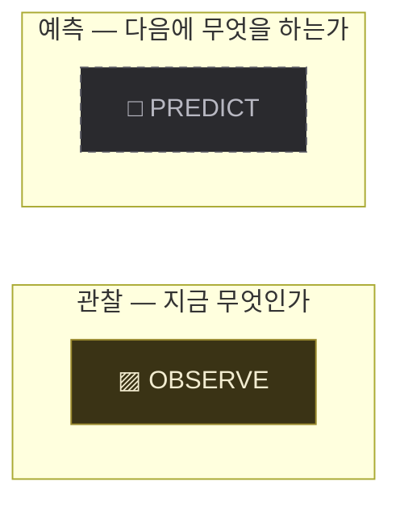

### 자원 유래 Capability Gate — BW §8~§10 · §17

탐험 → 자원 → 능력 → 더 깊은 탐험의 순환. 세계가 만든 적응을 자원으로 가져와 전에는 감당할 수 없던 층을 감당하게 한다.

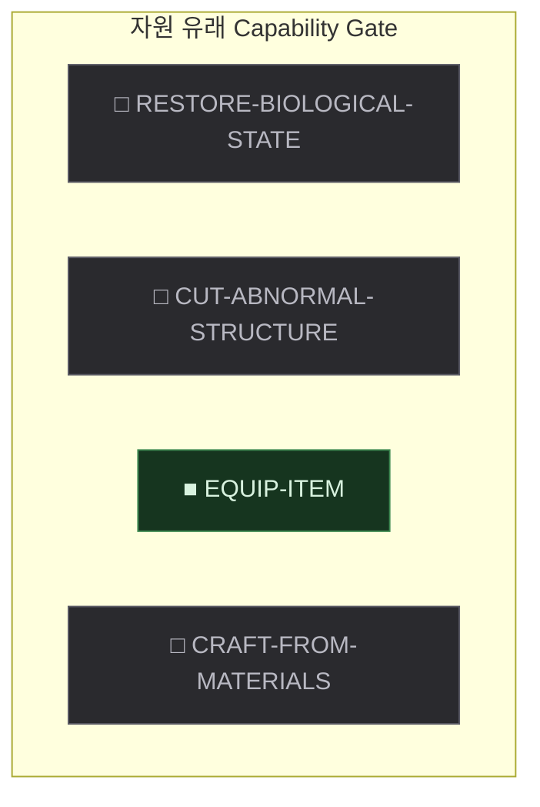

### 지목 — TG (content/proto-adventure/design/Design-Targeting-R0.md)

어느 층에도 속하지 않는 자리 — "지금 누구에게 하는가" 를 세계에 둔다.

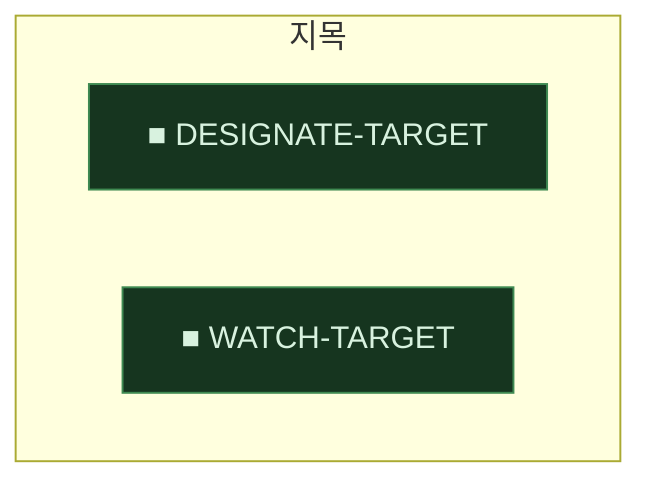

### 관계 태도 — BW §21 · §26

존재와 존재 사이의 태도(적대·중립·우호)가 세계의 사실로 있고, 칠 수 있는가와 자율 존재가 다가온 것을 어떻게 대하는가를 가른다.

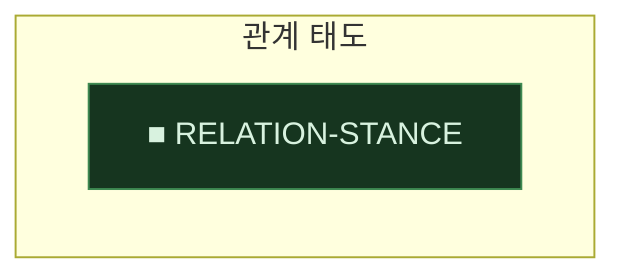

### 자율 존재 행동 — content/proto-adventure/design/Design-Creature-Behavior-R0.md (초안 — Human 승인 대기) · **DRAFT**

목적(Drive) · 영역 · 인지 · 국면 — 자율 존재가 자기 목적으로 움직이는 시스템. 이것이 서야 예측(MC-PREDICT)의 읽을 거리와 습성 관찰(MC-OBSERVE 의 남은 결손)이 생긴다 — 그 두 조각의 반쪽을 이 시스템이 소유한다.

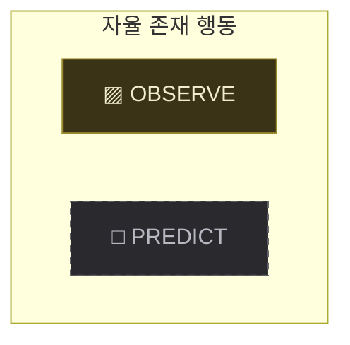

### 아이템 — IS (content/proto-adventure/design/Design-Item-System-R0.md) §4 · §5 · §6 · IE (content/proto-adventure/design/Design-Inventory-Equipment-D1.md) §0 · §48 — CARRY·EQUIP 자리의 운용

물건이 세계의 자원으로 성립하는 여섯 자리. 세계가 아이템을 정의하고, 몸이 그것을 지니고, 써서 상태를 바꾸고, 적용해 능력을 얻고, 재료를 다른 것으로 바꾸고, 몸 밖에서 주고받는다. 앞의 둘(정의 · 소지)은 능력이 아니라 나머지 넷의 바닥이다. 자원이 능력이 되는 순환(BW §17)과 정의/개체 분리(GR §28~§32)를 세계 쪽에서 받는 자리이며, 희귀 기관을 얻는 세 갈래(BW §27)도 이 시스템의 마지막 자리를 전제한다.

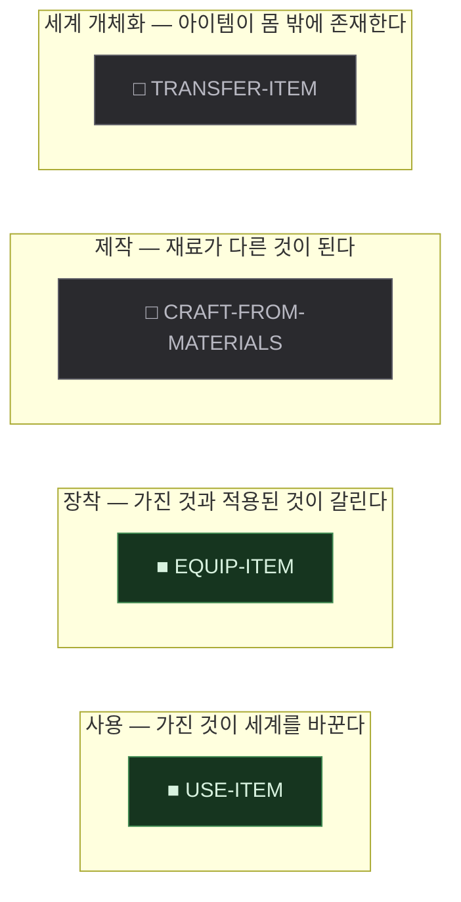

### 스킬 실행 형태 — SK (content/proto-adventure/design/Skill/Skill-System.md) §4 · §5 · §6 · **DRAFT**

효과가 세계에 나타나 대상에게 닿는 방식의 목록. 스킬은 이름이 아니라 발동 · 대상 기준 · 실행 · 대상 결정 · 효과의 조합이며, 그중 **실행**만이 세계에 새로운 생명주기와 판정을 요구하므로 자리를 가진다 (나머지 네 축은 조합의 항이지 사다리가 아니다). 전투 사다리(MS-COMBAT-LADDER)와 직교한다 — 그쪽은 피해가 어떻게 계산되는가의 층이고 이쪽은 그 효과가 어떻게 전달되는가의 자리다. 어느 자리든 피해 효과는 같은 피해 공식을 지난다.

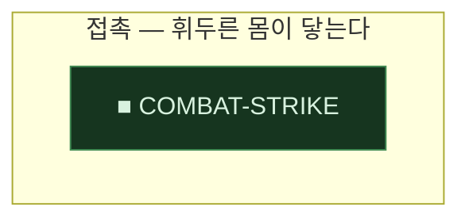

### 베이라 대지형 — BT (content/proto-adventure/design/Master-World-Beira-Terrain.md) §1 · §4~§11 · §13 · §15

하나의 원리가 매질(암석·물·대기·열·생명·공간·기억·Identity·소리·관계)에 대륙 규모로 결속되어 형성된 자연 시스템의 목록. 여덟이 문서에 서 있고, 각 지형은 자기 법칙이 요구하는 대응을 따로 가진다 — 그 요구는 MW-TERRAIN-* 의 demands 가 거울이다. 자리를 순서로 두지 않는다: 여덟은 난이도 순으로 배치된 목록이 아니며 (BT §16), 어디에 갈 수 있는지는 무엇을 감당하게 되었는가가 정한다 (BT §12). 깊이 사다리(MS-BEIRA-LADDER)와 **직교한다** (Human 결정 — HISTORY Q47(a)): 이쪽은 어떤 법칙의 땅인가이고 그쪽은 그 땅 안에서 얼마나 들어갔는가다. 한 대지형 안에 안전한 마을과 극단적으로 위험한 심부가 함께 있다 (BT §3).

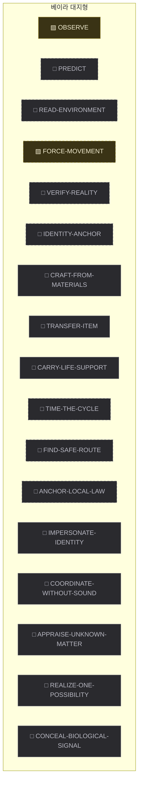

## 갈래별 준비도 — 어느 경로가 세계에 가장 가까운가

요구 Capability 중 이미 세계에 있는 것의 비율. `IMPLEMENTED` 1.0 · `PARTIAL` 0.5 로 센다.

| Possibility | 달성 Goal | 준비도 | 아직 없는 요구 |
|---|---|---:|---|
| `MATCH-WEAPON-TO-ARMOR` | OVERCOME-SUPERIOR-OPPONENT | ●●●●● 2/2 | 없음 |
| `PIERCE-THE-HARD-DEFENSE` | OVERCOME-SUPERIOR-OPPONENT | ●●●●● 4/4 | 없음 |
| `INTERRUPT` | OVERCOME-SUPERIOR-OPPONENT | ●●●●● 1/1 | 없음 |
| `TRADE-BODY-FOR-RESOURCE` | SURVIVE-ENEMY-OFFENSIVE | ●●●●○ 3/4 | CP-ECONOMY |
| `BET-ON-THE-CRITICAL-BLOW` | OVERCOME-SUPERIOR-OPPONENT | ●●●●○ 2/3 | ATTACK-POWER |
| `OUTGROW-THE-OPPONENT` | OVERCOME-SUPERIOR-OPPONENT | ●●●●○ 3/5 | ATTACK-POWER · CP-ECONOMY |
| `LEARN-TO-HANDLE-THE-LAYER` | EXPLORE-BEIRA | ●●●●○ 3/5 | OBSERVE · PREDICT |
| `BREAK-THE-GUARD` | OVERCOME-SUPERIOR-OPPONENT | ●●●○○ 1/3 | BREAK · CP-ECONOMY |
| `EXPLOIT-OPEN-BODY` | OVERCOME-SUPERIOR-OPPONENT | ●●●○○ 2/3 | COMBAT-FLOW |
| `ADAPT-BY-RESOURCE` | EXPLORE-BEIRA | ●●○○○ 2/5 | RESTORE-BIOLOGICAL-STATE · CUT-ABNORMAL-STRUCTURE · CRAFT-FROM-MATERIALS |
| `READ-AND-COUNTER` | OVERCOME-SUPERIOR-OPPONENT | ●●○○○ 1/4 | PERFECT-GUARD · COUNTER · CP-ECONOMY |
| `HOLD-FORTIFIED` | SURVIVE-ENEMY-OFFENSIVE | ●●○○○ 1/4 | FORTIFY · COMBAT-FLOW · CP-ECONOMY |
| `CONTROL-MOVEMENT` | OVERCOME-SUPERIOR-OPPONENT | ●●○○○ 0/3 | FORCE-MOVEMENT · CONTROL-SPACE · REPOSITION |
| `STAKE-EVERYTHING-ON-ONE-BLOW` | OVERCOME-SUPERIOR-OPPONENT | ●○○○○ 0/4 | VOW · COMBAT-FLOW · CP-ECONOMY · CONDITION-STACKING |
| `EVADE-BY-MOVING-THE-BODY` | SURVIVE-ENEMY-OFFENSIVE | ●○○○○ 0/2 | EVADE · CP-ECONOMY |
| `WEAPONIZE-ENVIRONMENT` | OVERCOME-SUPERIOR-OPPONENT | ○○○○○ 0/2 | READ-ENVIRONMENT · USE-HAZARD |
| `PREPARE-IN-CIVILIZATION` | EXPLORE-BEIRA | ○○○○○ 0/1 | CRAFT-FROM-MATERIALS |
| `KILL-CREATURE` | ACQUIRE-RARE-ORGAN | ○○○○○ 0/1 | TRANSFER-ITEM |
| `TAKE-SHED-ORGAN` | ACQUIRE-RARE-ORGAN | ○○○○○ 0/1 | TRANSFER-ITEM |
| `TRADE-WITH-ACTOR` | ACQUIRE-RARE-ORGAN | ○○○○○ 0/1 | TRANSFER-ITEM |
| `FIND-DEAD-SPECIMEN` | ACQUIRE-RARE-ORGAN | 요구 미기재 | 없음 |
| `FORCE-CREATURE-TO-RELEASE` | ACQUIRE-RARE-ORGAN | 요구 미기재 | 없음 |

## 요구 그물 — Possibility → Capability (AND)

한 Possibility 가 성립하려면 이어진 Capability 가 **전부** 있어야 한다.

```mermaid
flowchart LR
  MC-COMBAT-STRIKE["■ COMBAT-STRIKE"]
  MC-CP-ECONOMY["▨ CP-ECONOMY"]
  MC-BODY-FACING["■ BODY-FACING"]
  MC-COMBAT-CAUSE-READING["■ COMBAT-CAUSE-READING"]
  MC-GUARD["■ GUARD"]
  MC-DEFENSE-MITIGATION["■ DEFENSE-MITIGATION"]
  MC-ATTACK-POWER["▨ ATTACK-POWER"]
  MC-SKILL-SCALING["■ SKILL-SCALING"]
  MC-ATTACK-ARMOR-MATCHUP["■ ATTACK-ARMOR-MATCHUP"]
  MC-PENETRATION["■ PENETRATION"]
  MC-CRITICAL-STRIKE["■ CRITICAL-STRIKE"]
  MC-PERFECT-GUARD["□ PERFECT-GUARD"]
  MC-COUNTER["□ COUNTER"]
  MC-BREAK["▨ BREAK"]
  MC-COMBAT-FLOW["□ COMBAT-FLOW"]
  MC-FORTIFY["□ FORTIFY"]
  MC-EVADE["□ EVADE"]
  MC-CONDITION-STACKING["▨ CONDITION-STACKING"]
  MC-VOW["□ VOW"]
  MC-REPOSITION["▨ REPOSITION"]
  MC-OBSERVE["▨ OBSERVE"]
  MC-PREDICT["□ PREDICT"]
  MC-CONTROL-SPACE["□ CONTROL-SPACE"]
  MC-READ-ENVIRONMENT["□ READ-ENVIRONMENT"]
  MC-FORCE-MOVEMENT["▨ FORCE-MOVEMENT"]
  MC-USE-HAZARD["□ USE-HAZARD"]
  MC-INTERRUPT["■ INTERRUPT"]
  MC-RESTORE-BIOLOGICAL-STATE["□ RESTORE-BIOLOGICAL-STATE"]
  MC-CUT-ABNORMAL-STRUCTURE["□ CUT-ABNORMAL-STRUCTURE"]
  MC-DESIGNATE-TARGET["■ DESIGNATE-TARGET"]
  MC-WATCH-TARGET["■ WATCH-TARGET"]
  MC-RELATION-STANCE["■ RELATION-STANCE"]
  MC-USE-ITEM["■ USE-ITEM"]
  MC-EQUIP-ITEM["■ EQUIP-ITEM"]
  MC-CRAFT-FROM-MATERIALS["□ CRAFT-FROM-MATERIALS"]
  MC-TRANSFER-ITEM["□ TRANSFER-ITEM"]
  MP-OUTGROW-THE-OPPONENT["OUTGROW-THE-OPPONENT"]
  MP-MATCH-WEAPON-TO-ARMOR["MATCH-WEAPON-TO-ARMOR"]
  MP-PIERCE-THE-HARD-DEFENSE["PIERCE-THE-HARD-DEFENSE"]
  MP-BREAK-THE-GUARD["BREAK-THE-GUARD"]
  MP-READ-AND-COUNTER["READ-AND-COUNTER"]
  MP-EXPLOIT-OPEN-BODY["EXPLOIT-OPEN-BODY"]
  MP-INTERRUPT["INTERRUPT"]
  MP-CONTROL-MOVEMENT["CONTROL-MOVEMENT"]
  MP-WEAPONIZE-ENVIRONMENT["WEAPONIZE-ENVIRONMENT"]
  MP-BET-ON-THE-CRITICAL-BLOW["BET-ON-THE-CRITICAL-BLOW"]
  MP-STAKE-EVERYTHING-ON-ONE-BLOW["STAKE-EVERYTHING-ON-ONE-BLOW"]
  MP-TRADE-BODY-FOR-RESOURCE["TRADE-BODY-FOR-RESOURCE"]
  MP-EVADE-BY-MOVING-THE-BODY["EVADE-BY-MOVING-THE-BODY"]
  MP-HOLD-FORTIFIED["HOLD-FORTIFIED"]
  MP-LEARN-TO-HANDLE-THE-LAYER["LEARN-TO-HANDLE-THE-LAYER"]
  MP-ADAPT-BY-RESOURCE["ADAPT-BY-RESOURCE"]
  MP-PREPARE-IN-CIVILIZATION["PREPARE-IN-CIVILIZATION"]
  MP-KILL-CREATURE["KILL-CREATURE"]
  MP-TAKE-SHED-ORGAN["TAKE-SHED-ORGAN"]
  MP-TRADE-WITH-ACTOR["TRADE-WITH-ACTOR"]

  MP-OUTGROW-THE-OPPONENT --> MC-ATTACK-POWER
  MP-OUTGROW-THE-OPPONENT --> MC-SKILL-SCALING
  MP-OUTGROW-THE-OPPONENT --> MC-DEFENSE-MITIGATION
  MP-OUTGROW-THE-OPPONENT --> MC-COMBAT-STRIKE
  MP-OUTGROW-THE-OPPONENT --> MC-CP-ECONOMY
  MP-MATCH-WEAPON-TO-ARMOR --> MC-ATTACK-ARMOR-MATCHUP
  MP-MATCH-WEAPON-TO-ARMOR --> MC-COMBAT-STRIKE
  MP-PIERCE-THE-HARD-DEFENSE --> MC-PENETRATION
  MP-PIERCE-THE-HARD-DEFENSE --> MC-ATTACK-ARMOR-MATCHUP
  MP-PIERCE-THE-HARD-DEFENSE --> MC-DEFENSE-MITIGATION
  MP-PIERCE-THE-HARD-DEFENSE --> MC-COMBAT-STRIKE
  MP-BREAK-THE-GUARD --> MC-BREAK
  MP-BREAK-THE-GUARD --> MC-COMBAT-STRIKE
  MP-BREAK-THE-GUARD --> MC-CP-ECONOMY
  MP-READ-AND-COUNTER --> MC-GUARD
  MP-READ-AND-COUNTER --> MC-PERFECT-GUARD
  MP-READ-AND-COUNTER --> MC-COUNTER
  MP-READ-AND-COUNTER --> MC-CP-ECONOMY
  MP-EXPLOIT-OPEN-BODY --> MC-COMBAT-FLOW
  MP-EXPLOIT-OPEN-BODY --> MC-COMBAT-STRIKE
  MP-EXPLOIT-OPEN-BODY --> MC-COMBAT-CAUSE-READING
  MP-INTERRUPT --> MC-INTERRUPT
  MP-CONTROL-MOVEMENT --> MC-FORCE-MOVEMENT
  MP-CONTROL-MOVEMENT --> MC-CONTROL-SPACE
  MP-CONTROL-MOVEMENT --> MC-REPOSITION
  MP-WEAPONIZE-ENVIRONMENT --> MC-READ-ENVIRONMENT
  MP-WEAPONIZE-ENVIRONMENT --> MC-USE-HAZARD
  MP-BET-ON-THE-CRITICAL-BLOW --> MC-CRITICAL-STRIKE
  MP-BET-ON-THE-CRITICAL-BLOW --> MC-COMBAT-STRIKE
  MP-BET-ON-THE-CRITICAL-BLOW --> MC-ATTACK-POWER
  MP-STAKE-EVERYTHING-ON-ONE-BLOW --> MC-VOW
  MP-STAKE-EVERYTHING-ON-ONE-BLOW --> MC-COMBAT-FLOW
  MP-STAKE-EVERYTHING-ON-ONE-BLOW --> MC-CP-ECONOMY
  MP-STAKE-EVERYTHING-ON-ONE-BLOW --> MC-CONDITION-STACKING
  MP-TRADE-BODY-FOR-RESOURCE --> MC-GUARD
  MP-TRADE-BODY-FOR-RESOURCE --> MC-DEFENSE-MITIGATION
  MP-TRADE-BODY-FOR-RESOURCE --> MC-CP-ECONOMY
  MP-TRADE-BODY-FOR-RESOURCE --> MC-BODY-FACING
  MP-EVADE-BY-MOVING-THE-BODY --> MC-EVADE
  MP-EVADE-BY-MOVING-THE-BODY --> MC-CP-ECONOMY
  MP-HOLD-FORTIFIED --> MC-FORTIFY
  MP-HOLD-FORTIFIED --> MC-DEFENSE-MITIGATION
  MP-HOLD-FORTIFIED --> MC-COMBAT-FLOW
  MP-HOLD-FORTIFIED --> MC-CP-ECONOMY
  MP-LEARN-TO-HANDLE-THE-LAYER --> MC-OBSERVE
  MP-LEARN-TO-HANDLE-THE-LAYER --> MC-PREDICT
  MP-LEARN-TO-HANDLE-THE-LAYER --> MC-DESIGNATE-TARGET
  MP-LEARN-TO-HANDLE-THE-LAYER --> MC-WATCH-TARGET
  MP-LEARN-TO-HANDLE-THE-LAYER --> MC-RELATION-STANCE
  MP-ADAPT-BY-RESOURCE --> MC-RESTORE-BIOLOGICAL-STATE
  MP-ADAPT-BY-RESOURCE --> MC-CUT-ABNORMAL-STRUCTURE
  MP-ADAPT-BY-RESOURCE --> MC-USE-ITEM
  MP-ADAPT-BY-RESOURCE --> MC-EQUIP-ITEM
  MP-ADAPT-BY-RESOURCE --> MC-CRAFT-FROM-MATERIALS
  MP-PREPARE-IN-CIVILIZATION --> MC-CRAFT-FROM-MATERIALS
  MP-KILL-CREATURE --> MC-TRANSFER-ITEM
  MP-TAKE-SHED-ORGAN --> MC-TRANSFER-ITEM
  MP-TRADE-WITH-ACTOR --> MC-TRANSFER-ITEM

  classDef impl fill:#16351f,stroke:#3f8a52,color:#d8f2df;
  classDef part fill:#3a3315,stroke:#9a8a2e,color:#f2ecd0;
  classDef miss fill:#2a2a2e,stroke:#5c5c66,color:#b8b8c2;
  classDef poss fill:#1c3330,stroke:#3f7d6f,color:#d6f0e9;
  class MC-COMBAT-STRIKE,MC-BODY-FACING,MC-COMBAT-CAUSE-READING,MC-GUARD,MC-DEFENSE-MITIGATION,MC-SKILL-SCALING,MC-ATTACK-ARMOR-MATCHUP,MC-PENETRATION,MC-CRITICAL-STRIKE,MC-INTERRUPT,MC-DESIGNATE-TARGET,MC-WATCH-TARGET,MC-RELATION-STANCE,MC-USE-ITEM,MC-EQUIP-ITEM impl;
  class MC-CP-ECONOMY,MC-ATTACK-POWER,MC-BREAK,MC-CONDITION-STACKING,MC-REPOSITION,MC-OBSERVE,MC-FORCE-MOVEMENT part;
  class MC-PERFECT-GUARD,MC-COUNTER,MC-COMBAT-FLOW,MC-FORTIFY,MC-EVADE,MC-VOW,MC-PREDICT,MC-CONTROL-SPACE,MC-READ-ENVIRONMENT,MC-USE-HAZARD,MC-RESTORE-BIOLOGICAL-STATE,MC-CUT-ABNORMAL-STRUCTURE,MC-CRAFT-FROM-MATERIALS,MC-TRANSFER-ITEM miss;
  class MP-OUTGROW-THE-OPPONENT,MP-MATCH-WEAPON-TO-ARMOR,MP-PIERCE-THE-HARD-DEFENSE,MP-BREAK-THE-GUARD,MP-READ-AND-COUNTER,MP-EXPLOIT-OPEN-BODY,MP-INTERRUPT,MP-CONTROL-MOVEMENT,MP-WEAPONIZE-ENVIRONMENT,MP-BET-ON-THE-CRITICAL-BLOW,MP-STAKE-EVERYTHING-ON-ONE-BLOW,MP-TRADE-BODY-FOR-RESOURCE,MP-EVADE-BY-MOVING-THE-BODY,MP-HOLD-FORTIFIED,MP-LEARN-TO-HANDLE-THE-LAYER,MP-ADAPT-BY-RESOURCE,MP-PREPARE-IN-CIVILIZATION,MP-KILL-CREATURE,MP-TAKE-SHED-ORGAN,MP-TRADE-WITH-ACTOR poss;
```

## Constraint — 무엇이 걸러지는가

Constraint 는 단계가 아니라 각 선택 지점의 Filter 다. 아래는 어떤 노드가 어떤 원칙 아래 있는지다.

| Constraint | Scope | 상태 | 걸린 노드 | 한 문장 |
|---|---|---|---:|---|
| `COMBAT-MATCHUP-SOFT` | COMBAT | APPROVED | 4 | 공격 형태와 방어 형태의 상성은 선택을 만들되 결과를 지배하지 않는다. 상성은 별도 피해 배율이 아니라 대응 공격·방어 능력치의 차이로 표현한다. |
| `COMBAT-ONE-FORMULA` | COMBAT | APPROVED | 5 | 전투에는 하나의 기반 피해 공식만 존재한다. 새로운 전투 시스템은 새로운 피해 공식을 만들지 않고, 기존 공식의 입력값이나 결과값에 한 가지 의미만 더한다. |
| `COMBAT-ONE-LAYER-AT-A-TIME` | COMBAT | APPROVED | 0 | 전투 시스템은 한 번에 한 층만 추가하며, 현재 층이 플레이로 검증되기 전에는 다음 층을 올리지 않는다. 각 층은 아래 층 없이도 완전히 동작하는 상태를 유지한다. |
| `COMBAT-PLAYER-CAUSALITY` | COMBAT | REVISED | 28 | 전투의 중요한 결과는 관찰 가능한 세계 상태와 플레이어의 선택·행동에서 나오며, 같은 상태·같은 조건·같은 행동이면 언제나 같은 결과가 나온다. 단 하나의 예외로, Critical 은 확률 판정을 허용한다 — 그 경우에도 발생 확률과 증폭 결과는 관찰로 읽을 수 있어야 한다. |
| `COMBAT-SHARED-BUDGET` | COMBAT | APPROVED | 6 | 전투 행동은 하나의 공통 기력(CP) 예산을 나눠 쓴다. 행동별 전용 게이지를 신설하지 않는다. |
| `CONDITION-OPENS-WITHOUT-RECORDING` | GLOBAL | APPROVED | 1 | 지금의 조건으로 열리는 것은 어디에도 기록하지 않는다. 조건이 사라지면 저절로 닫혀야 하고, 그것을 되돌리는 규칙이 따로 있어서는 안 된다. |
| `GROWTH-CLASS-ORIGIN-TRACE` | GROWTH | APPROVED | 0 | Class 는 세계와 Actor 가 상호작용한 결과다. 모든 Class 는 하나 이상의 origin_trace(WorldState → Goal → Possibility)를 가지며, 그 Class 를 제거해도 원인이 된 세계 요소는 독립적으로 성립해야 한다. |
| `GROWTH-DEFINITION-INSTANCE-SPLIT` | GROWTH | APPROVED | 1 | Master 는 유한한 Definition(Class · Item Type · Property · Modifier · 조합 규칙)만 소유한다. 실제 생성된 Item Instance(II-*)와 조합 결과는 Runtime World 가 소유하며, 가능한 조합을 사전에 Node 로 생성하지 않는다. |
| `GROWTH-GOAL-FIRST` | GROWTH | APPROVED | 0 | 성장(새 Class · Item · Capability 의 획득) 자체를 Goal 로 세우지 않는다. 성장은 Actor 의 현재 Goal 을 현재 Capability 로 달성하기 어려울 때, 그 Goal 을 달성하는 하나의 Possibility 로만 성립한다. |
| `GROWTH-NEED-FROM-POSSIBILITY` | GROWTH | APPROVED | 0 | Class 와 Item 은 Capability 를 획득하는 세계 내 경로일 뿐이다. Capability 의 필요성은 항상 기존 Master 인과(Goal → Possibility --requires-->)에서 나오며, Class 나 Item 이 존재한다는 이유로 Capability 를 만들지 않는다. |
| `GROWTH-NO-CAPABILITY-DUPLICATION` | GROWTH | APPROVED | 1 | 같은 플레이 의미의 Capability 를 획득 Source(Class / Item / Actor)별로 복제하지 않는다. 하나의 MC-* 에 여러 획득 경로가 grants 로 연결된다. |
| `GROWTH-NOT-A-STAGE` | GROWTH | APPROVED | 0 | Growth 는 별도 Master Stage 가 아니다. 기본 절차 WHY → OPTIONS → NEED → NEXT 는 그대로 유지되고, Growth Graph 는 NEED 에서 발견된 Capability 에 대해 "세계에서 어떻게 얻는가"를 덧씌우는 보조 Overlay 로만 존재한다. |
| `ITEM-CAPABILITY-COMES-FROM-GRANTS` | ITEM | APPROVED | 1 | 아이템의 성질(IP-*)은 세계 압력에서 유래한 것만이고, 아이템의 용도는 그 종류가 가진다. 능력 판정은 성질 목록을 조회해서가 아니라 그 아이템이 지금 무엇을 주고 있는가로 한다. |
| `ITEM-CAPACITY-IS-FINITE` | ITEM | APPROVED | 1 | 가진 것을 담을 자리도, 몸에 적용할 자리도 유한하다. 적용할 자리는 담을 자리보다 훨씬 좁고, 그 좁음이 무엇을 들고 나갈지를 선택으로 만든다. 몇 개인가는 Cycle 이 소유한다. |
| `ITEM-CHANGE-IS-ONE-UNIT` | ITEM | APPROVED | 4 | 아이템이 관련된 변화는 하나의 성공 단위다. 효과와 수량은 함께 변하거나 함께 변하지 않으며, 실패한 시도는 세계에 아무 흔적도 남기지 않는다. |
| `ITEM-HOLDING-IS-NOT-APPLYING` | ITEM | REVISED | 1 | 아이템을 가지고 있는 것만으로는 몸이 달라지지 않는다. 능력치와 가능한 행동이 달라지는 것은 지금 적용된 것 때문이며, 적용을 풀면 정확히 원래대로 돌아온다. |
| `ITEM-KIND-IS-DATA-NOT-BRANCH` | ITEM | APPROVED | 2 | 아이템의 종류 이름은 정의를 찾는 열쇠일 뿐이며 규칙의 분기 조건이 되지 않는다. 새 아이템은 정의를 더하는 것으로 끝나고, 그 아이템을 쓰는 규칙 코드는 바뀌지 않는다. |
| `ITEM-LIVES-IN-ONE-PLACE` | ITEM | APPROVED | 2 | 아이템은 정확히 한 곳에 있다. 저장소가 아이템을 직접 담고, 다른 저장소의 자리를 가리키지 않는다. |
| `SKILL-ANCHOR-IS-NOT-RESOLUTION` | SKILL | APPROVED | 1 | 어디를 기준으로 쓰는가와 결과적으로 누가 효과를 받는가는 서로 다른 질문이다. 하나를 다른 하나로 대신하지 않고, 한 명이냐 여럿이냐를 스킬의 종류로 만들지 않는다. |
| `SKILL-COMBINE-BEFORE-NEW-FORM` | SKILL | REVISED | 0 | 새 스킬 요구는 먼저 기존 형태의 조합으로 표현한다. 새 실행 형태는 조합으로도 파라미터로도 표현할 수 없고, 세계에 다른 생명주기나 판정이 필요할 때만 추가한다. |
| `SKILL-DELIVERY-IS-NOT-EFFECT` | SKILL | REVISED | 1 | 효과가 세계를 지나 대상에 닿는 방식과, 대상에게 실제로 일어나는 일은 서로 다른 축이다. 한쪽을 다른 쪽의 종류로 만들지 않는다. |
| `SKILL-EFFECT-MUST-ALREADY-EXIST` | SKILL | APPROVED | 0 | 스킬은 지금 세계에 실제로 있는 상태 변화만 부를 수 있다. 아직 없는 효과의 이름을 미리 목록에 두지 않는다. |
| `SKILL-IS-COMBINATION-NOT-NAME` | SKILL | REVISED | 1 | 스킬의 이름은 세계가 아는 종류가 아니다. 시스템에는 발동·대상 기준·실행·대상 결정· 효과의 형태만 있고, 하나의 스킬은 그 형태들의 조합을 고른 정의일 뿐이다. |
| `SKILL-PRESENCE-IS-WORLD-NOT-SKILL` | SKILL | APPROVED | 0 | 몸이 아닌 것이 세계의 한 자리를 차지하는 일은 세계의 능력이다. 스킬이 자기 안에 그런 존재를 임시로 만들지 않는다. |
| `TARGET-IS-INTENT-NOT-AIM` | GLOBAL | APPROVED | 2 | 대상을 지목하는 것은 플레이어가 지금 누구에게 의도를 두었는지를 세계에 밝히는 관계일 뿐이다. 지목 자체는 명중·피해·정보·위협을 만들지 않으며, 세계가 플레이어를 대신해 다가가거나 따라가지 않는다. |
| `WORLD-COMBAT-IS-ONE-POSSIBILITY` | WORLD | APPROVED | 8 | Creature 의 발견·존재만으로 처치 Goal 을 만들지 않는다. Goal 은 WorldState (자원을 지킨다 · 길을 막는다 · 사냥한다 · 기관이 필요하다)에서 발생하며, 전투는 그 Goal 을 달성하는 Possibility 중 하나로만 성립한다. |
| `WORLD-CREATURE-FROM-PRESSURE` | WORLD | APPROVED | 2 | 전투 Creature 를 먼저 만들지 않는다. Creature 의 Capability 는 세계압이 만든 환경과 생존 압력에 대한 적응의 결과이며, Player 의 Capability Requirement 는 그 Creature 와의 조우가 만든 Goal 과 Combat Possibility 에서만 파생된다. |
| `WORLD-OWNS-THE-CHANCE` | GLOBAL | APPROVED | 0 | 우연의 원천은 세계가 지니는 상태이고, 그 상태는 관찰에 실리지 않으며, 그럼에도 결과는 끝까지 설명된다. 이미 결과가 정해진 판정에서는 그 원천을 소비하지 않는다. |
| `WORLD-OWNS-THE-SURFACE-LIST` | GLOBAL | APPROVED | 5 | 무엇을 할 수 있고 그 값이 어디까지 허용되는지의 목록은 세계가 소유하고 관찰 결과에 실어 보낸다. 관찰자(View)는 그 목록을 스스로 만들지 않는다. |
| `WORLD-PLAYER-UNFIXED-PATH` | WORLD | APPROVED | 6 | Player 의 역할·Class·진영·전투 방식과 탐험의 이유를 하나로 고정하지 않는다. Root Goal(베이라를 탐험한다) 아래의 Local Goal 은 Actor 와 상황마다 발견된 세계 상태로부터 생성된다. |
| `WORLD-PROGRESSION-IS-REACH` | WORLD | APPROVED | 6 | Progression 의 핵심은 수치 Level 의 상승이 아니라, 관찰과 이해로 대응 방법을 발견하고 Capability 와 Resource 를 얻어 이전에는 갈 수 없던 세계 범위에 도달하게 되는 확장이다. |
| `WORLD-RESOURCE-ADAPTATION-TRACE` | WORLD | APPROVED | 3 | 중요한 베이라 Resource 는 World Pressure → Environment → Survival Pressure → Adaptation → Special Property → Resource 의 인과 Trace 로 설명할 수 있어야 하며, 좋은 아이템을 위험한 곳에 배치하는 방향으로 만들지 않는다. |
| `WORLD-SAFETY-IS-A-NATURAL-EXCEPTION` | WORLD | APPROVED | 4 | 사람이 머무는 자리가 안전한 것은 위험이 낮게 설정되어서가 아니라, 그 대지형의 법칙이 안정되거나 다른 성질과 균형을 이루는 자연적 예외가 그 자리에 있기 때문이다. 사람의 문화와 건축은 그 예외를 확대하는 방식으로 발전한다. |
| `WORLD-TERRAIN-IS-A-PRINCIPLE` | WORLD | APPROVED | 0 | 대지형은 기후와 식생으로 구분되는 배경이 아니라, 하나의 World Principle 이 어떤 매질에 대륙 규모로 결속되어 형성된 자연 시스템이다. 새 대지형은 무엇에 결속되었고 어떤 상태를 어떤 조건에서 반복적으로 변화시키는가로 정의한다. |
| `WORLD-TERRAIN-LAW-IS-OBSERVABLE` | WORLD | APPROVED | 6 | 대지형의 법칙은 설명 없이 볼 수 있는 증거로 먼저 드러나고, 관찰할수록 반복되는 조건과 결과가 드러난다. 그 증거를 이해한 사람에게 열리는 행동은 하나가 아니다. |
| `WORLD-TERRAIN-READS-AT-A-DISTANCE` | WORLD | APPROVED | 0 | 각 대지형은 멀리서 보았을 때 한 장면만으로 다른 대지형과 구분되어야 한다. |

## 구멍 — 아직 채워지지 않은 자리

빈 인과 필드다. 지어내지 않은 자리이며, 다음에 무엇을 물어야 하는지를 가리킨다.

| 빈 필드 | 개수 | 노드 |
|---|---:|---|
| `changed_by` | 22 | PRIMAL-WORLD · WORLD-PRESSURE · FREE-PRESSURE · BOUND-PRESSURE · SAFE-FRONTIER · DEPTH-GRADIENT · ZONE-FRINGE · ZONE-WILD · ZONE-DANGER · ZONE-DEEP · ZONE-UNKNOWN · HYPER-PREDATION · SPATIAL-SHEAR · MACRO-TERRAIN · TERRAIN-BAIWANG-BASIN · TERRAIN-SUNEATER-ICEFIELD · TERRAIN-NAME-EATING-FOREST · TERRAIN-BREATHLESS-SEA · TERRAIN-SKYFALL-RANGE · TERRAIN-WALKING-CONTINENTS · TERRAIN-UNHAPPENED-DESERT · TERRAIN-BLOODBLOOM-FOREST |
| `causes` | 14 | PRIMAL-WORLD · WORLD-PRESSURE · FREE-PRESSURE · BOUND-PRESSURE · DEPTH-GRADIENT · ZONE-DANGER · ZONE-DEEP · ZONE-UNKNOWN · HYPER-PREDATION · SPATIAL-SHEAR · MACRO-TERRAIN · TERRAIN-SUNEATER-ICEFIELD · TERRAIN-WALKING-CONTINENTS · TERRAIN-UNHAPPENED-DESERT |
| `belief_context` | 6 | EXPLORE-BEIRA · ACQUIRE-RARE-ORGAN · OVERCOME-SUPERIOR-OPPONENT · SURVIVE-ENEMY-OFFENSIVE · HOLD-HUNTING-GROUND · RESCUE-THE-TAKEN |
| `knows` | 2 | PLAYER · HOSTILE-COMBATANT |
| `believes` | 2 | PLAYER · HOSTILE-COMBATANT |
| `motivation` | 2 | HOLD-HUNTING-GROUND · RESCUE-THE-TAKEN |
| `requires.capabilities` | 2 | FIND-DEAD-SPECIMEN · FORCE-CREATURE-TO-RELEASE |
