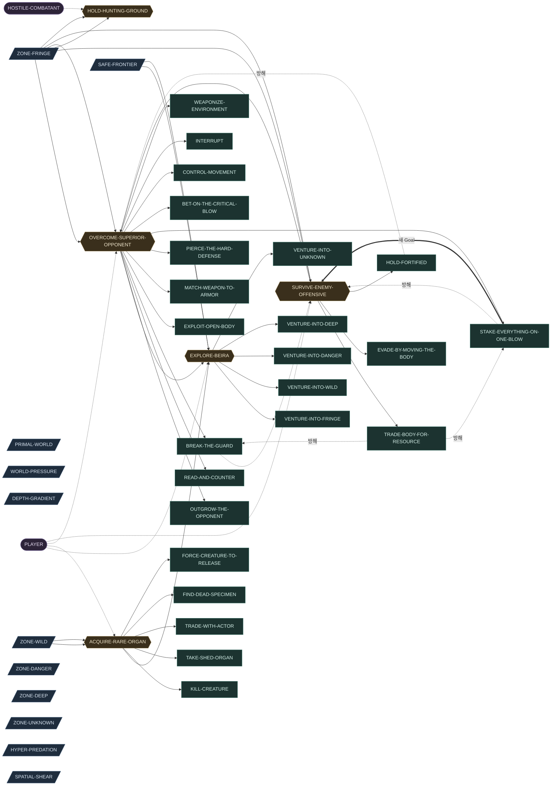

# Master Graph — 스냅샷

> **이 파일은 생성물이다.** 손으로 고치지 않는다 — `npm run master:graph` 가 다시 만든다.
> 원본은 `graph/*.yaml` 과 `constraints/DC-*.yaml` 이다.
> 인터랙티브 관찰(필터 · 서브그래프 · 상세)은 같은 명령이 만드는 `graph-view.html` 을 연다.

노드 86 — WorldState 11 · Actor 2 · Goal 5 · Possibility 24 · Capability 42 · Knowledge 2

Capability 구현 상태 — ■ IMPLEMENTED 7 · ▨ PARTIAL 2 · □ MISSING 33

## 인과 뼈대 — WorldState → Goal → Possibility

세계의 사정이 Goal 을 만들고, 각 Goal 은 여러 Possibility 로 갈린다 (OR).

## 갈래별 준비도 — 어느 경로가 세계에 가장 가까운가

요구 Capability 중 이미 세계에 있는 것의 비율. `IMPLEMENTED` 1.0 · `PARTIAL` 0.5 로 센다.

| Possibility | 달성 Goal | 준비도 | 아직 없는 요구 |
|---|---|---:|---|
| `MATCH-WEAPON-TO-ARMOR` | OVERCOME-SUPERIOR-OPPONENT | ●●●●● 2/2 | 없음 |
| `OUTGROW-THE-OPPONENT` | OVERCOME-SUPERIOR-OPPONENT | ●●●●○ 4/5 | CP-ECONOMY |
| `TRADE-BODY-FOR-RESOURCE` | SURVIVE-ENEMY-OFFENSIVE | ●●●●○ 3/4 | CP-ECONOMY |
| `PIERCE-THE-HARD-DEFENSE` | OVERCOME-SUPERIOR-OPPONENT | ●●●●○ 3/4 | PENETRATION |
| `BET-ON-THE-CRITICAL-BLOW` | OVERCOME-SUPERIOR-OPPONENT | ●●●○○ 2/3 | CRITICAL-STRIKE |
| `BREAK-THE-GUARD` | OVERCOME-SUPERIOR-OPPONENT | ●●●○○ 1/3 | BREAK · CP-ECONOMY |
| `EXPLOIT-OPEN-BODY` | OVERCOME-SUPERIOR-OPPONENT | ●●●○○ 1/3 | COMBAT-FLOW · COMBAT-CAUSE-READING |
| `READ-AND-COUNTER` | OVERCOME-SUPERIOR-OPPONENT | ●●○○○ 1/4 | PERFECT-GUARD · COUNTER · CP-ECONOMY |
| `HOLD-FORTIFIED` | SURVIVE-ENEMY-OFFENSIVE | ●●○○○ 1/4 | FORTIFY · COMBAT-FLOW · CP-ECONOMY |
| `EVADE-BY-MOVING-THE-BODY` | SURVIVE-ENEMY-OFFENSIVE | ●○○○○ 0/2 | EVADE · CP-ECONOMY |
| `STAKE-EVERYTHING-ON-ONE-BLOW` | OVERCOME-SUPERIOR-OPPONENT | ●○○○○ 0/4 | VOW · COMBAT-FLOW · CP-ECONOMY · CONDITION-STACKING |
| `CONTROL-MOVEMENT` | OVERCOME-SUPERIOR-OPPONENT | ○○○○○ 0/3 | FORCE-MOVEMENT · CONTROL-SPACE · REPOSITION |
| `INTERRUPT` | OVERCOME-SUPERIOR-OPPONENT | ○○○○○ 0/1 | INTERRUPT |
| `WEAPONIZE-ENVIRONMENT` | OVERCOME-SUPERIOR-OPPONENT | ○○○○○ 0/2 | READ-ENVIRONMENT · USE-HAZARD |
| `VENTURE-INTO-FRINGE` | EXPLORE-BEIRA | ○○○○○ 0/3 | OBSERVE · PREDICT · USE-TERRAIN |
| `VENTURE-INTO-WILD` | EXPLORE-BEIRA | ○○○○○ 0/4 | BREAK · DISCOVER-WEAKNESS · PRECISE-TARGETING · CONTROL-SPACE |
| `VENTURE-INTO-DANGER` | EXPLORE-BEIRA | ○○○○○ 0/4 | READ-ENVIRONMENT · FORCE-MOVEMENT · USE-HAZARD · INTERRUPT |
| `VENTURE-INTO-DEEP` | EXPLORE-BEIRA | ○○○○○ 0/5 | DISCOVER-WEAKNESS · DISRUPT-ABILITY · MAINTAIN-PRESSURE · TARGET-SPECIFIC-PART · READ-CREATURE-SYSTEM |
| `VENTURE-INTO-UNKNOWN` | EXPLORE-BEIRA | ○○○○○ 0/6 | PROTECT-PERCEPTION · VERIFY-REALITY · IDENTITY-ANCHOR · RESIST-INFLUENCE · BREAK-BIOLOGICAL-LINK · ESCAPE-ALTERED-SPACE |
| `KILL-CREATURE` | ACQUIRE-RARE-ORGAN | 요구 미기재 | 없음 |
| `TAKE-SHED-ORGAN` | ACQUIRE-RARE-ORGAN | 요구 미기재 | 없음 |
| `TRADE-WITH-ACTOR` | ACQUIRE-RARE-ORGAN | 요구 미기재 | 없음 |
| `FIND-DEAD-SPECIMEN` | ACQUIRE-RARE-ORGAN | 요구 미기재 | 없음 |
| `FORCE-CREATURE-TO-RELEASE` | ACQUIRE-RARE-ORGAN | 요구 미기재 | 없음 |

## 요구 그물 — Possibility → Capability (AND)

한 Possibility 가 성립하려면 이어진 Capability 가 **전부** 있어야 한다.

```mermaid
flowchart LR
  MC-COMBAT-STRIKE["■ COMBAT-STRIKE"]
  MC-CP-ECONOMY["▨ CP-ECONOMY"]
  MC-BODY-FACING["■ BODY-FACING"]
  MC-COMBAT-CAUSE-READING["▨ COMBAT-CAUSE-READING"]
  MC-GUARD["■ GUARD"]
  MC-PERFECT-GUARD["□ PERFECT-GUARD"]
  MC-COUNTER["□ COUNTER"]
  MC-DEFENSE-MITIGATION["■ DEFENSE-MITIGATION"]
  MC-ATTACK-POWER["■ ATTACK-POWER"]
  MC-SKILL-SCALING["■ SKILL-SCALING"]
  MC-EVADE["□ EVADE"]
  MC-BREAK["□ BREAK"]
  MC-CRITICAL-STRIKE["□ CRITICAL-STRIKE"]
  MC-COMBAT-FLOW["□ COMBAT-FLOW"]
  MC-FORTIFY["□ FORTIFY"]
  MC-ATTACK-ARMOR-MATCHUP["■ ATTACK-ARMOR-MATCHUP"]
  MC-PENETRATION["□ PENETRATION"]
  MC-CONDITION-STACKING["□ CONDITION-STACKING"]
  MC-VOW["□ VOW"]
  MC-REPOSITION["□ REPOSITION"]
  MC-OBSERVE["□ OBSERVE"]
  MC-PREDICT["□ PREDICT"]
  MC-USE-TERRAIN["□ USE-TERRAIN"]
  MC-DISCOVER-WEAKNESS["□ DISCOVER-WEAKNESS"]
  MC-PRECISE-TARGETING["□ PRECISE-TARGETING"]
  MC-CONTROL-SPACE["□ CONTROL-SPACE"]
  MC-READ-ENVIRONMENT["□ READ-ENVIRONMENT"]
  MC-FORCE-MOVEMENT["□ FORCE-MOVEMENT"]
  MC-USE-HAZARD["□ USE-HAZARD"]
  MC-INTERRUPT["□ INTERRUPT"]
  MC-DISRUPT-ABILITY["□ DISRUPT-ABILITY"]
  MC-MAINTAIN-PRESSURE["□ MAINTAIN-PRESSURE"]
  MC-TARGET-SPECIFIC-PART["□ TARGET-SPECIFIC-PART"]
  MC-READ-CREATURE-SYSTEM["□ READ-CREATURE-SYSTEM"]
  MC-PROTECT-PERCEPTION["□ PROTECT-PERCEPTION"]
  MC-VERIFY-REALITY["□ VERIFY-REALITY"]
  MC-IDENTITY-ANCHOR["□ IDENTITY-ANCHOR"]
  MC-RESIST-INFLUENCE["□ RESIST-INFLUENCE"]
  MC-BREAK-BIOLOGICAL-LINK["□ BREAK-BIOLOGICAL-LINK"]
  MC-ESCAPE-ALTERED-SPACE["□ ESCAPE-ALTERED-SPACE"]
  MP-OUTGROW-THE-OPPONENT["OUTGROW-THE-OPPONENT"]
  MP-READ-AND-COUNTER["READ-AND-COUNTER"]
  MP-BREAK-THE-GUARD["BREAK-THE-GUARD"]
  MP-EXPLOIT-OPEN-BODY["EXPLOIT-OPEN-BODY"]
  MP-MATCH-WEAPON-TO-ARMOR["MATCH-WEAPON-TO-ARMOR"]
  MP-PIERCE-THE-HARD-DEFENSE["PIERCE-THE-HARD-DEFENSE"]
  MP-STAKE-EVERYTHING-ON-ONE-BLOW["STAKE-EVERYTHING-ON-ONE-BLOW"]
  MP-TRADE-BODY-FOR-RESOURCE["TRADE-BODY-FOR-RESOURCE"]
  MP-EVADE-BY-MOVING-THE-BODY["EVADE-BY-MOVING-THE-BODY"]
  MP-HOLD-FORTIFIED["HOLD-FORTIFIED"]
  MP-BET-ON-THE-CRITICAL-BLOW["BET-ON-THE-CRITICAL-BLOW"]
  MP-CONTROL-MOVEMENT["CONTROL-MOVEMENT"]
  MP-INTERRUPT["INTERRUPT"]
  MP-WEAPONIZE-ENVIRONMENT["WEAPONIZE-ENVIRONMENT"]
  MP-VENTURE-INTO-FRINGE["VENTURE-INTO-FRINGE"]
  MP-VENTURE-INTO-WILD["VENTURE-INTO-WILD"]
  MP-VENTURE-INTO-DANGER["VENTURE-INTO-DANGER"]
  MP-VENTURE-INTO-DEEP["VENTURE-INTO-DEEP"]
  MP-VENTURE-INTO-UNKNOWN["VENTURE-INTO-UNKNOWN"]

  MP-OUTGROW-THE-OPPONENT --> MC-ATTACK-POWER
  MP-OUTGROW-THE-OPPONENT --> MC-SKILL-SCALING
  MP-OUTGROW-THE-OPPONENT --> MC-DEFENSE-MITIGATION
  MP-OUTGROW-THE-OPPONENT --> MC-COMBAT-STRIKE
  MP-OUTGROW-THE-OPPONENT --> MC-CP-ECONOMY
  MP-READ-AND-COUNTER --> MC-GUARD
  MP-READ-AND-COUNTER --> MC-PERFECT-GUARD
  MP-READ-AND-COUNTER --> MC-COUNTER
  MP-READ-AND-COUNTER --> MC-CP-ECONOMY
  MP-BREAK-THE-GUARD --> MC-BREAK
  MP-BREAK-THE-GUARD --> MC-COMBAT-STRIKE
  MP-BREAK-THE-GUARD --> MC-CP-ECONOMY
  MP-EXPLOIT-OPEN-BODY --> MC-COMBAT-FLOW
  MP-EXPLOIT-OPEN-BODY --> MC-COMBAT-STRIKE
  MP-EXPLOIT-OPEN-BODY --> MC-COMBAT-CAUSE-READING
  MP-MATCH-WEAPON-TO-ARMOR --> MC-ATTACK-ARMOR-MATCHUP
  MP-MATCH-WEAPON-TO-ARMOR --> MC-COMBAT-STRIKE
  MP-PIERCE-THE-HARD-DEFENSE --> MC-PENETRATION
  MP-PIERCE-THE-HARD-DEFENSE --> MC-ATTACK-ARMOR-MATCHUP
  MP-PIERCE-THE-HARD-DEFENSE --> MC-DEFENSE-MITIGATION
  MP-PIERCE-THE-HARD-DEFENSE --> MC-COMBAT-STRIKE
  MP-STAKE-EVERYTHING-ON-ONE-BLOW --> MC-VOW
  MP-STAKE-EVERYTHING-ON-ONE-BLOW --> MC-COMBAT-FLOW
  MP-STAKE-EVERYTHING-ON-ONE-BLOW --> MC-CP-ECONOMY
  MP-STAKE-EVERYTHING-ON-ONE-BLOW --> MC-CONDITION-STACKING
  MP-TRADE-BODY-FOR-RESOURCE --> MC-GUARD
  MP-TRADE-BODY-FOR-RESOURCE --> MC-DEFENSE-MITIGATION
  MP-TRADE-BODY-FOR-RESOURCE --> MC-CP-ECONOMY
  MP-TRADE-BODY-FOR-RESOURCE --> MC-BODY-FACING
  MP-EVADE-BY-MOVING-THE-BODY --> MC-EVADE
  MP-EVADE-BY-MOVING-THE-BODY --> MC-CP-ECONOMY
  MP-HOLD-FORTIFIED --> MC-FORTIFY
  MP-HOLD-FORTIFIED --> MC-DEFENSE-MITIGATION
  MP-HOLD-FORTIFIED --> MC-COMBAT-FLOW
  MP-HOLD-FORTIFIED --> MC-CP-ECONOMY
  MP-BET-ON-THE-CRITICAL-BLOW --> MC-CRITICAL-STRIKE
  MP-BET-ON-THE-CRITICAL-BLOW --> MC-COMBAT-STRIKE
  MP-BET-ON-THE-CRITICAL-BLOW --> MC-ATTACK-POWER
  MP-CONTROL-MOVEMENT --> MC-FORCE-MOVEMENT
  MP-CONTROL-MOVEMENT --> MC-CONTROL-SPACE
  MP-CONTROL-MOVEMENT --> MC-REPOSITION
  MP-INTERRUPT --> MC-INTERRUPT
  MP-WEAPONIZE-ENVIRONMENT --> MC-READ-ENVIRONMENT
  MP-WEAPONIZE-ENVIRONMENT --> MC-USE-HAZARD
  MP-VENTURE-INTO-FRINGE --> MC-OBSERVE
  MP-VENTURE-INTO-FRINGE --> MC-PREDICT
  MP-VENTURE-INTO-FRINGE --> MC-USE-TERRAIN
  MP-VENTURE-INTO-WILD --> MC-BREAK
  MP-VENTURE-INTO-WILD --> MC-DISCOVER-WEAKNESS
  MP-VENTURE-INTO-WILD --> MC-PRECISE-TARGETING
  MP-VENTURE-INTO-WILD --> MC-CONTROL-SPACE
  MP-VENTURE-INTO-DANGER --> MC-READ-ENVIRONMENT
  MP-VENTURE-INTO-DANGER --> MC-FORCE-MOVEMENT
  MP-VENTURE-INTO-DANGER --> MC-USE-HAZARD
  MP-VENTURE-INTO-DANGER --> MC-INTERRUPT
  MP-VENTURE-INTO-DEEP --> MC-DISCOVER-WEAKNESS
  MP-VENTURE-INTO-DEEP --> MC-DISRUPT-ABILITY
  MP-VENTURE-INTO-DEEP --> MC-MAINTAIN-PRESSURE
  MP-VENTURE-INTO-DEEP --> MC-TARGET-SPECIFIC-PART
  MP-VENTURE-INTO-DEEP --> MC-READ-CREATURE-SYSTEM
  MP-VENTURE-INTO-UNKNOWN --> MC-PROTECT-PERCEPTION
  MP-VENTURE-INTO-UNKNOWN --> MC-VERIFY-REALITY
  MP-VENTURE-INTO-UNKNOWN --> MC-IDENTITY-ANCHOR
  MP-VENTURE-INTO-UNKNOWN --> MC-RESIST-INFLUENCE
  MP-VENTURE-INTO-UNKNOWN --> MC-BREAK-BIOLOGICAL-LINK
  MP-VENTURE-INTO-UNKNOWN --> MC-ESCAPE-ALTERED-SPACE

  classDef impl fill:#16351f,stroke:#3f8a52,color:#d8f2df;
  classDef part fill:#3a3315,stroke:#9a8a2e,color:#f2ecd0;
  classDef miss fill:#2a2a2e,stroke:#5c5c66,color:#b8b8c2;
  classDef poss fill:#1c3330,stroke:#3f7d6f,color:#d6f0e9;
  class MC-COMBAT-STRIKE,MC-BODY-FACING,MC-GUARD,MC-DEFENSE-MITIGATION,MC-ATTACK-POWER,MC-SKILL-SCALING,MC-ATTACK-ARMOR-MATCHUP impl;
  class MC-CP-ECONOMY,MC-COMBAT-CAUSE-READING part;
  class MC-PERFECT-GUARD,MC-COUNTER,MC-EVADE,MC-BREAK,MC-CRITICAL-STRIKE,MC-COMBAT-FLOW,MC-FORTIFY,MC-PENETRATION,MC-CONDITION-STACKING,MC-VOW,MC-REPOSITION,MC-OBSERVE,MC-PREDICT,MC-USE-TERRAIN,MC-DISCOVER-WEAKNESS,MC-PRECISE-TARGETING,MC-CONTROL-SPACE,MC-READ-ENVIRONMENT,MC-FORCE-MOVEMENT,MC-USE-HAZARD,MC-INTERRUPT,MC-DISRUPT-ABILITY,MC-MAINTAIN-PRESSURE,MC-TARGET-SPECIFIC-PART,MC-READ-CREATURE-SYSTEM,MC-PROTECT-PERCEPTION,MC-VERIFY-REALITY,MC-IDENTITY-ANCHOR,MC-RESIST-INFLUENCE,MC-BREAK-BIOLOGICAL-LINK,MC-ESCAPE-ALTERED-SPACE miss;
  class MP-OUTGROW-THE-OPPONENT,MP-READ-AND-COUNTER,MP-BREAK-THE-GUARD,MP-EXPLOIT-OPEN-BODY,MP-MATCH-WEAPON-TO-ARMOR,MP-PIERCE-THE-HARD-DEFENSE,MP-STAKE-EVERYTHING-ON-ONE-BLOW,MP-TRADE-BODY-FOR-RESOURCE,MP-EVADE-BY-MOVING-THE-BODY,MP-HOLD-FORTIFIED,MP-BET-ON-THE-CRITICAL-BLOW,MP-CONTROL-MOVEMENT,MP-INTERRUPT,MP-WEAPONIZE-ENVIRONMENT,MP-VENTURE-INTO-FRINGE,MP-VENTURE-INTO-WILD,MP-VENTURE-INTO-DANGER,MP-VENTURE-INTO-DEEP,MP-VENTURE-INTO-UNKNOWN poss;
```

## Constraint — 무엇이 걸러지는가

Constraint 는 단계가 아니라 각 선택 지점의 Filter 다. 아래는 어떤 노드가 어떤 원칙 아래 있는지다.

| Constraint | Scope | 상태 | 걸린 노드 | 한 문장 |
|---|---|---|---:|---|
| `COMBAT-MATCHUP-SOFT` | COMBAT | APPROVED | 2 | 공격 형태와 방어 형태의 상성은 선택을 만들되 결과를 지배하지 않는다. 상성은 별도 피해 배율이 아니라 대응 공격·방어 능력치의 차이로 표현한다. |
| `COMBAT-ONE-FORMULA` | COMBAT | APPROVED | 3 | 전투에는 하나의 기반 피해 공식만 존재한다. 새로운 전투 시스템은 새로운 피해 공식을 만들지 않고, 기존 공식의 입력값이나 결과값에 한 가지 의미만 더한다. |
| `COMBAT-ONE-LAYER-AT-A-TIME` | COMBAT | APPROVED | 0 | 전투 시스템은 한 번에 한 층만 추가하며, 현재 층이 플레이로 검증되기 전에는 다음 층을 올리지 않는다. 각 층은 아래 층 없이도 완전히 동작하는 상태를 유지한다. |
| `COMBAT-PLAYER-CAUSALITY` | COMBAT | REVISED | 26 | 전투의 중요한 결과는 관찰 가능한 세계 상태와 플레이어의 선택·행동에서 나오며, 같은 상태·같은 조건·같은 행동이면 언제나 같은 결과가 나온다. 단 하나의 예외로, Critical 은 확률 판정을 허용한다 — 그 경우에도 발생 확률과 증폭 결과는 관찰로 읽을 수 있어야 한다. |
| `COMBAT-SHARED-BUDGET` | COMBAT | APPROVED | 6 | 전투 행동은 하나의 공통 기력(CP) 예산을 나눠 쓴다. 행동별 전용 게이지를 신설하지 않는다. |
| `GROWTH-CLASS-ORIGIN-TRACE` | GROWTH | APPROVED | 0 | Class 는 세계와 Actor 가 상호작용한 결과다. 모든 Class 는 하나 이상의 origin_trace(WorldState → Goal → Possibility)를 가지며, 그 Class 를 제거해도 원인이 된 세계 요소는 독립적으로 성립해야 한다. |
| `GROWTH-DEFINITION-INSTANCE-SPLIT` | GROWTH | APPROVED | 0 | Master 는 유한한 Definition(Class · Item Type · Property · Modifier · 조합 규칙)만 소유한다. 실제 생성된 Item Instance(II-*)와 조합 결과는 Runtime World 가 소유하며, 가능한 조합을 사전에 Node 로 생성하지 않는다. |
| `GROWTH-GOAL-FIRST` | GROWTH | APPROVED | 0 | 성장(새 Class · Item · Capability 의 획득) 자체를 Goal 로 세우지 않는다. 성장은 Actor 의 현재 Goal 을 현재 Capability 로 달성하기 어려울 때, 그 Goal 을 달성하는 하나의 Possibility 로만 성립한다. |
| `GROWTH-NEED-FROM-POSSIBILITY` | GROWTH | APPROVED | 0 | Class 와 Item 은 Capability 를 획득하는 세계 내 경로일 뿐이다. Capability 의 필요성은 항상 기존 Master 인과(Goal → Possibility --requires-->)에서 나오며, Class 나 Item 이 존재한다는 이유로 Capability 를 만들지 않는다. |
| `GROWTH-NO-CAPABILITY-DUPLICATION` | GROWTH | APPROVED | 0 | 같은 플레이 의미의 Capability 를 획득 Source(Class / Item / Actor)별로 복제하지 않는다. 하나의 MC-* 에 여러 획득 경로가 grants 로 연결된다. |
| `GROWTH-NOT-A-STAGE` | GROWTH | APPROVED | 0 | Growth 는 별도 Master Stage 가 아니다. 기본 절차 WHY → OPTIONS → NEED → NEXT 는 그대로 유지되고, Growth Graph 는 NEED 에서 발견된 Capability 에 대해 "세계에서 어떻게 얻는가"를 덧씌우는 보조 Overlay 로만 존재한다. |
| `WORLD-COMBAT-IS-ONE-POSSIBILITY` | WORLD | APPROVED | 7 | Creature 의 발견·존재만으로 처치 Goal 을 만들지 않는다. Goal 은 WorldState (자원을 지킨다 · 길을 막는다 · 사냥한다 · 기관이 필요하다)에서 발생하며, 전투는 그 Goal 을 달성하는 Possibility 중 하나로만 성립한다. |
| `WORLD-CREATURE-FROM-PRESSURE` | WORLD | APPROVED | 1 | 전투 Creature 를 먼저 만들지 않는다. Creature 의 Capability 는 세계압이 만든 환경과 생존 압력에 대한 적응의 결과이며, Player 의 Capability Requirement 는 그 Creature 와의 조우가 만든 Goal 과 Combat Possibility 에서만 파생된다. |
| `WORLD-OWNS-THE-SURFACE-LIST` | GLOBAL | APPROVED | 0 | 무엇을 할 수 있고 그 값이 어디까지 허용되는지의 목록은 세계가 소유하고 관찰 결과에 실어 보낸다. 관찰자(View)는 그 목록을 스스로 만들지 않는다. |
| `WORLD-PLAYER-UNFIXED-PATH` | WORLD | APPROVED | 1 | Player 의 역할·Class·진영·전투 방식과 탐험의 이유를 하나로 고정하지 않는다. Root Goal(베이라를 탐험한다) 아래의 Local Goal 은 Actor 와 상황마다 발견된 세계 상태로부터 생성된다. |
| `WORLD-PROGRESSION-IS-REACH` | WORLD | APPROVED | 6 | Progression 의 핵심은 수치 Level 의 상승이 아니라, 관찰과 이해로 대응 방법을 발견하고 Capability 와 Resource 를 얻어 이전에는 갈 수 없던 세계 범위에 도달하게 되는 확장이다. |
| `WORLD-RESOURCE-ADAPTATION-TRACE` | WORLD | APPROVED | 2 | 중요한 베이라 Resource 는 World Pressure → Environment → Survival Pressure → Adaptation → Special Property → Resource 의 인과 Trace 로 설명할 수 있어야 하며, 좋은 아이템을 위험한 곳에 배치하는 방향으로 만들지 않는다. |

## 구멍 — 아직 채워지지 않은 자리

빈 인과 필드다. 지어내지 않은 자리이며, 다음에 무엇을 물어야 하는지를 가리킨다.

| 빈 필드 | 개수 | 노드 |
|---|---:|---|
| `changed_by` | 11 | PRIMAL-WORLD · WORLD-PRESSURE · SAFE-FRONTIER · DEPTH-GRADIENT · ZONE-FRINGE · ZONE-WILD · ZONE-DANGER · ZONE-DEEP · ZONE-UNKNOWN · HYPER-PREDATION · SPATIAL-SHEAR |
| `causes` | 8 | PRIMAL-WORLD · WORLD-PRESSURE · DEPTH-GRADIENT · ZONE-DANGER · ZONE-DEEP · ZONE-UNKNOWN · HYPER-PREDATION · SPATIAL-SHEAR |
| `belief_context` | 5 | EXPLORE-BEIRA · ACQUIRE-RARE-ORGAN · OVERCOME-SUPERIOR-OPPONENT · SURVIVE-ENEMY-OFFENSIVE · HOLD-HUNTING-GROUND |
| `requires.capabilities` | 5 | KILL-CREATURE · TAKE-SHED-ORGAN · TRADE-WITH-ACTOR · FIND-DEAD-SPECIMEN · FORCE-CREATURE-TO-RELEASE |
| `knows` | 2 | PLAYER · HOSTILE-COMBATANT |
| `believes` | 2 | PLAYER · HOSTILE-COMBATANT |
| `required_by` | 2 | RESTORE-BIOLOGICAL-STATE · CUT-ABNORMAL-STRUCTURE |
| `motivation` | 2 | EXPLORE-BEIRA · HOLD-HUNTING-GROUND |

## 정합성 — `npm run master:graph:check` 가 잡은 것

- **WARN** `ORPHAN_CAPABILITY` — MC-RESTORE-BIOLOGICAL-STATE 를 요구하는 Possibility 가 없다 — 왜 필요한지 경로가 설명하지 못한다
- **WARN** `ORPHAN_CAPABILITY` — MC-CUT-ABNORMAL-STRUCTURE 를 요구하는 Possibility 가 없다 — 왜 필요한지 경로가 설명하지 못한다
