# Master Graph — 스냅샷

> **이 파일은 생성물이다.** 손으로 고치지 않는다 — `npm run master:graph` 가 다시 만든다.
> 원본은 `graph/*.yaml` 과 `constraints/DC-*.yaml` 이다.
> 인터랙티브 관찰(필터 · 서브그래프 · 상세)은 같은 명령이 만드는 `graph-view.html` 을 연다.

노드 160 — WorldState 30 · Actor 2 · Goal 6 · Possibility 33 · Capability 84 · Knowledge 5

Capability 구현 상태 — ■ IMPLEMENTED 18 · ▨ PARTIAL 8 · □ MISSING 58

## 세계 인과 척추 — arises_from

어떤 상태가 어떤 상태를 낳았는가. `→ Goal` 은 그 상태가 발생시키는 Goal(`causes`)이다.

```text
PRIMAL-WORLD
  WORLD-PRESSURE
    FREE-PRESSURE
      DEPTH-GRADIENT
        ZONE-FRINGE  → Goal: OVERCOME-SUPERIOR-OPPONENT · SURVIVE-ENEMY-OFFENSIVE · HOLD-HUNTING-GROUND
        ZONE-WILD  → Goal: ACQUIRE-RARE-ORGAN
        ZONE-DANGER
        ZONE-DEEP
        ZONE-UNKNOWN
      HYPER-PREDATION
      SPATIAL-SHEAR
      MACRO-TERRAIN
        TERRAIN-CIRCULATION  → Goal: EXPLORE-BEIRA
          SHAPED-LANDFORM
            SURVIVAL-PRESSURE
              ADAPTED-LIFE
                TERRAIN-RESOURCE
              TERRAIN-RESOURCE
          SURVIVAL-PRESSURE
          NATURAL-REFUGE
            NATURAL-SETTLEMENT
          CIRCULATION-EVIDENCE
        TERRAIN-BAIWANG-BASIN  → Goal: EXPLORE-BEIRA
        TERRAIN-SUNEATER-ICEFIELD
        TERRAIN-NAME-EATING-FOREST  → Goal: RESCUE-THE-TAKEN
        TERRAIN-BREATHLESS-SEA  → Goal: RESCUE-THE-TAKEN
        TERRAIN-SKYFALL-RANGE  → Goal: RESCUE-THE-TAKEN
        TERRAIN-WALKING-CONTINENTS
        TERRAIN-UNHAPPENED-DESERT
        TERRAIN-BLOODBLOOM-FOREST  → Goal: RESCUE-THE-TAKEN
    BOUND-PRESSURE
      SAFE-FRONTIER  → Goal: EXPLORE-BEIRA
      MACRO-TERRAIN
```

## 척추 — 어떤 전체의 조각인가 (part_of)

Capability 는 시스템(전체)의 조각이다. 시스템과 그 안의 자리(층·칸)의 단일 출처는
`graph/systems.yaml` 이다. **점선 테두리 = 잠정(grounded: false)** — 근거 문서가
이름만 대서, 그 전체의 설계 문서가 서면 semantic 을 개정한다.

### 전투 사다리 — R1 §14 · §15 · DT · UL §0 · §1 (위 두 칸의 설계)

전투 Capability 가 쌓이는 층 구조. 아래층이 서야 위층이 의미를 갖는다. 층에 속하지 않는 조각(기력 예산 · 능력치 축 · 계산 경위 관찰 · 공간 판정)은 모든 층이 공유하는 바닥이다 — segment 없이 이 시스템에 속한다.

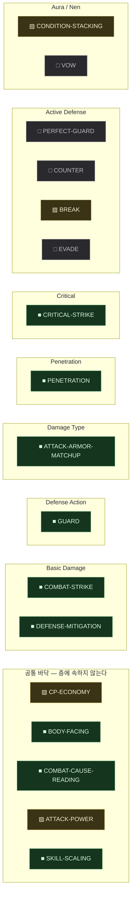

### 능동 방어 — UL §4~§10 · §42 F1~F3

공격이 자신에게 닿는 순간 무엇을 할 수 있는가의 자리들. R1 이 이름만 댔던 전투 사다리의 ACTIVE-DEFENSE 칸 안을 UL 이 열어 셋으로 나눴다. 막기 · 피하기 · 받아넘기기 · 되받아치기를 각각의 시스템으로 만들지 않는다 — 전부 하나의 응답이라는 공통 구조를 쓰고, 무엇이 일어나는지는 그 자리에 무엇을 끼웠는가가 정한다 (UL §4.1).

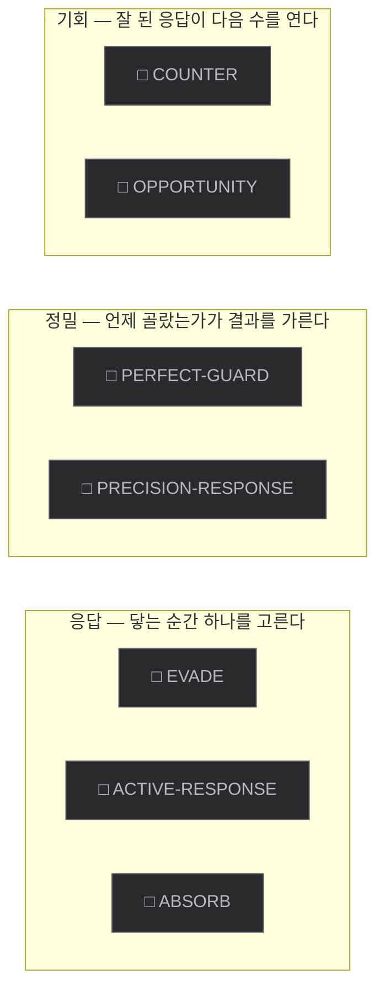

### 기력 배분과 계약 — UL §11~§24 · §42 F4~F7

개인의 능력이 어떤 규칙으로 작동하는지를 바꾸는 최상층. R1 이 이름만 댔던 전투 사다리의 AURA-NEN 칸 안을 UL 이 열어 넷으로 나눴다. 새로운 피해 타입이 아니라, 지금 힘을 어디에 몰아 두었고 어떤 조건과 제약 아래 쓰는가가 **무엇을 할 수 있는가** 자체를 바꾸는 자리다 (UL §11). 마지막 자리(세계 조작)가 이 층의 실제 확장 공간이며, UL §22 가 그 지도를 열두 영역(생명 · 위치 · 행동 · 관계 · 대상 · 정보 · 자원 · 피해 · 개체 · Skill · 영역 · 시간)으로 그려 두었다. 처음 여는 것은 그중 다섯뿐이다 (UL §42 F7).

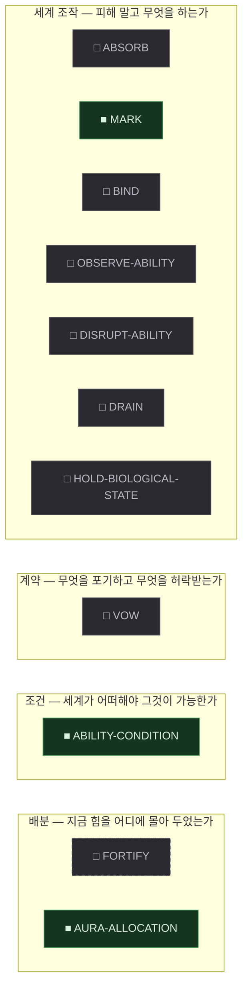

### 베이라 층 사다리 — BW §19~§25

세계의 깊이 층. 층마다 살아남기 위해 요구하는 대응이 다르다 — 각 층의 요구는 MW-ZONE-* 의 demands 가 거울이다. BW 는 층마다 이름과 "필요:" 목록만 공급하므로 이 사다리에 속한 조각 대부분은 grounded: false 다. 대지형(MS-BEIRA-TERRAIN)과 **직교한다** (HISTORY Q47(a)) — 어느 땅이든 그 안에서 깊어질 수 있고, 한 지역은 "어느 대지형의 어느 깊이" 를 함께 가진다.

```mermaid
flowchart TB
  subgraph SEG0 ["UNKNOWN"]
    N0["□ PROTECT-PERCEPTION"]
    N1["□ VERIFY-REALITY"]
    N2["□ IDENTITY-ANCHOR"]
    N3["□ RESIST-INFLUENCE"]
    N4["□ BREAK-BIOLOGICAL-LINK"]
    N5["□ ESCAPE-ALTERED-SPACE"]
  end
  subgraph SEG1 ["DEEP"]
    N6["□ DISCOVER-WEAKNESS"]
    N7["□ DISRUPT-ABILITY"]
    N8["□ MAINTAIN-PRESSURE"]
    N9["□ TARGET-SPECIFIC-PART"]
    N10["□ READ-CREATURE-SYSTEM"]
  end
  subgraph SEG2 ["DANGER"]
    N11["□ READ-ENVIRONMENT"]
    N12["▨ FORCE-MOVEMENT"]
    N13["□ USE-HAZARD"]
    N14["■ INTERRUPT"]
  end
  subgraph SEG3 ["WILD"]
    N15["▨ BREAK"]
    N16["□ DISCOVER-WEAKNESS"]
    N17["□ PRECISE-TARGETING"]
    N18["□ CONTROL-SPACE"]
  end
  subgraph SEG4 ["FRINGE"]
    N19["□ USE-TERRAIN"]
  end
  subgraph SEG5 ["SAFE FRONTIER"]
    N20["■ COMBAT-STRIKE"]
    N21["■ GUARD"]
    N22["□ EVADE"]
    N23["▨ REPOSITION"]
  end
  SEG0 ~~~ SEG1
  SEG1 ~~~ SEG2
  SEG2 ~~~ SEG3
  SEG3 ~~~ SEG4
  SEG4 ~~~ SEG5

  classDef impl fill:#16351f,stroke:#3f8a52,color:#d8f2df;
  classDef part fill:#3a3315,stroke:#9a8a2e,color:#f2ecd0;
  classDef miss fill:#2a2a2e,stroke:#5c5c66,color:#b8b8c2;
  classDef implS fill:#16351f,stroke:#3f8a52,color:#d8f2df,stroke-dasharray:5 4;
  classDef partS fill:#3a3315,stroke:#9a8a2e,color:#f2ecd0,stroke-dasharray:5 4;
  classDef missS fill:#2a2a2e,stroke:#5c5c66,color:#b8b8c2,stroke-dasharray:5 4;
  class N14,N20,N21 impl;
  class N7,N22 miss;
  class N12,N15,N23 partS;
  class N0,N1,N2,N3,N4,N5,N6,N8,N9,N10,N11,N13,N16,N17,N18,N19 missS;
```

### 앎의 사슬 — BW §32 (관찰 → 이해 → 대응 → 도달)

정보가 관문 뒤에 있고, 플레이어가 대가를 치러 아는 범위를 넓히는 진행 구조. 관찰이 "지금 무엇인가" 를, 예측이 "다음에 무엇을 하는가" 를 연다.

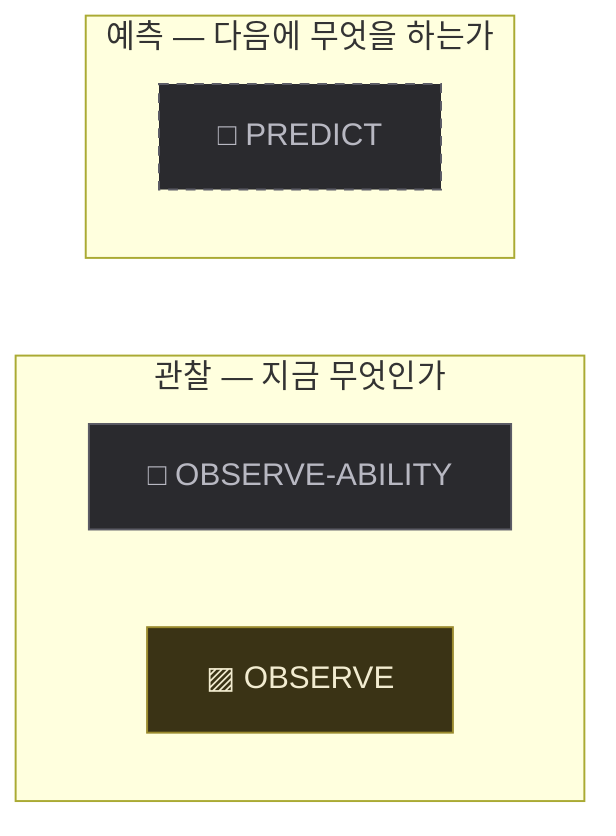

### 자원 유래 Capability Gate — BW §8~§10 · §17

탐험 → 자원 → 능력 → 더 깊은 탐험의 순환. 세계가 만든 적응을 자원으로 가져와 전에는 감당할 수 없던 층을 감당하게 한다.

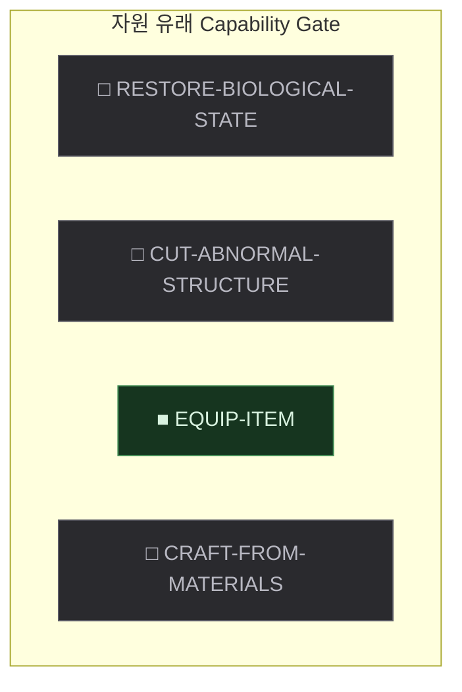

### 지목 — TG (content/proto-adventure/design/Design-Targeting-R0.md)

어느 층에도 속하지 않는 자리 — "지금 누구에게 하는가" 를 세계에 둔다.

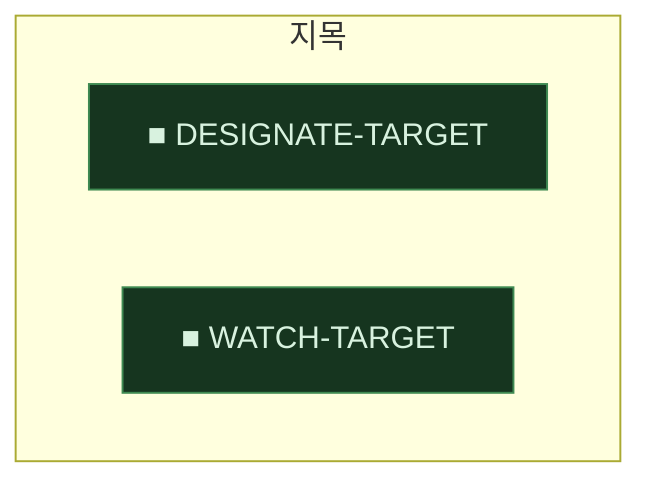

### 관계 태도 — BW §21 · §26

존재와 존재 사이의 태도(적대·중립·우호)가 세계의 사실로 있고, 칠 수 있는가와 자율 존재가 다가온 것을 어떻게 대하는가를 가른다.

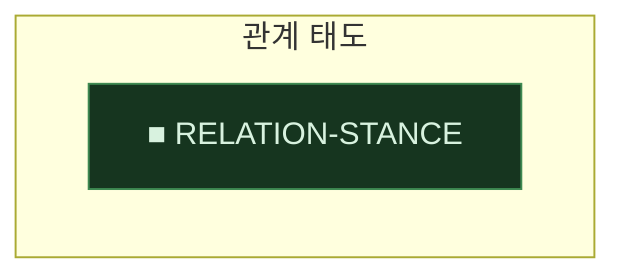

### 자율 존재 행동 — content/proto-adventure/design/Design-Creature-Behavior-R0.md (초안 — Human 승인 대기) · **DRAFT**

목적(Drive) · 영역 · 인지 · 국면 — 자율 존재가 자기 목적으로 움직이는 시스템. 이것이 서야 예측(MC-PREDICT)의 읽을 거리와 습성 관찰(MC-OBSERVE 의 남은 결손)이 생긴다 — 그 두 조각의 반쪽을 이 시스템이 소유한다.

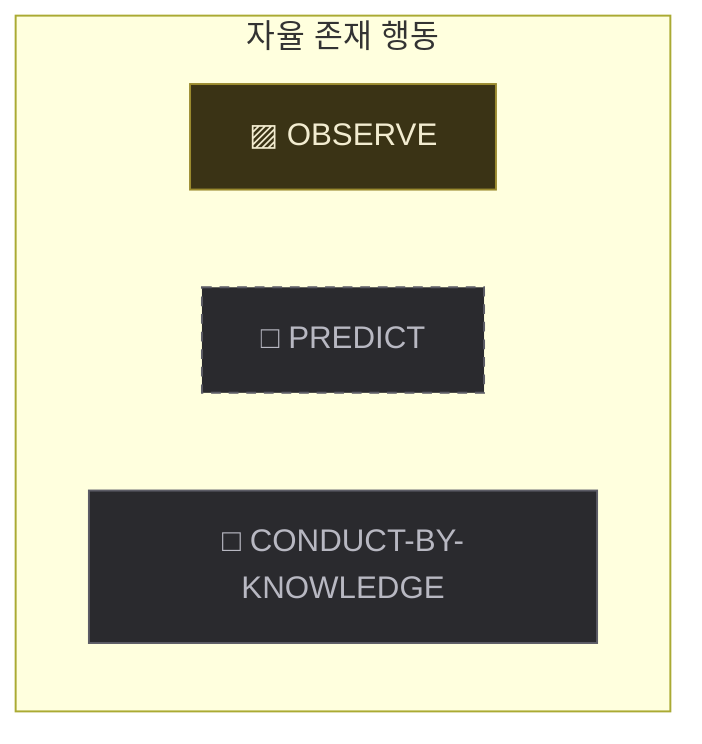

### 아이템 — IS (content/proto-adventure/design/Design-Item-System-R0.md) §4 · §5 · §6 · IE (content/proto-adventure/design/Design-Inventory-Equipment-D1.md) §0 · §48 — CARRY·EQUIP 자리의 운용

물건이 세계의 자원으로 성립하는 여섯 자리. 세계가 아이템을 정의하고, 몸이 그것을 지니고, 써서 상태를 바꾸고, 적용해 능력을 얻고, 재료를 다른 것으로 바꾸고, 몸 밖에서 주고받는다. 앞의 둘(정의 · 소지)은 능력이 아니라 나머지 넷의 바닥이다. 자원이 능력이 되는 순환(BW §17)과 정의/개체 분리(GR §28~§32)를 세계 쪽에서 받는 자리이며, 희귀 기관을 얻는 세 갈래(BW §27)도 이 시스템의 마지막 자리를 전제한다.

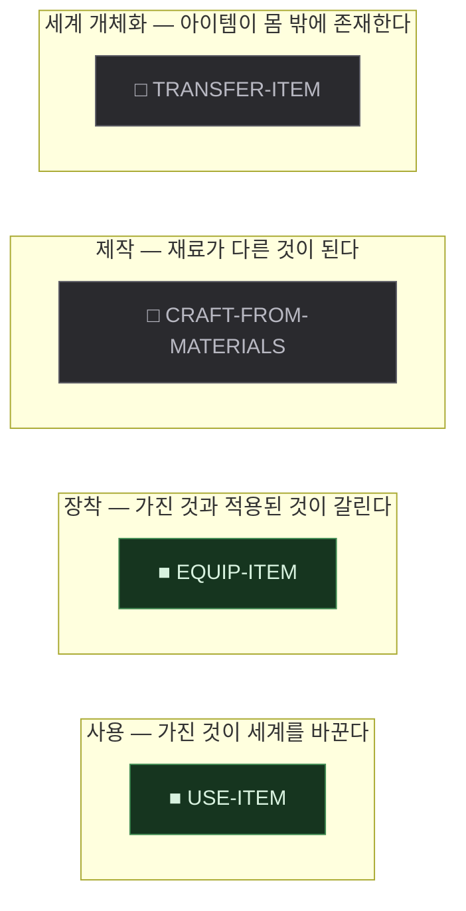

### 스킬 실행 형태 — SK (content/proto-adventure/design/Skill/Skill-System.md) §4 · §5 · §6 · **DRAFT**

효과가 세계에 나타나 대상에게 닿는 방식의 목록. 스킬은 이름이 아니라 발동 · 대상 기준 · 실행 · 대상 결정 · 효과의 조합이며, 그중 **실행**만이 세계에 새로운 생명주기와 판정을 요구하므로 자리를 가진다 (나머지 네 축은 조합의 항이지 사다리가 아니다). 전투 사다리(MS-COMBAT-LADDER)와 직교한다 — 그쪽은 피해가 어떻게 계산되는가의 층이고 이쪽은 그 효과가 어떻게 전달되는가의 자리다. 어느 자리든 피해 효과는 같은 피해 공식을 지난다.

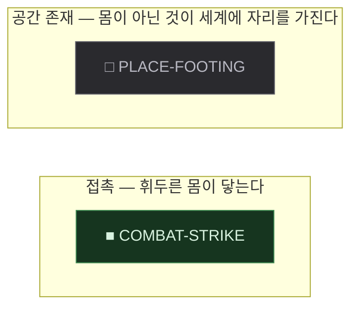

### 베이라 대지형 — BT (content/proto-adventure/design/Master-World-Beira-Terrain.md) §1 · §4~§11 · §13 · §15

하나의 원리가 매질(암석·물·대기·열·생명·공간·기억·Identity·소리·관계)에 대륙 규모로 결속되어 형성된 자연 시스템의 목록. 여덟이 문서에 서 있고, 각 지형은 자기 법칙이 요구하는 대응을 따로 가진다 — 그 요구는 MW-TERRAIN-* 의 demands 가 거울이다. 자리를 순서로 두지 않는다: 여덟은 난이도 순으로 배치된 목록이 아니며 (BT §16), 어디에 갈 수 있는지는 무엇을 감당하게 되었는가가 정한다 (BT §12). 깊이 사다리(MS-BEIRA-LADDER)와 **직교한다** (Human 결정 — HISTORY Q47(a)): 이쪽은 어떤 법칙의 땅인가이고 그쪽은 그 땅 안에서 얼마나 들어갔는가다. 한 대지형 안에 안전한 마을과 극단적으로 위험한 심부가 함께 있다 (BT §3).

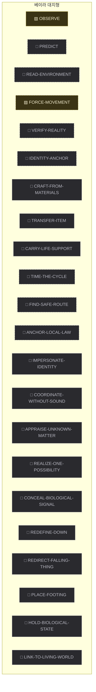

### Class 진화 사다리 — GS (content/proto-adventure/design/Master-Fairy-Growth-System.md) §3 · §4 · §7 · FC (content/proto-adventure/design/Design-Fairy-Class-Layer0-R0.md) §1 · §2 · §10 · §12 (ORIGIN 칸의 설계)

한 캐릭터가 자기 원리를 발전시키며 거치는 형태의 층. 아래 형태를 버리고 갈아 끼우는 것이 아니라 그 위에 서는 구조이며 (GS §3.1), 층이 오를수록 능력이 미치는 범위가 개인에서 전장으로, 전장에서 원리의 현현으로 넓어진다 (GS §4). 층마다 외형이 함께 바뀌어 멀리서도 어느 단계인지 읽힌다 (GS §7). 층과 층 사이를 넘는 자리(MC-CHANGE-CLASS)는 어느 한 층에 속하지 않는다 — segment 없이 이 시스템에 속한다. **바닥 칸(ORIGIN)이 FC 로 채워졌다** — 여섯 계열의 Origin Class 가 growth/classes/ 에 CL-*-ORIGIN 으로 서 있다. 위의 세 칸은 아직 비어 있다. **한 칸에 여러 형태가 선다** (Human 결정 — HISTORY Q69(b)): 같은 계열을 고른 두 사람이 같은 칸에서 서로 다른 형태가 될 수 있다. 기초 원리에 어떤 원리가 결합되었는가가 그 갈래를 가르며 (FC §1), 그래서 이 사다리는 네 칸짜리 사슬 하나가 아니라 네 칸짜리 나무다. GS 가 계열마다 이름을 준 사슬(왕골권사 · 천주질주자 · 태양포식자 · 가면술사 · 풍압사 · 대지공명사)은 그 나무의 **한 갈래**이고, 다른 갈래의 이름은 그 갈래를 세우는 설계 문서가 원리에서 도출한 뒤에 따라온다 (DC-GROWTH-CLASS-COMES-FROM-A-PRINCIPLE — 이름을 먼저 만들고 능력을 끼워 맞추지 않는다).

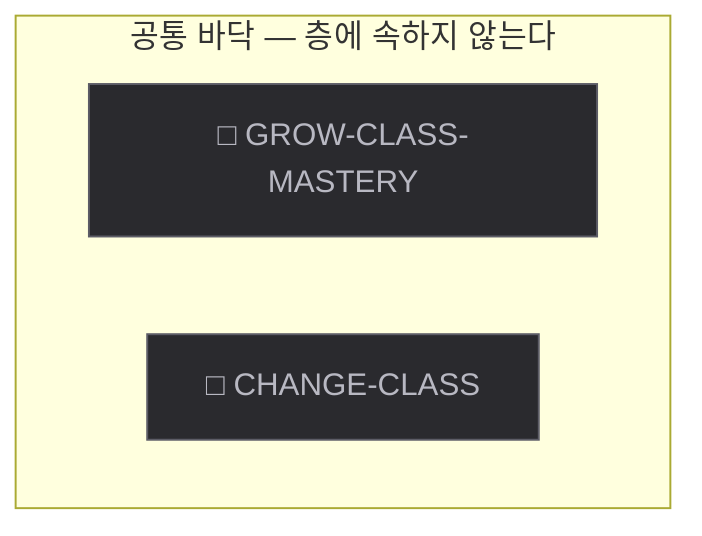

### 성장의 원천 — GS (content/proto-adventure/design/Master-Fairy-Growth-System.md) §5 · §19 · CK §34 (여섯째)

지금의 힘이 어디에서 올라오는가의 축들. GS §5 는 현재 전투력을 다섯 축의 합으로 적고 §19 는 축마다 무엇을 해야 오르는지를 명명한다 — 그 다섯에 전투 지식을 몇 개나 지고 갈 수 있는가(CK §34 · Q65(b))가 여섯째로 더해졌다. 층이 아니라 나란한 축이며 순서는 GS §5 의 나열 순서다 (아래에서 위로 읽는 사다리가 아니다). 마지막 자리(장비)는 이미 아이템 시스템이 세운 것과 같은 자리다 — 새로 만들지 않고 그 노드가 두 시스템에 속한다.

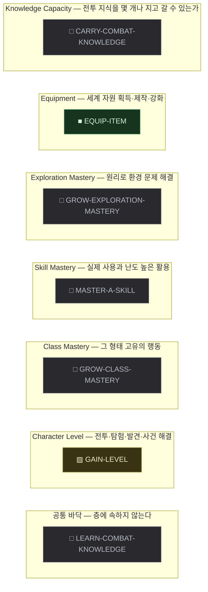

### 요정 계열 — GS (content/proto-adventure/design/Master-Fairy-Growth-System.md) §1 · §2 · §9~§16 · FC (content/proto-adventure/design/Design-Fairy-Class-Layer0-R0.md) §1 · §3~§8 (여섯 계열의 Origin Class)

하나의 세계 원리가 대륙이 아니라 **하나의 인격**에 집중되어 태어난 존재의 갈래 (GS §1). **플레이어가 수행하는 역할이 이것이다** — 여덟은 고를 수 있는 갈래이며, 고른 뒤 그 몸이 무엇을 잘하는가는 고정되지만 무엇을 하러 갈지는 고정되지 않는다 (HISTORY Q54(a)). 대지형(MS-BEIRA-TERRAIN)의 거울이다 — 여덟 계열이 여덟 대지형의 원리와 하나씩 짝을 이룬다. 순서가 없다는 것도 그쪽과 같다 (GS §9 는 이 여덟을 예시로 들 뿐 난이도나 계보로 늘어놓지 않는다). GS 는 계열마다 Principle · Power Fantasy · Class Line · 전투 · 탐험 · 성장 행동을 공급하지만 각 Class 의 정의(CL-*)는 세우지 않는다. **Class Line 의 이름은 GS 가 소유한다** (HISTORY Q55(b)) — 어긋난 계열 문서는 그 이름으로 맞춘다. CL-* 를 세우는 것은 계열별 설계 문서의 주입이며, 그때 이 여덟 자리가 채워진다. **여덟 중 여섯이 FC 로 채워졌다** — 백왕 · 역락 · 태양심 · 진명 · 숨결 · 맥동의 Origin Class 가 CL-*-ORIGIN 으로 서 있다. 가능성계와 혈화계는 FC 가 다루지 않아 비어 있으며, 그 둘의 계열 문서를 기다린다.

아직 이 시스템에 속한 조각이 없다.

### 성장 단계 (Growth Tier) — GB (content/proto-adventure/design/Design-Growth-Balance-R0.md) §18 · §19

한 성장이 어느 정도의 것을 건드리는가의 여섯 단계. 기본 능력에서 시작해 전문화와 특수 능력을 지나 원리 조작과 추상 세계 상태 개입까지 오르며, 단계마다 허용되는 것과 금지되는 것이 정해져 있다 (GB §19 — 예컨대 GT1 에서는 공간 조작 · 정체 조작 · 죽음 무효가 금지되고, GT5 의 추상 개입은 강한 Constraint · 좁은 조건 · 높은 획득 부담 중 하나 이상을 반드시 요구한다). **세계의 깊이와 같지 않다** — GB §18 이 직접 못박는다. 깊은 곳에서 얻었다고 높은 단계의 성장이 아니고, 낮은 단계의 성장이 깊은 곳에서 나올 수 있다. Class 진화 사다리(MS-CLASS-EVOLUTION)와도 다르다: 그쪽은 한 캐릭터가 거치는 형태의 층이고 이쪽은 **성장 하나가 세계에 대해 갖는 권한의 크기**다. 지금 이 여섯 자리에 배정된 노드는 없다 — GB 는 단계의 정의와 예산만 공급하고 기존 노드가 어느 단계인지는 말하지 않는다. 배정은 지어내지 않는다.

아직 이 시스템에 속한 조각이 없다.

### 전투 지식 — CK (content/proto-adventure/design/Design-Combat-Knowledge-Extension-R0.md) §40 · §41

세계에서 얻은 사실을 실제 전투 운용으로 바꾸는 습득 가능한 판단법의 층. 전투 사다리(MS-COMBAT-LADDER) 위가 아니라 **옆**에 선다 — 새 피해 공식도 새 판정도 만들지 않고, 이미 있는 능력을 언제 어떻게 쓸지를 정한다 (CK §0). 플레이어는 규칙을 쓰지 않고 완성된 지식을 얻어 골라 간다. 그래서 이 시스템의 자리들은 능력의 층이 아니라 **한 지식이 거치는 걸음**이다 (CK §40 · §41). CK §7 의 네 계열(대응 · 기력 · 상대 · 능력)은 층이 아니라 지식이 무엇에 닿는가의 분류이므로 자리로 세우지 않는다 — 문서 자신이 "시스템적으로 지나치게 분리할 필요는 없다" 고 적는다.

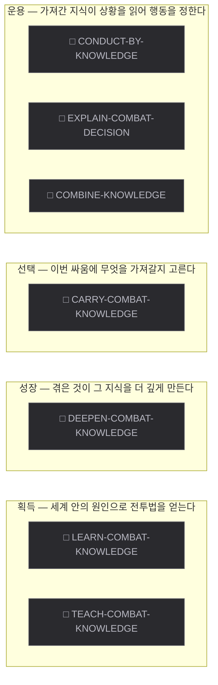

## Constraint — 무엇이 걸러지는가

Constraint 는 단계가 아니라 각 선택 지점의 Filter 다. 아래는 어떤 노드가 어떤 원칙 아래 있는지다.

| Constraint | Scope | 상태 | 걸린 노드 | 한 문장 |
|---|---|---|---:|---|
| `COMBAT-ABILITY-IS-A-RULE` | COMBAT | APPROVED | 7 | 능력의 다양성은 피해 배율의 가짓수가 아니라 세계에 가하는 조작의 종류와 그것을 여는 조건의 조합에서 나온다. 피해가 전혀 없는 능력도 강력할 수 있어야 하고, 능력의 출처가 무엇이든 세계에서는 같은 형태의 규칙이다. |
| `COMBAT-AURA-IS-A-PROFILE-NOT-A-DIAL` | COMBAT | APPROVED | 2 | 힘의 배분은 전투 중에 수치를 조절하는 일이 아니라 미리 만들어 둔 상태 하나를 고르는 일이다. 내부의 배분이 아무리 복잡해도 전투 중 입력은 "지금 어느 상태인가" 한 번이다. |
| `COMBAT-CONTRACT-BUYS-CAPABILITY` | COMBAT | APPROVED | 3 | 스스로 건 제약이 사는 것은 수치가 아니라 새로 허용되는 행동이다. 제약 · 그 대가로 열리는 것 · 어겼을 때 치르는 것 세 부분이 모두 정의되어야 계약이며, 세계가 그 성립과 위반을 판정할 수 있어야 한다. |
| `COMBAT-MATCHUP-SOFT` | COMBAT | APPROVED | 4 | 공격 형태와 방어 형태의 상성은 선택을 만들되 결과를 지배하지 않는다. 상성은 별도 피해 배율이 아니라 대응 공격·방어 능력치의 차이로 표현한다. |
| `COMBAT-ONE-FORMULA` | COMBAT | APPROVED | 10 | 전투에는 하나의 기반 피해 공식만 존재한다. 새로운 전투 시스템은 새로운 피해 공식을 만들지 않고, 기존 공식의 입력값이나 결과값에 한 가지 의미만 더한다. |
| `COMBAT-ONE-LAYER-AT-A-TIME` | COMBAT | APPROVED | 1 | 전투 시스템은 한 번에 한 층만 추가하며, 현재 층이 플레이로 검증되기 전에는 다음 층을 올리지 않는다. 각 층은 아래 층 없이도 완전히 동작하는 상태를 유지한다. |
| `COMBAT-ONE-RESPONSE-INPUT` | COMBAT | APPROVED | 5 | 공격을 받는 순간의 대응은 입력 하나다. 막기 · 피하기 · 받아넘기기 · 되받아치기를 각각의 입력으로 늘리지 않고, 그 하나가 무엇이 되는지는 지금 무엇을 끼워 두었는가가 정한다. |
| `COMBAT-PLAYER-CAUSALITY` | COMBAT | REVISED | 32 | 전투의 중요한 결과는 관찰 가능한 세계 상태와 플레이어의 선택·행동에서 나오며, 같은 상태·같은 조건·같은 행동이면 언제나 같은 결과가 나온다. 단 하나의 예외로, Critical 은 확률 판정을 허용한다 — 그 경우에도 발생 확률과 증폭 결과는 관찰로 읽을 수 있어야 한다. |
| `COMBAT-RESPONSE-IS-OPTIONAL-MASTERY` | COMBAT | APPROVED | 3 | 대응하지 않아도 기본 전투는 그대로 성립한다. 능동 방어는 살아남기 위한 요구가 아니라 잘했을 때 다른 것이 열리는 숙련이며, 일반 공격을 넘기기 위해 정확한 시점을 요구하지 않는다. |
| `COMBAT-SHARED-BUDGET` | COMBAT | APPROVED | 10 | 전투 행동은 하나의 공통 기력(CP) 예산을 나눠 쓴다. 행동별 전용 게이지를 신설하지 않는다. |
| `COMBAT-STRONG-RULE-HAS-COUNTERPLAY` | COMBAT | APPROVED | 16 | 상대의 행동 가능 범위를 줄이는 능력에는 상대가 알아내고 실행할 수 있는 대응책이 최소한 하나 있어야 한다. 대응책은 그 능력의 설명에 함께 정의되며, 세계 안에서 발견 가능해야 한다. |
| `COMBAT-UNAVAILABLE-HAS-A-REASON` | COMBAT | APPROVED | 8 | 일어난 일뿐 아니라 **일어나지 않은 일**도 세계가 사유를 답한다. 능력을 쓸 수 없거나 행동이 막힌 상태는 그 원인이 되는 세계 상태를 함께 드러내며, 상층이 만든 상태 (계약 · 표식 · 관계 · 기회 · 관찰한 것)는 전부 관찰 가능하다. |
| `CONDITION-OPENS-WITHOUT-RECORDING` | GLOBAL | APPROVED | 6 | 지금의 조건으로 열리는 것은 어디에도 기록하지 않는다. 조건이 사라지면 저절로 닫혀야 하고, 그것을 되돌리는 규칙이 따로 있어서는 안 된다. |
| `GROWTH-CAPABILITY-DECLARES-ITS-LIMITS` | GROWTH | APPROVED | 5 | 모든 Capability 는 무엇을 잘하는지와 함께 무엇에 부분적으로만 통하고 무엇에는 통하지 않는지를 밝힌다 — 성장은 가능해지는 것뿐 아니라 여전히 불가능한 것도 정의한다. |
| `GROWTH-CLASS-CHANGE-KEEPS-THE-PAST` | GROWTH | APPROVED | 2 | Class Change 는 다른 Class 로 교체하는 것이 아니라 같은 캐릭터가 상위 형태가 되는 것이며, 이전 Class 는 사라지지 않고 그 상위 형태의 기반으로 남는다. |
| `GROWTH-CLASS-CHANGE-NEEDS-THE-WORLD` | GROWTH | REVISED | 3 | Class Change 의 문턱은 시간과 수치만으로 넘을 수 없다 — 그 캐릭터의 원리와 관련된 세계 현상을 직접 겪은 것과 세계에서만 얻는 Property 를 함께 요구한다. |
| `GROWTH-CLASS-CLOSES-BEFORE-THE-NEXT-LAYER` | GROWTH | APPROVED | 0 | Class 하나는 자신에 대한 열두 질문에 즉시 답할 수 있을 때 완성이며, 특히 지금 할 수 없는 것과 원리가 하나 더해지면 어디로 넓어지는가가 닫히기 전에는 그 계열의 다음 Layer 를 세우지 않는다. |
| `GROWTH-CLASS-COMES-FROM-A-PRINCIPLE` | GROWTH | APPROVED | 0 | 새 Class 는 이름에서 시작하지 않는다. 먼저 새 Principle 이 있고, 거기서 새 Rule 과 새 행동, 전투 방식의 변화, 탐험 방식의 변화, 외형의 변화가 차례로 나온 뒤에야 그것이 Class 다. |
| `GROWTH-CLASS-ORIGIN-TRACE` | GROWTH | APPROVED | 0 | Class 는 세계와 Actor 가 상호작용한 결과다. 모든 Class 는 하나 이상의 origin_trace(WorldState → Goal → Possibility)를 가지며, 그 Class 를 제거해도 원인이 된 세계 요소는 독립적으로 성립해야 한다. |
| `GROWTH-CLASS-OWNS-THE-RESPONSE` | COMBAT · GROWTH | APPROVED | 1 | 공격에 대응하는 입력은 하나뿐이고, 그 자리에 무엇이 들어 있는가는 그 캐릭터의 Class 가 정한다. 같은 입력이 Class 마다 전혀 다른 행동이 된다. |
| `GROWTH-COST-IS-THE-WHOLE-BURDEN` | GROWTH | APPROVED | 1 | 성장의 비용은 소비한 자원의 개수가 아니라 그 성장을 얻기까지 치른 전체 플레이 부담이다 — 시간 · 위험 · 실력 · 앎 · 자원 · 기회 · 반복 가능성이 함께 비용이다. |
| `GROWTH-DEFINITION-INSTANCE-SPLIT` | GROWTH | APPROVED | 1 | Master 는 유한한 Definition(Class · Item Type · Property · Modifier · 조합 규칙)만 소유한다. 실제 생성된 Item Instance(II-*)와 조합 결과는 Runtime World 가 소유하며, 가능한 조합을 사전에 Node 로 생성하지 않는다. |
| `GROWTH-DIFFERENCE-IS-BEHAVIOR` | GROWTH | APPROVED | 1 | 캐릭터 사이의 차이는 능력치 값의 차이가 아니라 전투에서 반복하는 행동의 차이로 드러나야 한다. |
| `GROWTH-EXPLORATION-SHARES-THE-PRINCIPLE` | GROWTH | APPROVED | 2 | 탐험 능력은 전투와 별개로 주어지는 별도의 기능이 아니라, 같은 원리를 다른 방식으로 쓰는 것이어야 한다. |
| `GROWTH-GOAL-FIRST` | GROWTH | APPROVED | 2 | 성장(새 Class · Item · Capability 의 획득) 자체를 Goal 로 세우지 않는다. 성장은 Actor 의 현재 Goal 을 현재 Capability 로 달성하기 어려울 때, 그 Goal 을 달성하는 하나의 Possibility 로만 성립한다. |
| `GROWTH-INTENT-IS-MEASURED` | GROWTH | APPROVED | 0 | 중요한 성장은 자신이 무엇을 얼마나 바꿀 작정인지를 미리 밝히고, 실제로 굴려 본 결과가 그 범위를 벗어나면 실패로 다룬다. |
| `GROWTH-MASTERY-FROM-OWN-BEHAVIOR` | GROWTH | APPROVED | 3 | 숙련은 무엇을 얼마나 반복했는가가 아니라 그 형태 고유의 행동을 수행했는가에서 오르며, 같은 상황에서도 캐릭터마다 오르는 행동이 다르다. |
| `GROWTH-NEED-FROM-POSSIBILITY` | GROWTH | APPROVED | 0 | Class 와 Item 은 Capability 를 획득하는 세계 내 경로일 뿐이다. Capability 의 필요성은 항상 기존 Master 인과(Goal → Possibility --requires-->)에서 나오며, Class 나 Item 이 존재한다는 이유로 Capability 를 만들지 않는다. |
| `GROWTH-NO-CAPABILITY-DUPLICATION` | GROWTH | APPROVED | 4 | 같은 플레이 의미의 Capability 를 획득 Source(Class / Item / Actor)별로 복제하지 않는다. 하나의 MC-* 에 여러 획득 경로가 grants 로 연결된다. |
| `GROWTH-NO-DOMINATED-ROUTE` | GROWTH | APPROVED | 3 | 더 싸면서 모든 면에서 더 좋은 성장 경로를 두지 않는다 — 나란히 선 경로들은 서로 다른 장단점을 가져야 하고, 어느 하나가 다른 하나를 완전히 압도하면 압도당한 쪽은 존재할 이유가 없다. |
| `GROWTH-NOT-A-MASTER-KEY` | GROWTH | APPROVED | 1 | 하나의 성장이 서로 무관한 여러 관문을 한꺼번에 열지 않는다 — 열쇠 하나가 모든 문을 열면 그 뒤의 문들이 사라진다. |
| `GROWTH-NOT-A-STAGE` | GROWTH | APPROVED | 0 | Growth 는 별도 Master Stage 가 아니다. 기본 절차 WHY → OPTIONS → NEED → NEXT 는 그대로 유지되고, Growth Graph 는 NEED 에서 발견된 Capability 에 대해 "세계에서 어떻게 얻는가"를 덧씌우는 보조 Overlay 로만 존재한다. |
| `GROWTH-ORIGIN-IS-SIMPLE-FIRST` | COMBAT · GROWTH | APPROVED | 0 | Origin Class 는 복합 계약과 복합 규칙을 주력으로 쓰지 않는다. 단순한 Requirement · 단순한 Condition · 명확한 World Operation · 명확한 Counterplay 넷을 먼저 갖추고, 그것들이 계약과 복합 규칙으로 발전하는 것은 상위 Layer 의 몫이다. |
| `GROWTH-POWER-PAYS-IN-REACH-OR-CONSTRAINT` | GROWTH | APPROVED | 8 | 강한 효과와 넓은 적용 범위를 동시에 주지 않는다 — 강해질수록 적용 범위가 좁아지거나 분명한 조건이 붙어야 하며, 그 조건도 자원과 마찬가지로 성장의 값이다. |
| `GROWTH-PRINCIPLE-IS-PLAYED` | GROWTH | APPROVED | 2 | 캐릭터가 지닌 세계의 원리는 설정 문구가 아니라 그 캐릭터가 실제로 하는 행동으로 화면 위에 있어야 한다. |
| `GROWTH-REWARD-IS-NEW-REACH` | GROWTH | APPROVED | 2 | 성장의 가치는 커진 숫자가 아니라 이전에는 할 수 없던 무엇을 할 수 있게 되었는가를 포함하며, 비용과 보상을 하나의 점수로 환산해 맞추지 않는다. |
| `GROWTH-SKILL-GAINS-BEHAVIOR` | GROWTH | APPROVED | 1 | 스킬의 성장은 수치의 증가만으로 성립하지 않는다 — 그 스킬이 할 수 있는 행동 자체가 늘어나야 한다. |
| `GROWTH-STAGE-READS-AT-A-DISTANCE` | GROWTH | APPROVED | 1 | 캐릭터의 성장 단계는 멀리서 보기만 해도 알아볼 수 있어야 한다 — 힘의 증가가 외형의 변화로 함께 나타난다. |
| `ITEM-CAPABILITY-COMES-FROM-GRANTS` | ITEM | APPROVED | 1 | 아이템의 성질(IP-*)은 세계 압력에서 유래한 것만이고, 아이템의 용도는 그 종류가 가진다. 능력 판정은 성질 목록을 조회해서가 아니라 그 아이템이 지금 무엇을 주고 있는가로 한다. |
| `ITEM-CAPACITY-IS-FINITE` | ITEM | APPROVED | 1 | 가진 것을 담을 자리도, 몸에 적용할 자리도 유한하다. 적용할 자리는 담을 자리보다 훨씬 좁고, 그 좁음이 무엇을 들고 나갈지를 선택으로 만든다. 몇 개인가는 Cycle 이 소유한다. |
| `ITEM-CHANGE-IS-ONE-UNIT` | ITEM | APPROVED | 4 | 아이템이 관련된 변화는 하나의 성공 단위다. 효과와 수량은 함께 변하거나 함께 변하지 않으며, 실패한 시도는 세계에 아무 흔적도 남기지 않는다. |
| `ITEM-HOLDING-IS-NOT-APPLYING` | ITEM | REVISED | 1 | 아이템을 가지고 있는 것만으로는 몸이 달라지지 않는다. 능력치와 가능한 행동이 달라지는 것은 지금 적용된 것 때문이며, 적용을 풀면 정확히 원래대로 돌아온다. |
| `ITEM-KIND-IS-DATA-NOT-BRANCH` | ITEM | APPROVED | 2 | 아이템의 종류 이름은 정의를 찾는 열쇠일 뿐이며 규칙의 분기 조건이 되지 않는다. 새 아이템은 정의를 더하는 것으로 끝나고, 그 아이템을 쓰는 규칙 코드는 바뀌지 않는다. |
| `ITEM-LIVES-IN-ONE-PLACE` | ITEM | APPROVED | 2 | 아이템은 정확히 한 곳에 있다. 저장소가 아이템을 직접 담고, 다른 저장소의 자리를 가리키지 않는다. |
| `KNOWLEDGE-CONFLICT-IS-DESIGNED` | COMBAT | APPROVED | 2 | 두 지식이 서로 다른 판단을 요구할 때 그 우선순위는 지식 자신이 지닌다 — 플레이어가 순위를 매기지 않고, 상황에 더 구체적인 쪽이 일반적인 쪽을 이긴다. |
| `KNOWLEDGE-DECISION-IS-TRACEABLE` | COMBAT | APPROVED | 1 | 지식이 내린 판단은 무엇을 보고 무엇을 정했으며 어느 지식 때문인지가 세계에서 읽힌다. 캐릭터가 왜 그렇게 싸웠는지에 언제나 답할 수 있어야 한다. |
| `KNOWLEDGE-HAS-A-WORLD-CAUSE` | COMBAT · GLOBAL | APPROVED | 4 | 전투 지식은 세계 안에서 일어난 일 때문에 생긴다 — 관찰 · 반복 · 실패 · 전수 · 연구 · 소속. 메뉴에서 점수로 사는 항목이 되지 않는다. |
| `KNOWLEDGE-HAS-NO-SINGLE-ANSWER` | COMBAT | APPROVED | 2 | 한 상황에 통하는 전투 지식이 하나뿐이지 않다. 그 지식이 없으면 그 상대를 상대할 수 없게 만들지 않는다. |
| `KNOWLEDGE-IS-CARRIED-NOT-HOARDED` | COMBAT | APPROVED | 2 | 전투 지식은 **여러 개가 동시에 작동한다.** 다만 작동하는 자리가 배운 것보다 적어, 이번 전투에 어느 것들을 가져갈지 골라야 하고 그 선택이 곧 이 싸움의 그 캐릭터다. |
| `KNOWLEDGE-IS-NOT-A-SCRIPT` | COMBAT | APPROVED | 3 | 플레이어는 전투 판단 규칙을 쓰거나 고치지 않는다. 전투 지식은 내부를 열 수 없는 하나의 완성된 판단법으로 존재하고, 플레이어가 다루는 것은 그것을 고르는 일뿐이다. |
| `KNOWLEDGE-RUNS-CAPABILITY-NEVER-CREATES-IT` | COMBAT | APPROVED | 2 | 전투 지식은 그 몸이 이미 가진 능력을 더 잘 쓰게 할 뿐, 없는 능력을 만들어내지 않는다. 같은 지식이라도 실행되는 모습은 그 몸이 가진 능력에서 나온다. |
| `KNOWLEDGE-SHOWS-IN-BEHAVIOR` | COMBAT | APPROVED | 2 | 어떤 지식을 가져왔는가가 실제 전투 행동의 차이로 나타난다. 보이지 않는 보정만 주는 지식은 지식이 아니다. |
| `MASTERY-IS-KNOWING-NOT-REFLEX` | COMBAT · GLOBAL | APPROVED | 3 | 전투 숙련의 축은 조작 속도가 아니라 아는 것과 준비한 것이다. Response 층의 정교함은 캐릭터가 배운 것이 수행하며, 그것을 플레이어의 손이 대신해야만 성립하게 만들지 않는다. |
| `SKILL-ANCHOR-IS-NOT-RESOLUTION` | SKILL | APPROVED | 1 | 어디를 기준으로 쓰는가와 결과적으로 누가 효과를 받는가는 서로 다른 질문이다. 하나를 다른 하나로 대신하지 않고, 한 명이냐 여럿이냐를 스킬의 종류로 만들지 않는다. |
| `SKILL-COMBINE-BEFORE-NEW-FORM` | SKILL | REVISED | 1 | 새 스킬 요구는 먼저 기존 형태의 조합으로 표현한다. 새 실행 형태는 조합으로도 파라미터로도 표현할 수 없고, 세계에 다른 생명주기나 판정이 필요할 때만 추가한다. |
| `SKILL-DELIVERY-IS-NOT-EFFECT` | SKILL | REVISED | 1 | 효과가 세계를 지나 대상에 닿는 방식과, 대상에게 실제로 일어나는 일은 서로 다른 축이다. 한쪽을 다른 쪽의 종류로 만들지 않는다. |
| `SKILL-EFFECT-MUST-ALREADY-EXIST` | SKILL | APPROVED | 0 | 스킬은 지금 세계에 실제로 있는 상태 변화만 부를 수 있다. 아직 없는 효과의 이름을 미리 목록에 두지 않는다. |
| `SKILL-IS-COMBINATION-NOT-NAME` | SKILL | REVISED | 1 | 스킬의 이름은 세계가 아는 종류가 아니다. 시스템에는 발동·대상 기준·실행·대상 결정· 효과의 형태만 있고, 하나의 스킬은 그 형태들의 조합을 고른 정의일 뿐이다. |
| `SKILL-PRESENCE-IS-WORLD-NOT-SKILL` | SKILL | APPROVED | 1 | 몸이 아닌 것이 세계의 한 자리를 차지하는 일은 세계의 능력이다. 스킬이 자기 안에 그런 존재를 임시로 만들지 않는다. |
| `TARGET-IS-INTENT-NOT-AIM` | GLOBAL | APPROVED | 2 | 대상을 지목하는 것은 플레이어가 지금 누구에게 의도를 두었는지를 세계에 밝히는 관계일 뿐이다. 지목 자체는 명중·피해·정보·위협을 만들지 않으며, 세계가 플레이어를 대신해 다가가거나 따라가지 않는다. |
| `WORLD-COMBAT-IS-ONE-POSSIBILITY` | WORLD | APPROVED | 8 | Creature 의 발견·존재만으로 처치 Goal 을 만들지 않는다. Goal 은 WorldState (자원을 지킨다 · 길을 막는다 · 사냥한다 · 기관이 필요하다)에서 발생하며, 전투는 그 Goal 을 달성하는 Possibility 중 하나로만 성립한다. |
| `WORLD-CREATURE-FROM-PRESSURE` | WORLD | APPROVED | 2 | 전투 Creature 를 먼저 만들지 않는다. Creature 의 Capability 는 세계압이 만든 환경과 생존 압력에 대한 적응의 결과이며, Player 의 Capability Requirement 는 그 Creature 와의 조우가 만든 Goal 과 Combat Possibility 에서만 파생된다. |
| `WORLD-OWNS-THE-CHANCE` | GLOBAL | APPROVED | 1 | 우연의 원천은 세계가 지니는 상태이고, 그 상태는 관찰에 실리지 않으며, 그럼에도 결과는 끝까지 설명된다. 이미 결과가 정해진 판정에서는 그 원천을 소비하지 않는다. |
| `WORLD-OWNS-THE-SURFACE-LIST` | GLOBAL | APPROVED | 9 | 무엇을 할 수 있고 그 값이 어디까지 허용되는지의 목록은 세계가 소유하고 관찰 결과에 실어 보낸다. 관찰자(View)는 그 목록을 스스로 만들지 않는다. |
| `WORLD-PLAYER-UNFIXED-PATH` | WORLD | APPROVED | 7 | Player 의 역할·Class·진영·전투 방식과 탐험의 이유를 하나로 고정하지 않는다. Root Goal(베이라를 탐험한다) 아래의 Local Goal 은 Actor 와 상황마다 발견된 세계 상태로부터 생성된다. |
| `WORLD-PROGRESSION-IS-REACH` | WORLD | APPROVED | 10 | Progression 의 핵심은 수치 Level 의 상승이 아니라, 관찰과 이해로 대응 방법을 발견하고 Capability 와 Resource 를 얻어 이전에는 갈 수 없던 세계 범위에 도달하게 되는 확장이다. |
| `WORLD-RESOURCE-ADAPTATION-TRACE` | WORLD | APPROVED | 3 | 중요한 베이라 Resource 는 World Pressure → Environment → Survival Pressure → Adaptation → Special Property → Resource 의 인과 Trace 로 설명할 수 있어야 하며, 좋은 아이템을 위험한 곳에 배치하는 방향으로 만들지 않는다. |
| `WORLD-SAFETY-IS-A-NATURAL-EXCEPTION` | WORLD | APPROVED | 4 | 사람이 머무는 자리가 안전한 것은 위험이 낮게 설정되어서가 아니라, 그 대지형의 법칙이 안정되거나 다른 성질과 균형을 이루는 자연적 예외가 그 자리에 있기 때문이다. 사람의 문화와 건축은 그 예외를 확대하는 방식으로 발전한다. |
| `WORLD-TERRAIN-IS-A-PRINCIPLE` | WORLD | APPROVED | 0 | 대지형은 기후와 식생으로 구분되는 배경이 아니라, 하나의 World Principle 이 어떤 매질에 대륙 규모로 결속되어 형성된 자연 시스템이다. 새 대지형은 무엇에 결속되었고 어떤 상태를 어떤 조건에서 반복적으로 변화시키는가로 정의한다. |
| `WORLD-TERRAIN-LAW-IS-OBSERVABLE` | WORLD | APPROVED | 7 | 대지형의 법칙은 설명 없이 볼 수 있는 증거로 먼저 드러나고, 관찰할수록 반복되는 조건과 결과가 드러난다. 그 증거를 이해한 사람에게 열리는 행동은 하나가 아니다. |
| `WORLD-TERRAIN-READS-AT-A-DISTANCE` | WORLD | APPROVED | 0 | 각 대지형은 멀리서 보았을 때 한 장면만으로 다른 대지형과 구분되어야 한다. |

## 구멍 — 아직 채워지지 않은 자리

빈 인과 필드다. 지어내지 않은 자리이며, 다음에 무엇을 물어야 하는지를 가리킨다.

| 빈 필드 | 개수 | 노드 |
|---|---:|---|
| `changed_by` | 30 | PRIMAL-WORLD · WORLD-PRESSURE · FREE-PRESSURE · BOUND-PRESSURE · SAFE-FRONTIER · DEPTH-GRADIENT · ZONE-FRINGE · ZONE-WILD · ZONE-DANGER · ZONE-DEEP · ZONE-UNKNOWN · HYPER-PREDATION · SPATIAL-SHEAR · MACRO-TERRAIN · TERRAIN-CIRCULATION · SHAPED-LANDFORM · SURVIVAL-PRESSURE · ADAPTED-LIFE · NATURAL-REFUGE · TERRAIN-RESOURCE · NATURAL-SETTLEMENT · CIRCULATION-EVIDENCE · TERRAIN-BAIWANG-BASIN · TERRAIN-SUNEATER-ICEFIELD · TERRAIN-NAME-EATING-FOREST · TERRAIN-BREATHLESS-SEA · TERRAIN-SKYFALL-RANGE · TERRAIN-WALKING-CONTINENTS · TERRAIN-UNHAPPENED-DESERT · TERRAIN-BLOODBLOOM-FOREST |
| `causes` | 21 | PRIMAL-WORLD · WORLD-PRESSURE · FREE-PRESSURE · BOUND-PRESSURE · DEPTH-GRADIENT · ZONE-DANGER · ZONE-DEEP · ZONE-UNKNOWN · HYPER-PREDATION · SPATIAL-SHEAR · MACRO-TERRAIN · SHAPED-LANDFORM · SURVIVAL-PRESSURE · ADAPTED-LIFE · NATURAL-REFUGE · TERRAIN-RESOURCE · NATURAL-SETTLEMENT · CIRCULATION-EVIDENCE · TERRAIN-SUNEATER-ICEFIELD · TERRAIN-WALKING-CONTINENTS · TERRAIN-UNHAPPENED-DESERT |
| `belief_context` | 6 | EXPLORE-BEIRA · ACQUIRE-RARE-ORGAN · OVERCOME-SUPERIOR-OPPONENT · SURVIVE-ENEMY-OFFENSIVE · HOLD-HUNTING-GROUND · RESCUE-THE-TAKEN |
| `knows` | 2 | PLAYER · HOSTILE-COMBATANT |
| `believes` | 2 | PLAYER · HOSTILE-COMBATANT |
| `motivation` | 2 | HOLD-HUNTING-GROUND · RESCUE-THE-TAKEN |
| `requires.capabilities` | 2 | FIND-DEAD-SPECIMEN · FORCE-CREATURE-TO-RELEASE |

## Capability Overlay — Graph 를 세계와 겹쳐 본 상태

Master Graph 를 현재 `world/` `view/` 구현과 겹쳐 본 결과다. 기본 절차 **NEED** 단계의
산출물이며, NEXT(Frontier) 는 여기서 나온다.

각 노드의 `world_shape`(그 의미가 세계에 있다는 것을 무엇으로 확인하는가)가 판정 기준이고,
이 문서는 그 칸이 지금 닫혀 있는가만 답한다. 무엇이 언제 닫혔는가는 `feedback/` 소유다.
근거 문서의 약어는 `graph/*.yaml` 머리의 인용표가 정의한다 — 근거는 영역을 넘지 않는다
(HISTORY Q15). 해당 영역 문서가 이름조차 대지 않는 Capability 는 "없는 것" 이 아니라
**노드가 아니다** — 표에서 삭제한다.

### 판정 기준

```text
IMPLEMENTED   그 의미를 닫은 Cycle 이 있고 08-verification 이 실측으로 통과했다
PARTIAL       일부만 닫혔거나, 닫혔지만 이번 Possibility 가 요구하는 형태에 못 미친다
MISSING       세계에 그 의미가 없다
```

근거 칸에는 Cycle ID 또는 코드 실측을 적는다. **주장만 적지 않는다.**
Constraint Violation 과 혼동하지 않는다 — 여기는 **있는가/없는가**이지 **허용되는가**가 아니다.

### Capability — 전투 영역

실행 형태의 자리는 `graph/systems.yaml` 의 MS-SKILL-FORM(여섯 칸 — CONTACT 만 참) ·
MS-ACTIVE-DEFENSE · MS-AURA-NEN 이 소유한다. 빈 칸을 막는 것은 형상이 아니라 그것을
요구하는 Possibility 의 부재다 (open-questions Q35). 아군 보호 조작은 세계에 아군이
없어 세우지 못했다 (Q60).

| Capability | 상태 | 근거 | 부족한 것 |
|---|---|---|---|
| MC-COMBAT-STRIKE | IMPLEMENTED | C007 · C010 · C025 08-verification | — |
| MC-BODY-FACING | IMPLEMENTED | C006 08-verification | — |
| MC-CP-ECONOMY | PARTIAL | C007 · C011 08-verification | 기력이 스스로 돌아오지 않는다. 회복 경로는 "타격을 성공시킨다" 하나뿐이라, 빗나가면 아무것도 벌지 못하고 쉬어도 차지 않는다 |
| MC-COMBAT-CAUSE-READING | IMPLEMENTED | 코드 대조 — 모든 타격이 고른 능력치 이름·값, 기본 피해, 공격 기여, 방어 값, 관통, 유효 방어, 감쇄 배율, 최종·적용 피해, 막기 결과까지 관찰에 싣는다 | — (승격 확인 대기 · open-questions.md) |
| MC-ATTACK-POWER | PARTIAL | C010 · C023 08-verification | 값을 키우는 축이 없다. 물건으로 값이 *달라지는* 것은 섰으나 그것을 *키우는* 것 — 될 Class 도, 배울 상대도, 자라는 경로도 — 은 여전히 없다. 물건 쪽은 C024 로 둘이 되었으나(곡괭이 물리 공격 +12 · 손방패 물리 방어 +15) 그 둘은 서로 바꿔 끼는 관계이지 쌓이는 관계가 아니다 |
| MC-SKILL-SCALING | IMPLEMENTED | C010 08-verification | — |
| MC-DEFENSE-MITIGATION | IMPLEMENTED | C010 08-verification | — (이것은 수동 감쇄다. 막는 행동은 MC-GUARD 로 별개) |
| MC-ATTACK-ARMOR-MATCHUP | IMPLEMENTED | C012 08-verification | — |
| MC-GUARD | IMPLEMENTED | C011 08-verification | — |
| MC-PENETRATION | IMPLEMENTED | C013 08-verification | — (C013 Human Play 대기 · open-questions.md) |
| MC-BREAK | PARTIAL | C011 08-verification | 무너뜨리기 위한 행동이 없다. 지금은 상대가 자원을 다 쓴 결과로만 일어나므로 플레이어가 만들어 내는 구간이 아니다 |
| MC-CONDITION-STACKING | PARTIAL | 코드 대조 — 조건들을 곱해 합성하고 상·하한으로 묶는 얼개가 있다 | 조건의 출처가 둘(달리는 중·피격 중)뿐이고 둘 다 기력 회복량에만 작용한다. 이름 붙은 조건도, 지속 시간도, 겹침도, 플레이어가 조건을 만드는 수단도 없다 |
| MC-CRITICAL-STRIKE | IMPLEMENTED | C015 08-verification | — (성질을 올릴 경로는 이 노드가 아니라 MP-BET-ON-THE-CRITICAL-BLOW 의 `requires.resource` 가 진다 — 아래 Possibility 표) |
| MC-PERFECT-GUARD | MISSING | — | 막기는 있으나 시작 시각이 판정에 쓰이지 않는다. 막기는 켜 두는 자세이고 결과는 막힘/무너짐 둘뿐이다 (R1 §14 Active Defense 층). 다만 C019 로 행동 안의 시점을 읽는 규칙이 세계에 생겨 얹힐 바닥은 섰다 |
| MC-COUNTER | MISSING | — | 취약 상태(Exposed)라는 개념이 없다 (R1 §14 Active Defense 층) |
| MC-EVADE | MISSING | — | 회피 행동이 없다. 다만 공격이 이미 공간 판정이라 얹힐 바닥은 서 있다 (R1 §13 이연). C025 로 그 공간이 기술마다 달라졌다 — 피할 대상이 하나가 아니므로 회피가 설 때 다룰 것이 늘었다 |
| MC-FORTIFY | MISSING | — | 배분이 없으므로 몸 쪽에 몰아 둔 자세도 없다. 배분(MC-AURA-ALLOCATION)이 먼저 서야 한다 |
| MC-VOW | MISSING | — | 제약·실패 대가가 없다 (R1 §14 Aura/Nen 층). UL §21 이 요구하는 세 부분 중 세계에 있는 것은 하나도 없다 — 제약을 선언하는 자리도, 그것이 여는 행동도, 위반 판정도 없다 |
| MC-ACTIVE-RESPONSE | MISSING | — | 공격이 닿는 순간에 실행하는 행동이라는 개념이 없다. 막기는 미리 켜 두는 자세이고, 켠 뒤에는 받는 쪽이 개입할 자리가 없다 (`world/semantic/combat.ts` 의 `GuardOutcome`). 얹힐 바닥은 하나 서 있다 — C019 로 행동 안의 시점을 읽는 규칙이 생겼다 |
| MC-PRECISION-RESPONSE | MISSING | — | 대응 자체가 없으므로 그 시점 축도 없다. 다만 C019 가 행동 안의 시점을 읽는 규칙을 세워 두어, 판정에 쓸 시각은 세계에 이미 있다 |
| MC-OPPORTUNITY | MISSING | — | 기회라는 개념이 없고, 같은 자리의 행동이 상황에 따라 다른 것으로 바뀌는 규칙도 없다 |
| MC-ABSORB | MISSING | — | 막힌 피해는 줄어들 뿐 어디에도 남지 않는다 (`world/semantic/combat.ts` — 막힌 타격이 남기는 비율만 있다). 받아낸 것이 값으로 저장되는 자리가 없다 |
| MC-AURA-ALLOCATION | IMPLEMENTED | C-COMBAT-001 · C-COMBAT-003 08-verification | — |
| MC-ABILITY-CONDITION | IMPLEMENTED | C-COMBAT-003 · C-COMBAT-004 08-verification | — |
| MC-MARK | IMPLEMENTED | C-COMBAT-004 08-verification | — |
| MC-BIND | MISSING | — | 존재 사이를 잇는 실체가 없고, 남의 행동 범위를 줄이는 규칙도 없다. 관계는 태도 하나뿐이고 (C018) 그것은 칠 수 있는가만 가른다 |
| MC-OBSERVE-ABILITY | MISSING | — | 상대가 가진 능력이라는 것이 세계에 없다 — 적대 존재는 하나의 행동만 하고 그것에 규칙도 조건도 없다. 알아낼 대상 자체가 서지 않았다 |
| MC-DRAIN | MISSING | — | 상대가 유한하게 가진 것이 세계에 없다 — 기력은 자기 것만 줄고, 남의 것을 옮기는 규칙이 하나도 없다 |

### Capability — 탐험 영역 (BW)

현재 세계는 무대 하나짜리 전투 프로토타입이라 BW 유래 Capability 는 대부분 MISSING 이다.
PARTIAL 네 줄은 코드에 이미 얹힐 바닥이 있는 것들이다 (코드 대조).

| Capability | 상태 | 근거 | 부족한 것 |
|---|---|---|---|
| MC-REPOSITION (SAFE §20) | PARTIAL | 코드 대조 — 위치가 판정에 깊이 쓰인다: 휘두른 무기 끝이 훑는 궤적 안의 몸만 맞고, 막기는 정면에서 온 것만 막으며, 채집은 거리 안에서만 된다 | 유리한 자리를 빠르게·의도적으로 잡는 전용 수단. 걸어가서 만들 수는 있다 |
| MC-FORCE-MOVEMENT (DANGER §23) | PARTIAL | 코드 대조 — 타격이 상대를 때린 자리 바깥으로 밀어내고 그 힘이 관성·마찰로 이어진다 | 어디로 보낼지 고르는 수단. 밀림 방향이 언제나 때린 자리의 반대쪽으로 고정이다 |
| MC-INTERRUPT (DANGER §23) | IMPLEMENTED | C019 08-verification | — (`part_of.grounded: true` 의 근거였던 C002 의 부수 효과가 이제 노리는 수단이 되었다) |
| MC-BREAK (WILD §22) | PARTIAL | C011 08-verification | 무너뜨리기 위한 행동이 없다. 지금은 상대가 자원을 다 쓴 결과로만 일어나므로 플레이어가 만들어 내는 구간이 아니다 |
| MC-OBSERVE (FRINGE §21) | PARTIAL | C014 · C016 08-verification | 남은 결손은 하나다: 행동·습성 — 자율 존재의 패턴을 읽는 의미가 없다 (MC-PREDICT 자리). 그 하나가 닫히면 IMPLEMENTED. 그 자리는 보류(Human) — AI 기획서를 기다린다 (frontier "지금 열 수 없는 것") |
| MC-PREDICT (FRINGE §21) | MISSING | 코드 실측 — world/semantic/collision.ts | 없는 것은 읽을 거리와 앎의 관문 둘이다. ① 자율 존재가 쓰는 스킬이 하나뿐이라(`world/simulation/npc-decide.ts` — 언제나 `attack`) 다음 행동에 고를 갈래가 없다 ② 그 앎이 살펴봄·통찰과 무관하게 누구에게나 그냥 온다. 다만 노드의 semantic 자체가 잠정이다 (`part_of.grounded: false` — BW §21 은 이름만 댄다) — 보류(Human), AI 기획서 대기 |
| MC-USE-TERRAIN (FRINGE §21) | MISSING | — | 지형이 없다 — 무대는 아무 성질도 없는 평평한 사각형 하나다 |
| MC-DISCOVER-WEAKNESS · MC-PRECISE-TARGETING · MC-CONTROL-SPACE (WILD §22) | MISSING | — | 약점 발견·부위 조준·공간 통제의 의미가 없다 |
| MC-READ-ENVIRONMENT · MC-USE-HAZARD (DANGER §23) | MISSING | — | 환경 위험이라는 개념 자체가 없다 — 피해의 출처는 타격 하나뿐이다 |
| MC-DISRUPT-ABILITY · MC-MAINTAIN-PRESSURE · MC-TARGET-SPECIFIC-PART · MC-READ-CREATURE-SYSTEM (DEEP §24) | MISSING | — | 재생·공생·부위라는 개념 자체가 없고, 능력을 봉인한다는 개념도 없다 — 지금 세계에서 못 쓰는 사유는 자원·거리·장착 같은 자기 조건뿐이고 남이 걸어 둔 것 때문에 못 쓰는 자리가 없다 |
| MC-PROTECT-PERCEPTION · MC-VERIFY-REALITY · MC-IDENTITY-ANCHOR · MC-RESIST-INFLUENCE · MC-BREAK-BIOLOGICAL-LINK · MC-ESCAPE-ALTERED-SPACE (UNKNOWN §25) | MISSING | — | 지각·정체성·공간 변형이라는 개념 자체가 없다 |
| MC-RESTORE-BIOLOGICAL-STATE (자원 §8) | MISSING | — | 회복이라는 개념이 없다 — 생명은 줄기만 하고 되돌리는 경로는 디버그뿐이다 |
| MC-CUT-ABNORMAL-STRUCTURE (자원 §10 · §17) | MISSING | — | 제작·장착이 없고, 통하지 않는 구조라는 개념도 없다 |

### Capability — 대지형 영역 (BT)

BW 표가 **얼마나 깊은가**의 층이라면 이쪽은 **어떤 법칙의 땅인가**다 — 둘은 직교하며
(HISTORY Q47(a)) 땅이 들어오는 Cycle 은 두 표의 요구를 함께 본다. 지금 이 표를 막는
것은 “땅에 시간이 없다”다 — 주기·경로·고정을 요구하는 줄이 전부 여기 걸린다 (아래
구멍 4). 마지막 다섯 줄(Q71(b) 확장)은 무대가 한 평면이라 설 자리 자체가 없다.

| Capability | 상태 | 근거 | 부족한 것 |
|---|---|---|---|
| MC-CARRY-LIFE-SUPPORT (빙원 §5.7 · 무호흡해 §7.7) | MISSING | — | 몸이 열·공기 같은 것을 요구하지 않는다 — 지금 몸이 지닌 것은 생명과 기력뿐이고, 둘 다 나눠 줄 수 없다 |
| MC-TIME-THE-CYCLE (빙원 · 무호흡해 · 걷는 대륙 · 혈화수해) | MISSING | — | 세계에 주기를 가진 것이 없다 — 시간이 흐르지만 그 흐름으로 달라지는 땅의 조건이 없다 |
| MC-FIND-SAFE-ROUTE (빙원 · 무호흡해 · 산맥 · 걷는 대륙) | MISSING | — | 땅에 안전한 자리와 위험한 자리의 구분이 없다 — 이을 것도 피할 것도 없다 |
| MC-ANCHOR-LOCAL-LAW (산맥 §8.3 · 사막 §10.3 · 혈화수해 §11.3) | MISSING | — | 고정할 흔들림이 없다 — 땅이 아무 법칙도 가지지 않는다 |
| MC-IMPERSONATE-IDENTITY (수해 §6.5) | MISSING | — | 존재의 신원이라는 것이 세계에 없다 — 구분되는 것은 종류와 개체 번호뿐이고 그것을 빌릴 자리가 없다 |
| MC-COORDINATE-WITHOUT-SOUND (무호흡해 §7.6) | MISSING | — | 세계에 소리가 없다 — 없앨 것도 대신할 것도 아직 없다 |
| MC-APPRAISE-UNKNOWN-MATTER (갈비분지 §4.5) | MISSING | — | 물건이 정체를 감추지 않는다 — 정의소에 있는 것은 처음부터 전부 알려져 있다 |
| MC-REALIZE-ONE-POSSIBILITY (사막 §10.5) | MISSING | — | 세계에 가능성이라는 상태가 없다 — 참인 것은 지금의 하나뿐이고 선택되지 않은 것은 남지 않는다 |
| MC-CONCEAL-BIOLOGICAL-SIGNAL (혈화수해 §11.6) | MISSING | — | 몸의 상태를 좇는 것이 없다 — 남은 생명은 관찰에 실리지만 그것을 근거로 삼는 존재가 없다 |
| MC-REDEFINE-DOWN (산맥 §8.7 핵심 경험) | MISSING | — | 세계에 아래쪽이라는 것이 없다 — 떨어지는 일도 오르는 일도 없고, 무대는 한 평면이라 벽도 천장도 자리로 존재하지 않는다 |
| MC-REDIRECT-FALLING-THING (산맥 §8.7) | MISSING | — | 날아가는 중인 것이 세계에 없다 — 공격은 즉시 닿거나 닿지 않고, 진행 중인 것에 개입할 자리가 없다 |
| MC-PLACE-FOOTING (산맥 §8.7 · 무호흡해 §7.7) | MISSING | — | 몸이 아닌 것이 세계에 자리를 갖지 못한다 — MS-SKILL-FORM 의 공간 존재 칸이 통째로 비어 있고, 무대에는 놓을 자리도 없다 |
| MC-HOLD-BIOLOGICAL-STATE (혈화수해 §11.2 · §11.3 · §11.7) | MISSING | — | 존재가 단계적으로 다른 것이 되어 가는 과정이 세계에 없다 — 쓰러지는 것 하나뿐이라 붙들 진행이 없다 |
| MC-LINK-TO-LIVING-WORLD (걷는 대륙 §9.5 · §9.6) | MISSING | — | 땅이 살아 있지 않다 — 무대는 자리와 법칙을 가질 뿐 상태도 의사도 없고, 존재와 이어지는 관계는 태도(적대·중립·우호) 하나뿐이다 |

### Capability — 지목·관계 영역 (TG · BW §21)

앞의 둘은 `content/proto-adventure/design/Design-Targeting-R0.md` 주입으로, 마지막 하나는 Human 지시로 섰다
(HISTORY Q24(b)). 층(BW)에 속하지 않는다 — 어느 층에서든 "지금 누구에게 하는가" 와
"그것이 나를 어떻게 대하는가" 를 세계에 두는 자리다. 판정은 코드 대조로 했다.

| Capability | 상태 | 근거 | 부족한 것 |
|---|---|---|---|
| MC-DESIGNATE-TARGET | IMPLEMENTED | C017 08-verification | — (`RULE-TARGET-CLEAR-STALE-001` 은 플레이로 도달하지 않는다 — 존재가 세계에서 사라지는 경로가 0건이다. 규칙과 단위 검증은 섰고, 확인은 존재를 없애는 개념이 오는 Cycle 의 몫이다 — C017 08 주①) |
| MC-WATCH-TARGET | IMPLEMENTED | C017 08-verification | — |
| MC-RELATION-STANCE | IMPLEMENTED | C018 08-verification | — (Human Play 확인 대기 — 기계 검증 6종·794 tests 통과) |

### Capability — 아이템 영역 (IS · IE)

IS 가 나눈 네 조각 중 둘이 섰다 — 쓴다(C020) · 적용한다(C023·C024), 둘 다 Cycle 실측.
나머지 둘(만든다 · 주고받는다)은 코드 대조로 MISSING 이다. 정의·소지·소지 한도·여는
표면은 할 수 있는 일을 늘리지 않아 이 표에 없다 (IS §4 · §6) — 그 바닥의 지금 형태는
각 줄의 근거 칸이 가리키는 08-verification 이 소유한다.

| Capability | 상태 | 근거 | 부족한 것 |
|---|---|---|---|
| MC-USE-ITEM | IMPLEMENTED | C020 08-verification | — |
| MC-EQUIP-ITEM | IMPLEMENTED | C023 · C024 08-verification | — (곁가지 하나 — 전용 자리를 선언한 물건이 아직 없어 `slot-not-fit` 이 코드에만 서 있고 플레이에서 겪히지 않는다. 그리고 자리 여섯이 걸 것 둘보다 여전히 넓어, 교체가 *불편을 푸는 일*이지 아직 *고르는 일*은 아니다 — C024 08 Master Gap ②) |
| MC-CRAFT-FROM-MATERIALS | MISSING | C020 08-verification | 제작법 데이터 · 가능 여부 판정 · 재료 소모와 결과물 생성의 한 단위 처리 |
| MC-TRANSFER-ITEM | MISSING | C020 08-verification | 몸 밖의 아이템 · 줍기 · 버리기 · 전리품 보관소 · 획득 권한 · 소멸. 쓰러진 몸에서 아무것도 나오지 않는 것이 이 결손이다. IE 가 더한 것: 적용해 둔 것을 내려놓는 길이 담을 곳을 거치지 않는다는 것 (IE §35) |

### Capability — 성장 영역 (GS)

GS §5 · §19 의 성장 다섯 축 중 넷이 여기 있다. 다섯째(장비)는 아이템 영역의
MC-EQUIP-ITEM 이 그 자리다 — 같은 의미를 성장 이름으로 복제하지 않는다
(DC-GROWTH-NO-CAPABILITY-DUPLICATION). 마지막 줄(MC-CHANGE-CLASS)은 축이 아니라
문턱이며, 넘어갈 형태(CL-*)는 문서 간 이름 불일치로 아직 서지 못했다 (Q55).

| Capability | 상태 | 근거 | 부족한 것 |
|---|---|---|---|
| MC-GAIN-LEVEL | PARTIAL | C-GROWTH-001 08-verification | 쌓이는 원천이 이 노드가 든 넷 중 둘뿐이다 — "탐험하고" 와 "사건을 해결한 것" 이 세계에 없다. 그리고 GS §5 가 든 다섯 중 셋(생명력 · 기력 · 기본 이동)이 자라지 않는다 — 그 셋은 아직 "유효 값" 이라는 자리를 지니지 않아 걸린 것도 배분도 성장도 닿을 곳이 없다 |
| MC-GROW-CLASS-MASTERY · MC-GROW-EXPLORATION-MASTERY (같은 원리의 두 쓰임 — GS §8) | MISSING | — | 형태(Class)라는 것이 세계에 없다 — 몸이 한 종류이고 무엇을 했는지 세는 자리도 없다 |
| MC-MASTER-A-SKILL | MISSING | — | 스킬이 자란다는 개념이 없다 — 기술은 종류가 정한 값 그대로이고 쓴 이력이 어디에도 남지 않는다 |
| MC-CHANGE-CLASS | MISSING | — | 몸이 형태를 갖지 않는다 — 세계의 몸은 종류 하나로 고정이고, 형태를 바꾸는 사건도 그 조건을 세는 자리도 없다. 설계 쪽은 절반이 섰다 (Origin CL-* 6) — 넘어갈 상위 형태의 CL-* 가 아직 0 이다 |

### Capability — 전투 지식 영역 (CK)

일곱 전부 MISSING — 판단이라는 층 자체가 세계에 없다 (자율 존재는 RULE-NPC-DECIDE-001
하나로 움직인다). 문은 셋째 줄 MC-CONDUCT-BY-KNOWLEDGE 다 — 운용이 서지 않으면 나머지
여섯은 아무 데도 닿지 않는다. Response 층의 형태는 UL(§4~§9)이 소유하고 그것을 수행하는
것은 손이 아니라 배운 것이다 (Q63 · CK §15 — 재는 자는 UL §32).

| Capability | 상태 | 근거 | 부족한 것 |
|---|---|---|---|
| MC-LEARN-COMBAT-KNOWLEDGE | MISSING | — | 전투법이라는 것이 세계에 없다 — 배울 대상도 배우는 길도 없다 |
| MC-CARRY-COMBAT-KNOWLEDGE | MISSING | — | 가져갈 것이 없다 — 전투법도, 그것을 담는 자리도 없다 |
| MC-CONDUCT-BY-KNOWLEDGE | MISSING | — | 판단이라는 것이 세계에 없다 — 사람의 몸은 요청받은 것만 하고, 자율 존재는 고정된 규칙 하나로 움직인다 |
| MC-DEEPEN-COMBAT-KNOWLEDGE | MISSING | — | 깊어질 지식이 없다 |
| MC-EXPLAIN-COMBAT-DECISION | MISSING | — | 설명할 판단이 없다. 다만 경위를 세계가 싣고 화면이 옮기는 형태는 이미 섰다 (C010 이래의 breakdown) |
| MC-TEACH-COMBAT-KNOWLEDGE | MISSING | — | 전할 지식도 전할 상대도 없다 — 세계에 다른 플레이어 말고는 말을 주고받는 존재가 없다 |
| MC-COMBINE-KNOWLEDGE | MISSING | — | 맞물릴 지식이 없다 |

### World / Actor / Knowledge — 세계 자체는 얼마나 서 있는가

Capability 만 보면 전투가 꽤 찬 것처럼 보이지만, 그 전투가 놓일 **세계**가 거의 없다.
이 표가 그것을 드러낸다 (각 노드의 `implemented` 필드와 같은 값이다).

| Node | 상태 | 지금 세계에 있는 것 / 없는 것 |
|---|---|---|
| MW-PRIMAL-WORLD | PRESENT | 전제이므로 어긋나는 규칙이 없으면 성립 |
| MW-WORLD-PRESSURE · MW-FREE-PRESSURE · MW-BOUND-PRESSURE | PARTIAL | 세계가 만들어질 때 에너지의 분포(씨앗의 표본열)가 먼저 서고 자리들이 그 결과다 — "표현될 자리가 없다" 던 그 자리가 생겼다 (C-TERRAIN-003). 발현 하나(heat-binding)에 한하며, 지역 개념 · 여러 법칙 · Free/Bound 의 세계 표현은 남아 있다 |
| MW-SAFE-FRONTIER | ABSENT | 안전한 곳과 위험한 곳의 구분이 없다 — 무대가 하나다 |
| MW-DEPTH-GRADIENT · MW-ZONE-WILD/DANGER/DEEP/UNKNOWN | ABSENT | 깊이도 층도 없다 |
| MW-ZONE-FRINGE | PARTIAL | 정면 전투력이 우위인 적대 존재는 있다. 그것이 사는 층이 없고, 우위를 힘 아닌 것으로 뒤집을 수단도 없다 |
| MW-HYPER-PREDATION · MW-SPATIAL-SHEAR | ABSENT | 대표 지역 둘 다 없다 |
| MW-MACRO-TERRAIN | PARTIAL | 땅이 자리로 나뉘고 그 자리가 법칙을 지닌다 (C-TERRAIN-001 — World.GroundZones · GroundLawDefinition). 남은 것은 world_shape 의 나머지다: 법칙이 하나뿐이고, 그 법칙이 낳는 자원이 없으며, 어디에 갈 수 있는가가 감당으로 정해지지 않고, 깊이와의 직교도 아직 없다 |
| MW-TERRAIN-CIRCULATION | PRESENT | C-TERRAIN-002 — 자리가 거둔 것을 지니고(kept), 넘치면 뿜고, 그 안의 몸에게 돌려주고, 다 쓰면 닫혀 도로 거둔다. 같은 자리를 다른 시각에 보면 다르고 그 다름이 "그 사이에 누가 거기서 얼마나 빼앗겼는가" 로 설명된다 — 주기는 세계가 정한 것이 아니다 |
| MW-SHAPED-LANDFORM | PARTIAL | 자리의 배치가 손이 아니라 순환의 원리(씨앗·법칙)에서 나온다 — 맥은 흩어진 점이 아니라 이웃으로 뻗은 밭이다 (C-TERRAIN-003). 남은 것은 생김새 자체 — 산맥·수계· 대기가 없고 무대는 여전히 평면이며, 선 것은 자리의 분포까지다 |
| MW-SURVIVAL-PRESSURE | PARTIAL | C-TERRAIN-002 로 압력이 순환에서 나온다 — 어디가 거두고 어디가 돌려주는지가 내가 한 일의 결과이므로 읽어서 이용할 거리가 생겼다. 남은 절반은 world_shape 의 "읽은 사람과 읽지 못한 사람이 다른 결과를 낸다" 다: 지금 상태는 읽히나 앞으로 일어날 일은 읽히지 않는다 (MW-CIRCULATION-EVIDENCE 가 그 자리다) |
| MW-ADAPTED-LIFE | ABSENT | 세계에 있는 것은 좌표로 놓인 방랑자 둘과 광맥 하나뿐이고 셋 다 땅의 법칙과 무관한 자리에 있다. 놓는 것 말고 다른 길이 세계에 없다 |
| MW-TERRAIN-RESOURCE | ABSENT | 캘 수 있는 것은 광맥의 돌 하나뿐이고, 그것은 어떤 법칙이 낳은 것이 아니라 좌표에 놓인 것이다. 캐어도 세계에 아무 되돌림이 없다 |
| MW-NATURAL-REFUGE | PRESENT | C-TERRAIN-002 — 예외를 놓을 형이 사라졌다(GroundZone.role 삭제). 법칙이 멎는 자리는 넘쳐서 뿜는 중인 맥뿐이므로 "왜 하필 거기가 안전한가" 에 세계가 답한다 — 거기에 열이 모였기 때문이고, 모인 것은 누군가 거기서 빼앗겼기 때문이다. 그리고 생겨나고 사라진다 |
| MW-NATURAL-SETTLEMENT | ABSENT | 사람도 문화도 없다 — 세계에 있는 존재는 순회하는 방랑자 둘뿐이고 어디에도 정착하지 않는다 |
| MW-CIRCULATION-EVIDENCE | ABSENT | 자리의 범위가 화면에 보이지만 그것은 법칙의 경계이지 순환이 남긴 증거가 아니다 — 아직 일어나지 않은 것을 가리키는 것이 세계에 하나도 없다. TERRAIN 트랙의 다음 후보(FR-THE-LAND-SHOWS-BEFORE-IT-TAKES)가 이 노드를 연다 |
| MW-TERRAIN-* 8종 (BT §4~§11) | ABSENT | 머물 곳과 나갈 곳의 구분이 없다 — 무대가 하나다 |
| MA-PLAYER | PARTIAL | 몸이 한 종류로 고정이라 고를 갈래 자체가 없다 — 요정 계열 여덟(MS-FAIRY-LINEAGE)이 그 자리이고 아직 비어 있다 |
| MA-HOSTILE-COMBATANT | PRESENT | C018 로 마지막 칸이 닫혔다 — 스스로 순찰·추격·공격하고, 플레이어와 같은 관문을 지나며(몬스터 전용 규칙 없음), 이제 지킬 자리를 지녀 그 행동이 자기 영역을 지키는 것으로 읽힌다. 같은 종류 두 개체가 하나는 적대하고 하나는 하지 않는다 — 적대가 종류가 아니라 사정의 결과다 |
| MK-LOCAL-WORLDSTATE | ABSENT | 지역이 없다. 다만 "모르는 상태" 라는 것 자체는 C014 로 세계에 생겼다 (살펴봄 이전) — 얹힐 바닥은 섰다 |
| MK-OPPONENT-DEFENSE-SHAPE | PARTIAL | 방어 형태와 관통 반영값이 관찰에 실리고 (C012 · C013), 그것을 알게 되는 과정이 생겼다 — 살펴보기 전에는 가려져 있고 (C014), 통찰을 기르면 자리별로 열린다 (C016) |
| MK-OPPONENT-FLOW-PATTERN | ABSENT | 힘을 배분하는 상태가 없다 |
| MK-WITNESSED-WORLD-PHENOMENON | ABSENT | 드물게 일어나는 세계 현상이 없다 — 세계에서 일어나는 일은 존재들의 행동뿐이고 그 자리에 있었다는 사실도 남지 않는다 |

### Possibility 별로 본 상태

어느 경로가 지금 얼마나 닫혀 있는가 — Frontier 는 이 표에서 고른다.

#### MG-OVERCOME-SUPERIOR-OPPONENT (15 갈래)

| Possibility | 준비도 | 요구 중 없는 것 | 비고 |
|---|---|---|---|
| MP-MATCH-WEAPON-TO-ARMOR | 2/2 | 없음 | C012 로 닫혔다 — 지금 플레이 가능하다 |
| MP-PIERCE-THE-HARD-DEFENSE | 4/4 | 없음 | C013 로 닫혔다 — 지금 플레이 가능하다. 다만 아직 좁다: 플레이어가 관통을 얻는 경로가 세계에 없다 (종류가 정한 값과 디버그뿐 — growth/growth-graph.md) |
| MP-OUTGROW-THE-OPPONENT | 3/6 | MC-ATTACK-POWER(PARTIAL) + 전투 밖의 원천 | C-GROWTH-001 로 자라는 축이 섰다 — 세계 안에서 한 일이 몸에 쌓이고 문턱을 넘으면 겨루는 값이 오르며, 같은 상대·같은 기술의 결과가 실제로 달라진다. world_shape 의 마지막 문장("세계 안의 행위로 올릴 수 있어야 한다")이 닫혔다. 그러나 이 갈래가 말하는 것은 전투 밖에서 기른 값으로 정면 교환을 이기는 것인데, 선 원천 넷 중 전투 밖의 것은 캐는 일 하나뿐이고(4/회 · 첫 문턱까지 다섯 번) 한 단계의 폭이 작아(한 대에 2) 그것만으로 판이 뒤집히지 않는다. 없는 것은 이제 축이 아니라 전투 밖의 원천이다 |
| MP-BET-ON-THE-CRITICAL-BLOW | 2/3 | 요구 Capability 는 없음 · `requires.resource` 미충족 | C015 로 절반 닫혔다 — 증폭이 터지는 것과 그 경위가 다 보인다. 그러나 "준비로 기대값을 올린다" 는 나머지 절반이 남았다: Critical 성질을 올릴 성장·장비가 세계에 없어 경로가 종류 초기값과 디버그뿐이다 |
| MP-INTERRUPT | 1/1 | 없음 | C019 로 닫혔다 — 지금 플레이 가능하다. 상대의 선딜을 노려 끊고, 늦으면 이미 나간 칼을 무르지 못한다. 요구는 MC-INTERRUPT 하나뿐이었고 그것이 섰다 |
| MP-BREAK-THE-GUARD | 1/3 | MC-BREAK(PARTIAL) | 무너지는 상태는 있고 무너뜨리는 행동만 없다 (R1 §14 Active Defense 층) |
| MP-READ-AND-COUNTER | 1/7 | MC-ACTIVE-RESPONSE · MC-PRECISION-RESPONSE · MC-PERFECT-GUARD · MC-OPPORTUNITY · MC-COUNTER | UL 이 그 층의 설계 문서다 — 이 갈래는 이제 두 조각이 아니라 다섯 조각으로 갈린다. 완벽한 막기는 정밀 응답을 막기에 적용한 결과이고 되받아치기는 기회를 통해 온다 (UL §6 · §7). 순서는 UL §42 F1 → F2 → F3 다 |
| MP-EXPLOIT-OPEN-BODY | 3/3 | MC-AURA-ALLOCATION (PARTIAL) | 요구 넷 중 셋이 섰고 넷째(MC-AURA-ALLOCATION)가 PARTIAL 이라 갈래도 PARTIAL 이다. 다만 플레이로는 이미 성립한다 — 상대가 물리에 무른 것을 알아내고 배분으로 그 무른 쪽을 친다 (C-COMBAT-001 WORLD SCENARIO). 노드의 완결과 플레이의 성립이 갈리는 자리이며, 어느 쪽으로 판정할지는 Q66 다 |
| MP-CONTROL-MOVEMENT | 0/3 | MC-CONTROL-SPACE + MC-FORCE-MOVEMENT·MC-REPOSITION(둘 다 PARTIAL) | 셋 중 둘이 절반 서 있다 |
| MP-STAKE-EVERYTHING-ON-ONE-BLOW | 1/4 | MC-VOW · MC-AURA-ALLOCATION + MC-CONDITION-STACKING(PARTIAL) | Aura/Nen 층 — 가장 멀다. UL §20 이 계약의 대가를 바꾼 뒤로 이 갈래는 "제약으로 위력을 산다" 쪽 반쪽만 쓴다 — 허락을 사는 반쪽은 MP-BIND-BY-CONTRACT 다 |
| MP-WEAPONIZE-ENVIRONMENT | 0/2 | MC-READ-ENVIRONMENT · MC-USE-HAZARD + MW-ZONE-DANGER | 환경 위험 개념 자체가 없다 |
| MP-CONCENTRATE-THE-POWER | 2/3 | MC-AURA-ALLOCATION (PARTIAL) | UL §42 F4 — 상층 넷 중 첫 칸. 아래 세 칸(응답 · 정밀 · 기회)이 먼저 서야 한다는 순서가 문서에 있다 |
| MP-BIND-BY-CONTRACT | 3/5 | MC-VOW · MC-BIND | 요구 다섯 중 셋이 섰다 — 지목(C017) · 조건 관문(C-COMBAT-003) · 표식(C-COMBAT-004). 남은 둘(계약 · 묶음)은 쪼갤 수 없어 FR-A-PROMISE-BINDS-BOTH 하나가 함께 세운다 |
| MP-KNOW-THE-OPPONENT-RULE | 2/4 | MC-OBSERVE-ABILITY · MC-DISRUPT-ABILITY | 관문(C-COMBAT-003)과 배분(C-COMBAT-001·003)이 섰다. 남은 것은 관찰·봉인 — 그리고 알아낼 대상(자율 존재의 규칙 있는 능력과 그것을 쓰는 판단)이 세계에 없다 (Design-Creature-Behavior-R0 승인 대기) |
| MP-TAKE-WHAT-MAKES-IT-STRONG | 0/1 | MC-DRAIN | 상대가 유한하게 가진 것이 세계에 없다 — 옮길 것이 없다 |

#### MG-SURVIVE-ENEMY-OFFENSIVE (4 갈래)

| Possibility | 준비도 | 요구 중 없는 것 | 비고 |
|---|---|---|---|
| MP-TRADE-BODY-FOR-RESOURCE | 3/4 | 없음 | C011 로 닫혔다 — 지금 플레이 가능하다 |
| MP-EVADE-BY-MOVING-THE-BODY | 0/3 | MC-EVADE · MC-ACTIVE-RESPONSE | R1 §13 이 이후 확장으로만 지정했고 UL §8 이 그 형태를 확정했다 — 짧은 이동에 짧은 판정 무효 구간을 얹는다. 회피는 응답 자리에 끼우는 것 중 하나다 |
| MP-HOLD-FORTIFIED | 2/4 | MC-FORTIFY · MC-AURA-ALLOCATION (PARTIAL) | Q59(a) 로 몸·능력·인지 세 축 위에 선다 — 대가가 "공격이 약해진다" 에서 "능력과 인지가 얇아진다" 로 바뀌었다 |
| MP-STORE-AND-RELEASE | 1/4 | MC-ABSORB · MC-ACTIVE-RESPONSE · MC-PRECISION-RESPONSE | UL §28 (축적자) — 응답 자리(F1)와 정밀 구간(F2) 위에 얹힌다. 막기는 이미 섰다 (C011) |

#### MG-EXPLORE-BEIRA (4 갈래)

층 진입은 Possibility 가 아니다 — 층의 요구는 `demands` 소유다 (HISTORY Q21). 넷은
**어떻게 감당하는가**다: 겪어서 익힌다 · 자원이 대신한다 · 문명권에서 사서 준비한다 ·
몸 자체가 상위 형태가 된다 (GS — 잃을 수 없고 되돌아가지 않는 대신 문턱이 넷).

| Possibility | 준비도 | 요구 중 없는 것 | 비고 |
|---|---|---|---|
| MP-LEARN-TO-HANDLE-THE-LAYER | 3/5 | MC-PREDICT 하나 (+ MC-OBSERVE 는 PARTIAL — 같은 자리다) | 네 칸 중 셋이 닫혔다. C014·C016 이 살펴봄과 그것에 이르는 두 길을, C017 이 지목 둘(MC-DESIGNATE-TARGET · MC-WATCH-TARGET)을, C018 이 관계(MC-RELATION-STANCE)를 세웠다. 남은 것은 예측 하나이며 그것이 MC-OBSERVE 의 마지막 결손과 같은 자리다 — 닫히면 이 갈래가 통째로 선다 — 다만 보류(Human) (AI 기획서 대기 · frontier "지금 열 수 없는 것"). 탐험의 기본 갈래이자 다른 둘의 앞이다 (먼저 겪은 사람이 없으면 살 정보도 가져올 자원도 없다) |
| MP-ADAPT-BY-RESOURCE | 2/5 | MC-RESTORE-BIOLOGICAL-STATE · MC-CUT-ABNORMAL-STRUCTURE + MC-EQUIP-ITEM(IMPLEMENTED) + MC-CRAFT-FROM-MATERIALS + MK-LOCAL-WORLDSTATE + 자원 | 이 갈래의 문장이 세계에서 통째로 참이 되었다 — "물건이 대신해 주고, 물건을 잃으면 도로 못 하게 된다"(BW §17). 앞 절반은 C020(쓰면 없어진다)이, 뒤 절반은 C023(풀면 캘 수 없게 된다)이 세웠고, C024 가 그 둘 사이를 오가는 길(교체)을 냈다. 걸 물건이 둘이 되어 갈래가 처음으로 둘이다 — 공격을 얹을지 방어를 얹을지. 다만 자리가 여섯이라 아직 둘 다 걸 수 있으므로 그것이 진짜 선택이 되려면 자리가 걸 것보다 좁아져야 한다. 쓸 물건은 여전히 한 종류뿐이고, 남은 것은 제작이며 그것이 회복·절단 앞을 막고 있다 |
| MP-PREPARE-IN-CIVILIZATION | 0/1 | MC-CRAFT-FROM-MATERIALS + MK-LOCAL-WORLDSTATE + MW-SAFE-FRONTIER + 관계·대가 | BW §14 가 열거한 활동 중 제작만 근거 문서를 얻어 배선되었다 (IS §4). 나머지(정보·교역·훈련)는 여전히 이름을 댄 문서가 없다. 막는 것은 능력만이 아니라 문명권·거래라는 세계 기반이다 |
| MP-BECOME-A-HIGHER-FORM | 0/5 | 다섯 축 전부 (MC-GAIN-LEVEL · MC-GROW-CLASS-MASTERY · MC-MASTER-A-SKILL · MC-GROW-EXPLORATION-MASTERY · MC-CHANGE-CLASS) + MK-WITNESSED-WORLD-PHENOMENON + Catalyst 자원 | 한 칸도 서 있지 않다. 다만 이 갈래가 서면 overlay 의 둘째 구멍("성장이 세계 밖에 있다")이 통째로 닫힌다 — 지금 능력치를 바꾸는 유일한 경로는 디버그 명령이고, GS 주입이 처음으로 그 값이 어디에서 올라오는지를 명명했다. 다섯 축 중 장비 하나만 이미 서 있고 (MC-EQUIP-ITEM — C023 · C024), 그것도 이 갈래가 아니라 자원으로 감당하는 갈래에 매달려 있다 |

#### 층이 요구하는 것 — MW-ZONE-* 의 demands

각 층을 감당하려면 무엇이 있어야 하는가. 위 세 방법 중 무엇으로 채우든 상관없다.

| 층 | demands | 지금 채워진 것 |
|---|---|---|
| MW-SAFE-FRONTIER (§20) | MC-COMBAT-STRIKE · MC-GUARD · MC-EVADE · MC-REPOSITION | 2 / 4 (없음: EVADE / 절반: REPOSITION) |
| MW-ZONE-FRINGE (§21) | MC-OBSERVE · MC-PREDICT · MC-USE-TERRAIN | 0 / 3 (없음: PREDICT · USE-TERRAIN / 절반: OBSERVE) |
| MW-ZONE-WILD (§22) | MC-BREAK · MC-DISCOVER-WEAKNESS · MC-PRECISE-TARGETING · MC-CONTROL-SPACE | 0 / 4 (없음: DISCOVER-WEAKNESS · PRECISE-TARGETING · CONTROL-SPACE / 절반: BREAK) |
| MW-ZONE-DANGER (§23) | MC-READ-ENVIRONMENT · MC-FORCE-MOVEMENT · MC-USE-HAZARD · MC-INTERRUPT | 1 / 4 (없음: READ-ENVIRONMENT · USE-HAZARD / 절반: FORCE-MOVEMENT) |
| MW-ZONE-DEEP (§24) | MC-DISCOVER-WEAKNESS · MC-DISRUPT-ABILITY · MC-MAINTAIN-PRESSURE · MC-TARGET-SPECIFIC-PART · MC-READ-CREATURE-SYSTEM | 0 / 5 (없음: DISCOVER-WEAKNESS · DISRUPT-ABILITY · MAINTAIN-PRESSURE · TARGET-SPECIFIC-PART · READ-CREATURE-SYSTEM) |
| MW-ZONE-UNKNOWN (§25) | MC-PROTECT-PERCEPTION · MC-VERIFY-REALITY · MC-IDENTITY-ANCHOR · MC-RESIST-INFLUENCE · MC-BREAK-BIOLOGICAL-LINK · MC-ESCAPE-ALTERED-SPACE | 0 / 6 (없음: PROTECT-PERCEPTION · VERIFY-REALITY · IDENTITY-ANCHOR · RESIST-INFLUENCE · BREAK-BIOLOGICAL-LINK · ESCAPE-ALTERED-SPACE) |

#### 대지형이 요구하는 것 — MW-TERRAIN-* 의 demands

각 땅을 감당하려면 무엇이 있어야 하는가. 층 표와 축이 다르다 — 이쪽은 깊이가 아니라
법칙이며, 여덟에 순서가 없다 (BT §16). 여덟 중 채워진 칸이 하나도 없다. 절반으로
서 있는 둘(살펴봄 · 밀어내기)도 이 지형들 때문에 선 것이 아니라 다른 자리에서
이미 서 있던 것을 지형이 함께 요구하는 것이다.

| 층 | demands | 지금 채워진 것 |
|---|---|---|
| 백왕의 갈비분지 (§4) | MC-APPRAISE-UNKNOWN-MATTER · MC-CRAFT-FROM-MATERIALS · MC-TRANSFER-ITEM | 0 / 3 (없음: APPRAISE-UNKNOWN-MATTER · CRAFT-FROM-MATERIALS · TRANSFER-ITEM) |
| 해를 삼킨 빙원 (§5) | MC-READ-ENVIRONMENT · MC-CARRY-LIFE-SUPPORT · MC-TIME-THE-CYCLE · MC-FIND-SAFE-ROUTE | 0 / 4 (없음: READ-ENVIRONMENT · CARRY-LIFE-SUPPORT · TIME-THE-CYCLE · FIND-SAFE-ROUTE) |
| 이름을 먹는 수해 (§6) | MC-IDENTITY-ANCHOR · MC-IMPERSONATE-IDENTITY · MC-OBSERVE | 0 / 3 (없음: IDENTITY-ANCHOR · IMPERSONATE-IDENTITY / 절반: OBSERVE) |
| 무호흡해 (§7) | MC-CARRY-LIFE-SUPPORT · MC-TIME-THE-CYCLE · MC-FIND-SAFE-ROUTE · MC-COORDINATE-WITHOUT-SOUND · MC-PLACE-FOOTING | 0 / 5 (없음: CARRY-LIFE-SUPPORT · TIME-THE-CYCLE · FIND-SAFE-ROUTE · COORDINATE-WITHOUT-SOUND · PLACE-FOOTING) |
| 하늘로 떨어지는 산맥 (§8) | MC-READ-ENVIRONMENT · MC-ANCHOR-LOCAL-LAW · MC-FIND-SAFE-ROUTE · MC-FORCE-MOVEMENT · MC-REDEFINE-DOWN · MC-REDIRECT-FALLING-THING · MC-PLACE-FOOTING | 0 / 7 (없음: READ-ENVIRONMENT · ANCHOR-LOCAL-LAW · FIND-SAFE-ROUTE · REDEFINE-DOWN · REDIRECT-FALLING-THING · PLACE-FOOTING / 절반: FORCE-MOVEMENT) |
| 걷는 대륙의 무리 (§9) | MC-PREDICT · MC-TIME-THE-CYCLE · MC-FIND-SAFE-ROUTE · MC-LINK-TO-LIVING-WORLD | 0 / 4 (없음: PREDICT · TIME-THE-CYCLE · FIND-SAFE-ROUTE · LINK-TO-LIVING-WORLD) |
| 아직 일어나지 않은 사막 (§10) | MC-VERIFY-REALITY · MC-ANCHOR-LOCAL-LAW · MC-REALIZE-ONE-POSSIBILITY | 0 / 3 (없음: VERIFY-REALITY · ANCHOR-LOCAL-LAW · REALIZE-ONE-POSSIBILITY) |
| 사람을 꽃피우는 혈화수해 (§11) | MC-CONCEAL-BIOLOGICAL-SIGNAL · MC-TIME-THE-CYCLE · MC-ANCHOR-LOCAL-LAW | 0 / 3 (없음: CONCEAL-BIOLOGICAL-SIGNAL · TIME-THE-CYCLE · ANCHOR-LOCAL-LAW) |

#### MG-RESCUE-THE-TAKEN (3 갈래)

셋은 다루는 것이 다르다 — 옮겨 가는 **과정**을 붙들거나, 법칙이 걸어 둔 **것**을 끊거나,
갈 수 없는 **자리**에 도달한다 (Q71(b)). 배타적이지 않고 한 판 안에서 앞뒤로 붙는다.
셋 다 닫히지 않는 근본은 “존재가 단계적으로 다른 것이 되어 가는 과정”이 세계에
없어서다 — 지금 존재는 멀쩡하거나 쓰러지거나 둘뿐이다.

| Possibility | 준비도 | 요구 중 없는 것 | 비고 |
|---|---|---|---|
| MP-STOP-THE-TRANSFER | 0/2 | MC-HOLD-BIOLOGICAL-STATE · MC-OBSERVE | 진행이라는 것이 세계에 없어 붙들 대상이 없다 — 존재는 멀쩡하거나 쓰러지거나 둘뿐이다 |
| MP-CUT-WHAT-HOLDS-THEM | 0/2 | MC-BREAK-BIOLOGICAL-LINK · MC-DISCOVER-WEAKNESS | 셋 중 유일하게 새 Capability 를 요구하지 않는다 — 이미 선 둘로 성립한다. 다만 그 둘이 모두 MISSING 이다 |
| MP-REACH-THE-UNREACHABLE | 0/4 | MC-REDEFINE-DOWN · MC-PLACE-FOOTING · MC-REDIRECT-FALLING-THING · MC-CARRY-LIFE-SUPPORT | 넷 다 MISSING 이다. 무대가 한 평면이라 닿을 수 없는 자리라는 것 자체가 세계에 없다 |

#### MG-ACQUIRE-RARE-ORGAN (5 갈래)

| Possibility | 준비도 | 요구 중 없는 것 | 비고 |
|---|---|---|---|
| MP-KILL-CREATURE | 0/1 | MC-TRANSFER-ITEM | 쓰러뜨리는 것까지는 된다. 쓰러진 몸에서 아무것도 나오지 않고 그 몸은 치워지지도 않아 영구 장애물로 남는다 — IS 주입으로 그 결손이 이름을 얻었다 |
| MP-TAKE-SHED-ORGAN · MP-TRADE-WITH-ACTOR | 0/1 | MC-TRANSFER-ITEM + 각자의 세계 기반 (탈락을 만드는 자율 행동 · 거래 상대) | IS §4 로 공통 앞칸 하나가 배선되었다. 몸 밖에 물건이 놓이지 않는 한 셋 다 열리지 않는다 |
| MP-FIND-DEAD-SPECIMEN · MP-FORCE-CREATURE-TO-RELEASE | 요구 미기재 | 판정 불가 — requires 미배선 | BW §27 은 대안 구조만 공급했다. IS §4 가 이름을 댄 셋에 이 둘은 포함되지 않아 배선하지 않았다 — 요구 배선(OPTIONS/NEED)이 끝나야 판정된다 |

### 지금 세계에서 가장 큰 구멍

표 전체를 관통하는 구조적 공백이 넷이다. 개별 결손이 아니라 층의 부재다.

```text
1. 자원이 하는 일이 하나뿐이다 — IS 네 조각 중 쓴다(C020)와 적용한다(C023·C024)가
   섰고, 만든다 · 주고받는다가 MISSING 이다. 소비재 계통은 그래프에도 없다 (IS §5.5 · §5.6).
2. 성장의 원천이 좁다 — 한 일이 몸에 쌓여 값이 오르는 축은 섰다 (C-GROWTH-001).
   전투 밖의 원천이 캐는 일 하나뿐이라 그것만으로 판이 뒤집히지 않는다 (MP-OUTGROW
   overlay_note). 다섯 축 중 넷이 MISSING, 문턱(CL-*)은 이름 불일치로 못 섰다 (Q55).
3. 앞날을 읽을 것이 없다 — 지금은 읽힌다 (C014 · C016). 자율 존재의 다음 행동이
   언제나 같은 한 가지라 읽을 거리가 없다 — 전투 지식 층(CK 표)이 그 자리다.
4. 땅의 순환을 미리 읽을 수 없다 — 순환은 돈다 (C-TERRAIN-002 · 003). 증거
   (MW-CIRCULATION-EVIDENCE)가 ABSENT 라 창이 언제 열리는지 겪어야만 알고, 순환 아래
   일곱 고리 중 여섯이 ABSENT 다 — 적응·정착은 Design-Creature-Behavior-R0 승인 대기,
   자원은 유래만 섰고 세계 구현 대기다 (MW-TERRAIN-RESOURCE ABSENT).
```

### 갱신 경로

원본은 노드 필드(overlay · overlay_evidence · overlay_gap · overlay_missing ·
overlay_note · implemented · implemented_note)와 graph/overlay-notes.yaml 이다 —
Feedback · Inject 가 판정을 고치고 `npm run master:graph` 가 이 절을 다시 만든다.
경위는 feedback/<CycleId>.md 소유다. Cycle Agent 는 편집하지 않는다.
